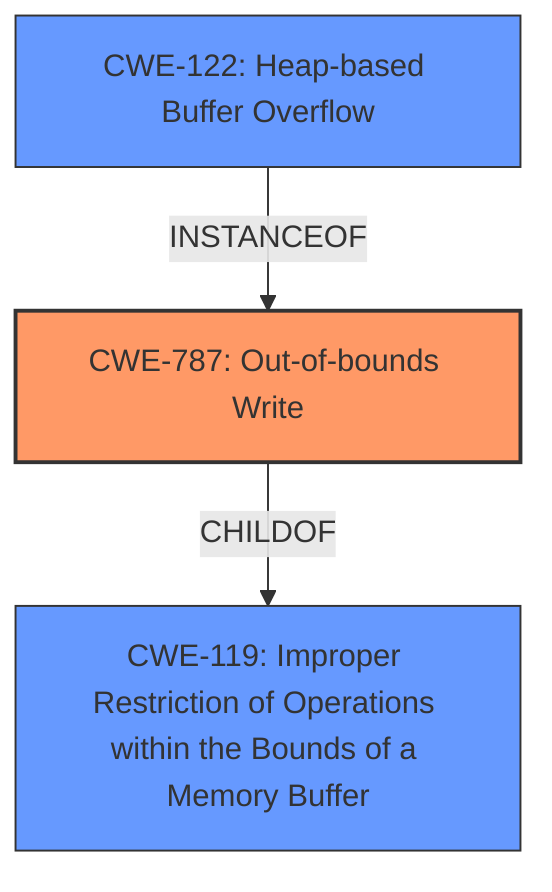

# Analysis for CVE-2025-32022

# Summary

| CWE ID   | CWE Name                                                                       | Confidence | CWE Abstraction Level | CWE Vulnerability Mapping Label | CWE-Vulnerability Mapping Notes |
| :------- | :----------------------------------------------------------------------------- | :--------- | :-------------------- | :------------------------------ | :------------------------------ |
| CWE-787  | Out-of-bounds Write                                                            | 1.0        | Base                  | Primary                         | Allowed                       |
| CWE-122  | Heap-based Buffer Overflow                                                     | 0.9        | Variant               | Secondary                       | Allowed                       |
| CWE-119  | Improper Restriction of Operations within the Bounds of a Memory Buffer | 0.7        | Class                  | Secondary                       | Discouraged                       |

## Evidence and Confidence

*   **Confidence Score:** 0.9
*   **Evidence Strength:** HIGH

## Relationship Analysis

The primary CWE is CWE-787, which represents an out-of-bounds write. CWE-122, Heap-based Buffer Overflow, is a variant of buffer overflow that occurs specifically in the heap, making it a more specific classification of the overflow. CWE-119 is a broader class encompassing improper restrictions on memory buffer operations. The hierarchical relationships are: CWE-787 is a child of CWE-119. CWE-122 can be considered a more specific instance of CWE-787, occurring in the heap. The selection favors CWE-787 due to its direct relevance to the **root cause** described.

## Vulnerability Chain

The vulnerability chain starts with a **heap buffer overflow** (CWE-122) leading to an **out-of-bounds write** (CWE-787), which then results in the overwriting of other parts of the heap, causing random instabilities and undefined behavior. The **root cause** is the **heap buffer overflow**, and the direct consequence is the **out-of-bounds write**.

## Summary of Analysis

The analysis is strongly based on the provided evidence, particularly the CVE reference link summary, which explicitly mentions the "Heap-based buffer overflow (CWE-787)" as a weakness. The description includes "heap buffer overwrite vulnerability," and the impact includes "overwriting other parts of the heap." This clearly points to a buffer overflow that allows writing beyond the intended buffer boundaries.

The graph relationships influenced the decision to include both CWE-787 and CWE-122. CWE-787 is selected as the primary weakness because it is the direct result of the overflow. CWE-122 is included to specify that this overflow occurs in the heap.

CWE-787 and CWE-122 are at the optimal level of specificity because they accurately describe the **root cause** and its location (heap) respectively. CWE-119 is a more general category, but it is included because it represents the broader class of memory buffer vulnerabilities.

Relevant CWE Information:

# Enhanced Context (25 CWEs)
The following CWEs were identified as potentially relevant to this vulnerability:

## CWE-665: Improper Initialization
**Abstraction Level**: Class
**Similarity Score**: 0.68
**Source**: dense

**Description**:
The product does not initialize or incorrectly initializes a resource, which might leave the resource in an unexpected state when it is accessed or used.

**Mapping Guidance**:
- Usage: Discouraged
- Rationale: This CWE entry is a level-1 Class (i.e., a child of a Pillar). It might have lower-level children that would be more appropriate

*Not Used:* While initialization issues could be a contributing factor, the core issue is the buffer overflow, making this less relevant.

## CWE-330: Use of Insufficiently Random Values
**Abstraction Level**: Class
**Similarity Score**: 0.68
**Source**: dense

**Description**:
The product uses insufficiently random numbers or values in a security context that depends on unpredictable numbers.

**Mapping Guidance**:
- Usage: Discouraged
- Rationale: This CWE entry is a level-1 Class (i.e., a child of a Pillar). It might have lower-level children that would be more appropriate

*Not Used:* Although the vulnerability is in the `urandom` plugin, the weakness is not related to the randomness of the values but to a buffer overflow.

## CWE-909: Missing Initialization of Resource
**Abstraction Level**: Class
**Similarity Score**: 0.68
**Source**: dense

**Description**:
The product does not initialize a critical resource.

**Mapping Guidance**:
- Usage: Allowed-with-Review
- Rationale: This CWE entry is a Class and might have Base-level children that would be more appropriate

*Not Used:* Similar to CWE-665, this is not the core issue. The vulnerability stems from writing beyond buffer boundaries, not the lack of initialization.

## CWE-824: Access of Uninitialized Pointer
**Abstraction Level**: Base
**Similarity Score**: 0.67
**Source**: dense

**Description**:
The product accesses or uses a pointer that has not been initialized.

**Mapping Guidance**:
- Usage: Allowed
- Rationale: This CWE entry is at the Base level of abstraction, which is a preferred level of abstraction for mapping to the root causes of vulnerabilities.

*Not Used:* The core issue is buffer overflow, not accessing an uninitialized pointer.

## CWE-131: Incorrect Calculation of Buffer Size
**Abstraction Level**: Base
**Similarity Score**: 0.67
**Source**: dense

**Description**:
The product does not correctly calculate the size to be used when allocating a buffer, which could lead to a buffer overflow.

**Mapping Guidance**:
- Usage: Allowed
- Rationale: This CWE entry is at the Base level of abstraction, which is a preferred level of abstraction for mapping to the root causes of vulnerabilities.

*Not Used:* While an incorrect size calculation could contribute to the overflow, it's not explicitly stated as the **root cause** in the provided information. The description focuses on the overwrite itself.

## CWE-252: Unchecked Return Value
**Abstraction Level**: Base
**Similarity Score**: 0.67
**Source**: dense

**Description**:
The product does not check the return value from a method or function, which can prevent it from detecting unexpected states and conditions.

**Mapping Guidance**:
- Usage: Allowed
- Rationale: This CWE entry is at the Base level of abstraction, which is a preferred level of abstraction for mapping to the root causes of vulnerabilities.

*Not Used:* This is not related to the described vulnerability.

## CWE-667: Improper Locking
**Abstraction Level**: Class
**Similarity Score**: 0.67
**Source**: dense

**Description**:
The product does not properly acquire or release a lock on a resource, leading to unexpected resource state changes and behaviors.

**Mapping Guidance**:
- Usage: Allowed-with-Review
- Rationale: This CWE entry is a Class and might have Base-level children that would be more appropriate

*Not Used:* This is not related to the described vulnerability.

## CWE-908: Use of Uninitialized Resource
**Abstraction Level**: Base
**Similarity Score**: 0.67
**Source**: dense

**Description**:
The product uses or accesses a resource that has not been initialized.

**Mapping Guidance**:
- Usage: Allowed
- Rationale: This CWE entry is at the Base level of abstraction, which is a preferred level of abstraction for mapping to the root causes of vulnerabilities.

*Not Used:* The core issue is buffer overflow, not using an uninitialized resource.

## CWE-1284: Improper Validation of Specified Quantity in Input
**Abstraction Level**: Base
**Similarity Score**: 0.67
**Source**: dense

**Description**:
The product receives input that is expected to specify a quantity (such as size or length), but it does not validate or incorrectly validates that the quantity has the required properties.

**Mapping Guidance**:
- Usage: Allowed
- Rationale: This CWE entry is at the Base level of abstraction, which is a preferred level of abstraction for mapping to the root causes of vulnerabilities.

*Not Used:* While input validation issues can lead to overflows, the provided description doesn't emphasize this aspect. The focus is on the heap buffer overwrite.

## CWE-193: Off-by-one Error
**Abstraction Level**: Base
**Similarity Score**: 0.66
**Source**: dense

**Description**:
A product calculates or