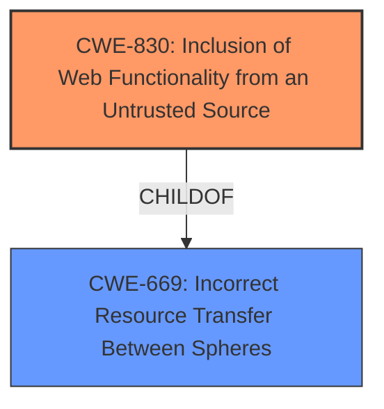

# Analysis Report for CVE-2025-32026

# Vulnerability Analysis Report: CVE-2025-32026

## Description

Element Web is a Matrix web client built using the Matrix React SDK. Element Web, starting from version 1.11.16 up to version 1.11.96, can be configured to **load Element Call from an external URL**. Under certain conditions, the external page is able to get access to the media encryption keys used for an Element Call call. Version 1.11.97 fixes the problem.

## Vulnerability Description Key Phrases

- **Rootcause:** load Element Call from an external URL
- **Impact:** get access to the media encryption keys
- **Product:** Element Web
- **Version:** 1.11.16 to 1.11.96

## Analysis (with Relationship Data)

# Summary
| CWE ID | CWE Name | Confidence | CWE Abstraction Level | CWE Vulnerability Mapping Label | CWE-Vulnerability Mapping Notes |
|---|---|---|---|---|---|
| **CWE-830** | **Inclusion of Web Functionality from an Untrusted Source** | 0.9 | Variant | Allowed | Primary CWE. The root cause is the inclusion of web functionality from an untrusted source. |

## Evidence and Confidence

*   **Confidence Score:** 0.9
*   **Evidence Strength:** HIGH

## Relationship Analysis
The primary CWE is CWE-830, a variant. The retriever results did not show any parent or child relationships of note. The closest relationship is that CWE-830 is a child of CWE-669: Incorrect Resource Transfer Between Spheres, which is a Class.



## Vulnerability Chain
The chain of weaknesses is:
1.  **CWE-830 Inclusion of Web Functionality from an Untrusted Source:** Element Web is configured to **load Element Call from an external URL**
2.  Impact: Under certain conditions, the external page is able to get access to the media encryption keys used for an Element Call call.

## Summary of Analysis
Based on the provided evidence, the primary root cause of this vulnerability is the ability to **load Element Call from an external URL**. This aligns directly with **CWE-830 Inclusion of Web Functionality from an Untrusted Source**.

The **Vulnerability Description Key Phrases** section highlights the root cause as **"load Element Call from an external URL."** The **CVE Reference Links Content Summary** confirms this by stating the **root cause** is that "Element Web, from versions 1.11.16 to 1.11.96, allows loading Element Call from an external URL. This external page can then access the media encryption keys used for Element Call."

The retriever results identify **CWE-830 Inclusion of Web Functionality from an Untrusted Source** as a potential candidate, and its description accurately matches the vulnerability.

Other CWEs were considered but ultimately rejected:

*   CWE-347 Improper Verification of Cryptographic Signature: While access to encryption keys is part of the impact, the root cause is not related to signature verification.
*   CWE-863 Incorrect Authorization: There's no mention of authorization issues in the description.
*   CWE-79 Improper Neutralization of Input During Web Page Generation ('Cross-site Scripting'): This is not directly related to XSS.
*   CWE-494 Download of Code Without Integrity Check: This is a related vulnerability, but the core issue is the inclusion of code from an untrusted source, not necessarily the download itself.

The selection of CWE-830 is at the Variant level, which is appropriate given the specific nature of the vulnerability. The evidence supports this classification with high confidence.


## CWE Relationship Analysis

Current CWEs represent these abstraction levels: .


### Vulnerability Chain Analysis

**Chain starting from CWE-863:**
- 863 (Incorrect Authorization) - ROOT


**Chain starting from CWE-494:**
- 494 (Download of Code Without Integrity Check) - ROOT


### CWE Relationship Diagram

```mermaid
graph TD
    classDef primary fill:#f96,stroke:#333,stroke-width:2px
    classDef secondary fill:#69f,stroke:#333
    classDef tertiary fill:#9e9,stroke:#333
```


*Report generated on 2025-07-14 19:15:20*
