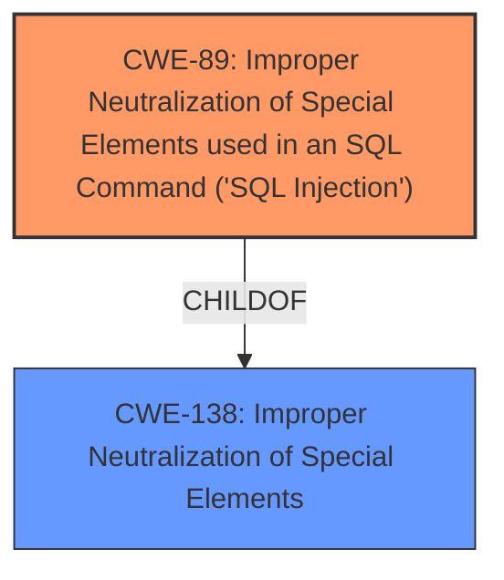

# Analysis Report for CVE-2025-3206

# Vulnerability Analysis Report: CVE-2025-3206

## Description

A vulnerability has been found in code-projects Hospital Management System 1.0 and classified as critical. This vulnerability affects unknown code of the file /admin/doctor-specilization.php. The manipulation of the argument doctorspecilization leads to **sql injection**. The attack can be initiated remotely. The exploit has been disclosed to the public and may be used.

## Vulnerability Description Key Phrases

- **Weakness:** sql injection
- **Vector:** manipulation of the argument doctorspecilization
- **Product:** Hospital Management System
- **Version:** 1
- **Component:** /admin/doctor-specilization.php

## Analysis (with Relationship Data)

# Summary
| CWE ID | CWE Name | Confidence | CWE Abstraction Level | CWE Vulnerability Mapping Label | CWE-Vulnerability Mapping Notes |
|---|---|---|---|---|---|
| CWE-89 | Improper Neutralization of Special Elements used in an SQL Command ('SQL Injection') | 1.0 | Base | Allowed | Primary CWE. The application uses user-supplied input in SQL queries without proper sanitization or validation. |

## Evidence and Confidence

*   **Confidence Score:** 1.0
*   **Evidence Strength:** HIGH

## Relationship Analysis
The primary identified weakness is CWE-89, which is a Base level CWE. The retriever results did not indicate other CWEs that were a better fit for this vulnerability. CWE-89 is a child of CWE-138, Improper Neutralization of Special Elements.



## Vulnerability Chain
The vulnerability chain starts with **improper neutralization** of the `doctorspecilization` parameter, leading to **SQL injection**.

## Summary of Analysis
The vulnerability description clearly states that the manipulation of the `doctorspecilization` argument leads to **SQL injection**. The CVE reference links content summary confirms this, stating that the root cause is insufficient user input validation for the "doctorspecilization" parameter. The application directly uses user-supplied input in SQL queries without proper sanitization or validation. The retriever results also strongly suggest CWE-89 as the primary weakness. Therefore, CWE-89 is the most appropriate CWE for this vulnerability. The evidence provided is direct and clear, leading to high confidence in this assessment. The selected CWE is at the optimal level of specificity, as it directly addresses the SQL injection vulnerability.


## CWE Relationship Analysis

Current CWEs represent these abstraction levels: .


### Vulnerability Chain Analysis

**Chain starting from CWE-89:**
- 89 (Improper Neutralization of Special Elements used in an SQL Command ('SQL Injection')) - ROOT


**Chain starting from CWE-138:**
- 138 (Improper Neutralization of Special Elements) - ROOT


### CWE Relationship Diagram

```mermaid
graph TD
    classDef primary fill:#f96,stroke:#333,stroke-width:2px
    classDef secondary fill:#69f,stroke:#333
    classDef tertiary fill:#9e9,stroke:#333
```


*Report generated on 2025-07-14 19:17:17*
