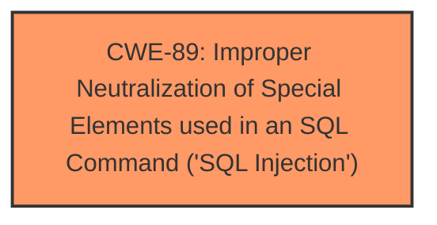

# Analysis for CVE-2025-3217

# Summary
| CWE ID | CWE Name | Confidence | CWE Abstraction Level | CWE Vulnerability Mapping Label | CWE-Vulnerability Mapping Notes |
|---|---|---|---|---|---|
| CWE-89 | Improper Neutralization of Special Elements used in an SQL Command ('SQL Injection') | 1.0 | Base | Allowed | Primary CWE. The application constructs an SQL command using externally-influenced input without proper neutralization of special elements. |

## Evidence and Confidence

*   **Confidence Score:** 1.0
*   **Evidence Strength:** HIGH

## Relationship Analysis
The primary relationship that influenced the decision was the direct match of the vulnerability description to the definition of CWE-89. The vulnerability involves the manipulation of the 'emailid' argument leading to **SQL Injection**, which perfectly aligns with CWE-89's description of constructing SQL commands using externally-influenced input without proper neutralization. No other parent, child, or peer relationships significantly altered this initial assessment. The base level of CWE-89 is appropriate as it directly represents the root cause of the vulnerability.

## Vulnerability Chain
The vulnerability chain starts with the **improper neutralization** of input in the `/registration.php` file, specifically the 'emailid' parameter. This leads directly to the ability to inject SQL commands, resulting in unauthorized database access and potential data leakage.

## Summary of Analysis
The analysis strongly supports the classification of this vulnerability as CWE-89. The vulnerability description clearly states that the manipulation of the 'emailid' argument leads to **SQL Injection**, and the CVE Reference Links Content Summary confirms that the root cause is insufficient user input validation of this parameter, which is then used in SQL queries without proper sanitization. The provided payload example further solidifies this assessment.

The assessment is heavily based on the provided evidence, particularly the vulnerability description and the CVE Reference Links Content Summary. The statement "The manipulation of the argument emailid leads to **sql injection**" is a direct indicator of CWE-89.

CWE-89 is the optimal level of specificity because it directly addresses the **root cause** of the vulnerability: the **improper neutralization** of special elements in an SQL command.

Relevant CWE Information:

# Enhanced Context (25 CWEs)

## CWE-89: Improper Neutralization of Special Elements used in an SQL Command ('SQL Injection')
**Abstraction Level**: Base
**Similarity Score**: 0.79
**Source**: dense

**Description**:
The product constructs all or part of an SQL command using externally-influenced input from an upstream component, but it does not neutralize or incorrectly neutralizes special elements that could modify the intended SQL command when it is sent to a downstream component. Without sufficient removal or quoting of SQL syntax in user-controllable inputs, the generated SQL query can cause those inputs to be interpreted as SQL instead of ordinary user data.

**Mapping Guidance**:
- Usage: Allowed
- Rationale: This CWE entry is at the Base level of abstraction, which is a preferred level of abstraction for mapping to the root causes of vulnerabilities.

## CWE-79: Improper Neutralization of Input During Web Page Generation ('Cross-site Scripting')
**Abstraction Level**: Base
**Similarity Score**: 1077.66
**Source**: sparse

**Description**:
The product does not neutralize or incorrectly neutralizes user-controllable input before it is placed in output that is used as a web page that is served to other users.

**Mapping Guidance**:
- Usage: Allowed
- Rationale: This CWE entry is at the Base level of abstraction, which is a preferred level of abstraction for mapping to the root causes of vulnerabilities.

*CWEs Considered but Not Used:*

*   CWE-79 (Improper Neutralization of Input During Web Page Generation ('Cross-site Scripting')) was considered but deemed less appropriate because the vulnerability is directly related to SQL commands and not the generation of web pages.
*   CWE-74 (Improper Neutralization of Special Elements in Output Used by a Downstream Component ('Injection')) was considered but is too high-level. CWE-89 is a more specific instance of injection.
*   CWE-1336 (Improper Neutralization of Special Elements Used in a Template Engine): This CWE is not applicable as the vulnerability does not involve a template engine.
*   CWE-434 (Unrestricted Upload of File with Dangerous Type): This CWE is not applicable as the vulnerability is not related to file uploads.