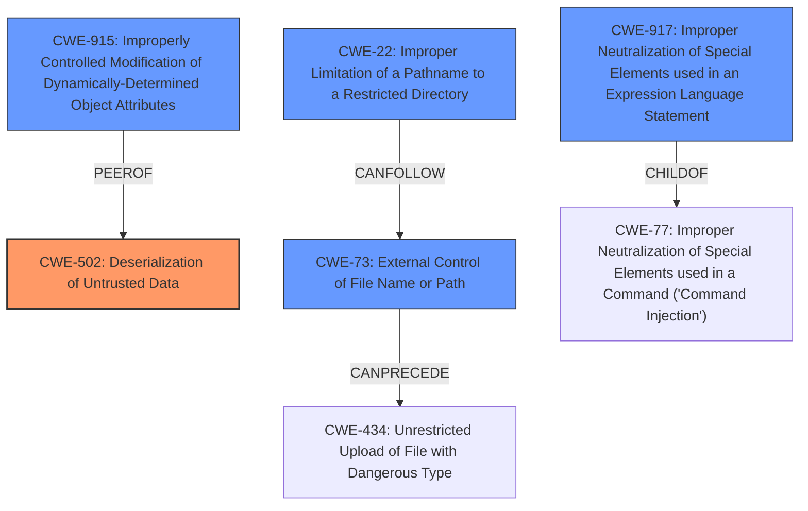

# Enhanced Analysis for CVE-2025-32363

# Summary
| CWE ID | CWE Name | Confidence | CWE Abstraction Level | CWE Vulnerability Mapping Label | CWE-Vulnerability Mapping Notes |
|---|---|---|---|---|---|
| CWE-502 | Deserialization of Untrusted Data | 1.0 | Base | Primary | Allowed |

## Evidence and Confidence

*   **Confidence Score:** 1.0
*   **Evidence Strength:** HIGH

## Relationship Analysis
The primary relationship to consider is the absence of proper input validation or type checking during deserialization, which allows for the execution of arbitrary code. While other CWEs like CWE-915, CWE-917, CWE-73 and CWE-22 were considered due to their presence in the Retriever results, CWE-502 directly addresses the root cause described in the vulnerability. CWE-502 stands as the most direct and relevant classification.



## Vulnerability Chain
The vulnerability chain starts with the **deserialization of untrusted data** (CWE-502), which allows an attacker to inject malicious code into the system. This leads to remote code execution, effectively giving the attacker control over the target system.

## Summary of Analysis
The vulnerability description explicitly states that the root cause is "**deserialization of untrusted data**." This aligns directly with CWE-502, which describes the **weakness** as occurring when a product deserializes untrusted data without sufficiently ensuring its validity. The high confidence score is based on the explicit description of the vulnerability aligning with the definition of CWE-502. The other CWEs considered were less direct matches to the provided vulnerability description.

Relevant CWE Information:

# Enhanced Context (25 CWEs)
The following CWEs were identified as potentially relevant to this vulnerability:

## CWE-502: Deserialization of Untrusted Data
**Abstraction Level**: Base
**Similarity Score**: 0.76
**Source**: dense

**Description**:
The product deserializes untrusted data without sufficiently ensuring that the resulting data will be valid.

**Mapping Guidance**:
- Usage: Allowed
- Rationale: This CWE entry is at the Base level of abstraction, which is a preferred level of abstraction for mapping to the root causes of vulnerabilities.
## CWE-502: Deserialization of Untrusted Data
**Abstraction Level**: Base
**Similarity Score**: 382.95
**Source**: sparse

**Description**:
The product deserializes untrusted data without sufficiently ensuring that the resulting data will be valid.

**Mapping Guidance**:
- Usage: Allowed
- Rationale: This CWE entry is at the Base level of abstraction, which is a preferred level of abstraction for mapping to the root causes of vulnerabilities.
## CWE-502: Deserialization of Untrusted Data
**Abstraction Level**: Base
**Similarity Score**: 2.49
**Source**: graph

**Description**:
The product deserializes untrusted data without sufficiently ensuring that the resulting data will be valid.

**Mapping Guidance**:
- Usage: Allowed
- Rationale: This CWE entry is at the Base level of abstraction, which is a preferred level of abstraction for mapping to the root causes of vulnerabilities.

### CWE-502: Deserialization of Untrusted Data
**Technical Explanation:**
CWE-502 [https://cwe.mitre.org/data/definitions/502.html] describes a **weakness** where a product deserializes untrusted data without sufficiently ensuring that the resulting data will be valid. In this case, mediDOK before 2.5.18.43 is vulnerable because it allows remote attackers to achieve remote code execution via **deserialization of untrusted data**. The **lack of proper validation** during deserialization allows the attacker to inject malicious code, leading to the ability to execute arbitrary commands on the target system.
**Security Implications:**
The security implication is remote code execution. An attacker can gain complete control over the affected system.
**Relationships:**
CWE-502 is a base-level CWE.
**Mapping Guidance:**
The official MITRE mapping guidance allows for the use of CWE-502 at the Base level of abstraction. The vulnerability description explicitly mentions **deserialization of untrusted data**, making this a direct and appropriate mapping.
**Other CWEs Considered but Not Used:**
CWE-915, CWE-917, CWE-73, CWE-22, CWE-121, CWE-250, CWE-20, CWE-96, CWE-94: These CWEs were considered but deemed less appropriate because they represent related but not directly causative factors. The core issue is the **deserialization of untrusted data**, which is directly addressed by CWE-502.


## CWE Relationship Analysis

Current CWEs represent these abstraction levels: .


### Vulnerability Chain Analysis

**Chain starting from CWE-502:**
- 502 (Deserialization of Untrusted Data) - ROOT


**Chain starting from CWE-121:**
- 121 (Stack-based Buffer Overflow) - ROOT


### CWE Relationship Diagram

```mermaid
graph TD
    classDef primary fill:#f96,stroke:#333,stroke-width:2px
    classDef secondary fill:#69f,stroke:#333
    classDef tertiary fill:#9e9,stroke:#333
```