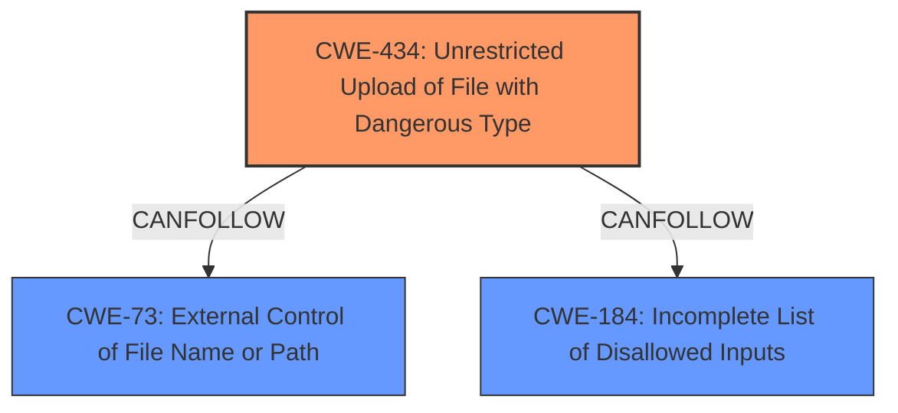

# Analysis for CVE-2025-3244

# Summary
| CWE ID | CWE Name | Confidence | CWE Abstraction Level | CWE Vulnerability Mapping Label | CWE-Vulnerability Mapping Notes |
|---|---|---|---|---|---|
| CWE-434 | Unrestricted Upload of File with Dangerous Type | 1.0 | Base | Allowed | Primary CWE. The vulnerability description explicitly states "**unrestricted upload**". |

## Evidence and Confidence

*   **Confidence Score:** 1.0
*   **Evidence Strength:** HIGH

## Relationship Analysis
The primary CWE, CWE-434, does have relationships with other CWEs, but they don't significantly influence the decision in this case due to the clear evidence in the vulnerability description.

## Vulnerability Chain
The vulnerability chain starts with the **unrestricted upload** (CWE-434), potentially leading to further exploitation depending on the file type and server configuration.

## Summary of Analysis
The vulnerability description explicitly mentions "**unrestricted upload**" when manipulating the Avatar argument in `/add-admin.php`. This aligns directly with CWE-434 (Unrestricted Upload of File with Dangerous Type). The retriever results also list CWE-434 as a top candidate. The decision is based on the explicit mention of the weakness in the vulnerability description. CWE-434 is at the Base level of abstraction, which is the preferred level.

Relevant CWE Information:
- CWE-434: The product allows the upload or transfer of dangerous file types that are automatically processed within its environment.