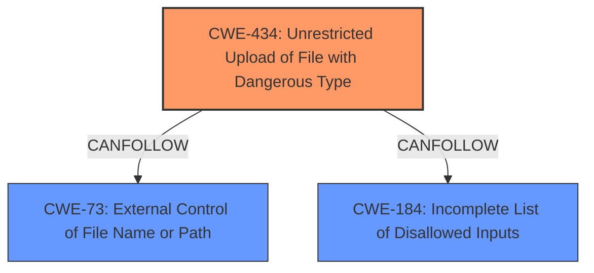

# Analysis Report for CVE-2025-3244

# Vulnerability Analysis Report: CVE-2025-3244

## Description

A vulnerability was found in SourceCodester Web-based Pharmacy Product Management System 1.0. It has been declared as critical. Affected by this vulnerability is an unknown functionality of the file /add-admin.php of the component Create User Page. The manipulation of the argument Avatar leads to **unrestricted upload**. The attack can be launched remotely. The exploit has been disclosed to the public and may be used.

## Vulnerability Description Key Phrases

- **Weakness:** unrestricted upload
- **Vector:** manipulation of Avatar argument
- **Product:** SourceCodester Web-based Pharmacy Product Management System
- **Version:** 1.0
- **Component:** /add-admin.php

## Analysis (with Relationship Data)

# Summary
| CWE ID | CWE Name | Confidence | CWE Abstraction Level | CWE Vulnerability Mapping Label | CWE-Vulnerability Mapping Notes |
|---|---|---|---|---|---|
| CWE-434 | Unrestricted Upload of File with Dangerous Type | 1.0 | Base | Allowed | Primary CWE. The vulnerability description explicitly states "**unrestricted upload**". |

## Evidence and Confidence

*   **Confidence Score:** 1.0
*   **Evidence Strength:** HIGH

## Relationship Analysis
The primary CWE, CWE-434, does have relationships with other CWEs, but they don't significantly influence the decision in this case due to the clear evidence in the vulnerability description.



## Vulnerability Chain
The vulnerability chain starts with the **unrestricted upload** (CWE-434), potentially leading to further exploitation depending on the file type and server configuration.

## Summary of Analysis
The vulnerability description explicitly mentions "**unrestricted upload**" when manipulating the Avatar argument in `/add-admin.php`. This aligns directly with CWE-434 (Unrestricted Upload of File with Dangerous Type). The retriever results also list CWE-434 as a top candidate. The decision is based on the explicit mention of the weakness in the vulnerability description. CWE-434 is at the Base level of abstraction, which is the preferred level.

Relevant CWE Information:
- CWE-434: The product allows the upload or transfer of dangerous file types that are automatically processed within its environment.


## CWE Relationship Analysis

Current CWEs represent these abstraction levels: .


### Vulnerability Chain Analysis

**Chain starting from CWE-184:**
- 184 (Incomplete List of Disallowed Inputs) - ROOT


**Chain starting from CWE-73:**
- 73 (External Control of File Name or Path) - ROOT


### CWE Relationship Diagram

```mermaid
graph TD
    classDef primary fill:#f96,stroke:#333,stroke-width:2px
    classDef secondary fill:#69f,stroke:#333
    classDef tertiary fill:#9e9,stroke:#333
```


*Report generated on 2025-07-14 19:33:02*
