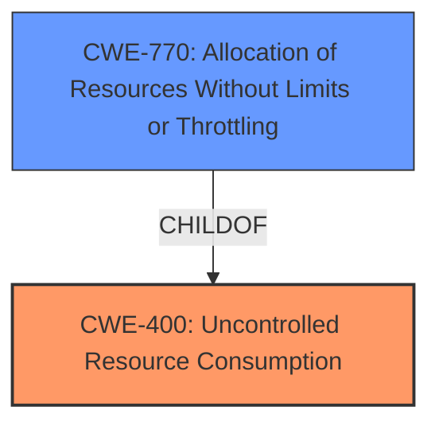

# Analysis Report for CVE-2025-32472

# Vulnerability Analysis Report: CVE-2025-32472

## Description

The multiScan and picoScan are vulnerable to a denial-of-service (DoS) attack. A remote attacker can exploit this vulnerability by conducting a Slowloris-type attack, causing the web page to become unresponsive.

## Vulnerability Description Key Phrases

- **Component:** multiScan and picoScan
- **Vector:** Slowloris-type attack
- **Impact:** become unresponsive, denial-of-service (DoS) attack
- **Attacker:** remote attacker

## Analysis (with Relationship Data)

# Summary

| CWE ID  | CWE Name                                                                                        | Confidence | CWE Abstraction Level | CWE Vulnerability Mapping Label | CWE-Vulnerability Mapping Notes |
| :------- | :---------------------------------------------------------------------------------------------- | :--------- | :---------------------- | :------------------------------ | :------------------------------ |
| CWE-400 | Uncontrolled Resource Consumption                                                               | 0.85       | Class                   | Primary                         | Discouraged                    |
| CWE-770 | Allocation of Resources Without Limits or Throttling                                          | 0.75       | Base                    | Secondary                       | Allowed                       |

## Evidence and Confidence

*   **Confidence Score:** 0.80
*   **Evidence Strength:** MEDIUM

## Relationship Analysis

The primary CWE identified is CWE-400 [Uncontrolled Resource Consumption], which is a Class-level CWE. CWE-770 [Allocation of Resources Without Limits or Throttling] is a Base-level CWE and a child of CWE-400. The relationship indicates that CWE-770 is a more specific type of resource consumption issue. The attack described, Slowloris, involves exhausting resources, suggesting CWE-400 is applicable. While CWE-770 could provide more granularity, the description focuses on the consumption aspect.



## Vulnerability Chain

The vulnerability chain starts with the **uncontrolled resource consumption** (CWE-400), specifically triggered by a Slowloris attack, where the attacker **allocates resources without limits or throttling** (CWE-770), leading to a denial-of-service (DoS) impact.

## Summary of Analysis

The initial analysis identified CWE-400 [Uncontrolled Resource Consumption] as the primary weakness due to the DoS caused by a Slowloris attack. The evidence supports this because the **root cause** is a DoS vulnerability. The description states that "The multiScan and picoScan are vulnerable to a denial-of-service (DoS) attack... by conducting a Slowloris-type attack, causing the web page to become unresponsive."

CWE-770 [Allocation of Resources Without Limits or Throttling] was considered as a more specific alternative, since Slowloris attacks work by opening multiple connections without ever closing them, thus exhausting server resources.

However, the description highlights the **unresponsiveness** which is a symptom of resource exhaustion, supporting CWE-400 [Uncontrolled Resource Consumption]. Although CWE-400 is discouraged, the evidence is more aligned to the consumption aspect, even if the allocation occurs without limits or throttling.

The decision is based on the available evidence and relationship analysis. The evidence is limited, leading to a slightly lower confidence score. Selecting CWE-400 [Uncontrolled Resource Consumption] is at the optimal level of specificity, adequately capturing the root cause given the available information.

Relevant CWE Information:

# Enhanced Context (25 CWEs)
The following CWEs were identified as potentially relevant to this vulnerability:

## CWE-668: Exposure of Resource to Wrong Sphere
**Abstraction Level**: Class
**Similarity Score**: 0.75
**Source**: dense

**Description**:
The product exposes a resource to the wrong control sphere, providing unintended actors with inappropriate access to the resource.

**Mapping Guidance**:
- Usage: Discouraged
- Rationale: CWE-668 is high-level and is often misused as a catch-all when lower-level CWE IDs might be applicable. It is sometimes used for low-information vulnerability reports [REF-1287]. It is a level-1 Class (i.e., a child of a Pillar). It is not useful for trend analysis.

*Not Selected:* Not relevant because the vulnerability is not about exposing resources to the wrong sphere, but about exhausting resources.

## CWE-755: Improper Handling of Exceptional Conditions
**Abstraction Level**: Class
**Similarity Score**: 0.75
**Source**: dense

**Description**:
The product does not handle or incorrectly handles an exceptional condition.

**Mapping Guidance**:
- Usage: Discouraged
- Rationale: This CWE entry is a level-1 Class (i.e., a child of a Pillar). It might have lower-level children that would be more appropriate

*Not Selected:* Not relevant because the vulnerability isn't directly related to the handling of exceptions, but to resource exhaustion.

## CWE-400: Uncontrolled Resource Consumption
**Abstraction Level**: Class
**Similarity Score**: 0.75
**Source**: dense

**Description**:
The product does not properly control the allocation and maintenance of a limited resource, thereby enabling an actor to influence the amount of resources consumed, eventually leading to the exhaustion of available resources.

**Mapping Guidance**:
- Usage: Discouraged
- Rationale: CWE-400 is intended for incorrect behaviors in which the product is expected to track and restrict how many resources it consumes, but CWE-400 is often misused because it is conflated with the "technical impact" of vulnerabilities in which resource consumption occurs. It is sometimes used for low-information vulnerability reports. It is a level-1 Class (i.e., a child of a Pillar).

*Selected as Primary:* The vulnerability leads to denial of service by exhausting resources, which aligns well with the description of CWE-400. Despite the discouraged usage, the description closely matches the observed behavior.

## CWE-294: Authentication Bypass by Capture-replay
**Abstraction Level**: Base
**Similarity Score**: 0.74
**Source**: dense

**Description**:
A capture-replay flaw exists when the design of the product makes it possible for a malicious user to sniff network traffic and bypass authentication by replaying it to the server in question to the same effect as the original message (or with minor changes).

**Mapping Guidance**:
- Usage: Allowed
- Rationale: This CWE entry is at the Base level of abstraction, which is a preferred level of abstraction for mapping to the root causes of vulnerabilities.

*Not Selected:* This is not about authentication bypass, but about resource exhaustion.

## CWE-696: Incorrect Behavior Order
**Abstraction Level**: Class
**Similarity Score**: 0.73
**Source**: dense

**Description**:
The product performs multiple related behaviors, but the behaviors are performed in the wrong order in ways which may produce resultant weaknesses.

**Mapping Guidance**:
- Usage: Allowed-with-Review
- Rationale: This CWE entry is a Class and might have Base-level children that would be more appropriate

*Not Selected:* This vulnerability isn't about the order of operations.

## CWE-425: Direct Request ('Forced Browsing')
**Abstraction Level**: Base
**Similarity Score**: 0.73
**Source**: dense

**Description**:
The web application does not adequately enforce appropriate authorization on all restricted URLs, scripts, or files.

**Mapping Guidance**:
- Usage: Allowed
- Rationale: This CWE entry is at the Base level of abstraction, which is a preferred level of abstraction for mapping to the root causes of vulnerabilities.

*Not Selected:* Not relevant as it pertains to authorization issues, not resource exhaustion.

## CWE-119: Improper Restriction of Operations within the Bounds of a Memory Buffer
**Abstraction Level**: Class
**Similarity Score**: 0.73
**Source**: dense

**Description**:
The product performs operations on a memory buffer, but it reads from or writes to a memory location outside the buffer's intended boundary. This may result in read or write operations on unexpected memory locations that could be linked to other variables, data structures, or internal program data.

**Mapping Guidance**:
- Usage: Discouraged
- Rationale: CWE-119 is commonly misused in low-information vulnerability reports when lower-level CWEs could be used instead, or when more details about the vulnerability are available.

*Not Selected:* This is not about memory buffer issues, but about resource exhaustion at a higher level.

## CWE-200: Exposure of Sensitive Information to an Unauthorized Actor
**Abstraction Level**: Class
**Similarity Score**: 0.73
**Source**: dense

**Description**:
The product exposes sensitive information to an actor that is not explicitly authorized to have access to that information.

**Mapping Guidance**:
- Usage: Discouraged
- Rationale: CWE-200 is commonly misused to represent the loss of confidentiality in a vulnerability, but confidentiality loss is a technical impact - not a root cause error. As of CWE 4.9, over 400 CWE entries can lead to a loss of confidentiality. Other options are often available. [REF-1287].

*Not Selected:* This is not about information exposure.

## CWE-497: Exposure of Sensitive System Information to an Unauthorized Control Sphere
**Abstraction Level**: Base
**Similarity Score**: 0.73
**Source**: dense

**Description**:
The product


## CWE Relationship Analysis

Current CWEs represent these abstraction levels: .


### Vulnerability Chain Analysis

**Chain starting from CWE-400:**
- 400 (Uncontrolled Resource Consumption) - ROOT


**Chain starting from CWE-770:**
- 770 (Allocation of Resources Without Limits or Throttling) - ROOT


### CWE Relationship Diagram

```mermaid
graph TD
    classDef primary fill:#f96,stroke:#333,stroke-width:2px
    classDef secondary fill:#69f,stroke:#333
    classDef tertiary fill:#9e9,stroke:#333
```


*Report generated on 2025-07-14 19:35:44*
