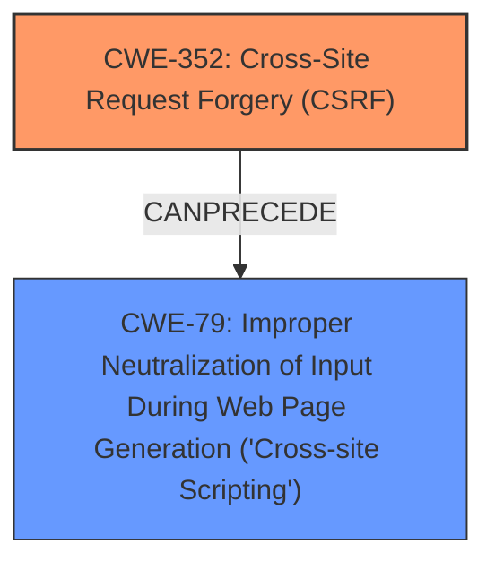

# Enhanced Analysis for CVE-2025-32505

# Summary
| CWE ID | CWE Name | Confidence | CWE Abstraction Level | CWE Vulnerability Mapping Label | CWE-Vulnerability Mapping Notes |
|---|---|---|---|---|---|
| CWE-352 | Cross-Site Request Forgery (CSRF) | 0.9 | Compound | Primary | Allowed |
| CWE-79 | Improper Neutralization of Input During Web Page Generation ('Cross-site Scripting') | 0.8 | Base | Secondary | Allowed |

## Evidence and Confidence

*   **Confidence Score:** 0.85
*   **Evidence Strength:** MEDIUM

## Relationship Analysis
The primary relationship identified is that **CWE-352** [Cross-Site Request Forgery (CSRF)] can **precede** **CWE-79** [Improper Neutralization of Input During Web Page Generation ('Cross-site Scripting')] because the **missing CSRF protection** allows for actions that lead to stored **XSS**. **CWE-352** is a compound weakness. **CWE-79** is a base weakness.



## Vulnerability Chain
The vulnerability chain starts with the **missing CSRF protection** (**CWE-352** [Cross-Site Request Forgery (CSRF)]). This allows an attacker to inject malicious code (stored **XSS**) into the application (**CWE-79** [Improper Neutralization of Input During Web Page Generation ('Cross-site Scripting')]).
  - **CWE-352**: Root cause, **missing CSRF protection**
  - **CWE-79**: Impact, Stored **XSS**

## Summary of Analysis
The primary weakness is the **Cross-Site Request Forgery** (**CWE-352** [Cross-Site Request Forgery (CSRF)]) vulnerability. The **missing CSRF protection** allows an attacker to perform actions on behalf of a user, leading to the stored **XSS** (**CWE-79** [Improper Neutralization of Input During Web Page Generation ('Cross-site Scripting')]).

The evidence for **CWE-352** [Cross-Site Request Forgery (CSRF)] is found in:
- **Vulnerability Description Key Phrases**: "**rootcause:** **Cross-Site Request Forgery**"
- **CVE Reference Links Content Summary**: "**Root cause of vulnerability:** Cross Site Request Forgery (CSRF) vulnerability."

The evidence for **CWE-79** [Improper Neutralization of Input During Web Page Generation ('Cross-site Scripting')] is found in:
- **Vulnerability Description Key Phrases**: "**weakness:** **XSS**"
- **CVE Reference Links Content Summary**: "Missing CSRF protection allows a malicious actor to force higher privileged users to execute unwanted actions." and "A malicious actor can force higher privileged users to execute unwanted actions under their current authentication."

The retriever results also support **CWE-79** [Improper Neutralization of Input During Web Page Generation ('Cross-site Scripting')] as the top candidate and **CWE-352** [Cross-Site Request Forgery (CSRF)] as a secondary candidate.

Other CWEs considered but not used:
- **CWE-89** [Improper Neutralization of Special Elements used in an SQL Command ('SQL Injection')], **CWE-918** [Server-Side Request Forgery (SSRF)], **CWE-601** [URL Redirection to Untrusted Site ('Open Redirect')], **CWE-78** [Improper Neutralization of Special Elements used in an OS Command ('OS Command Injection')]: These are related to injection and redirection vulnerabilities, but they don't directly fit the described scenario of **CSRF** leading to stored **XSS**.
- **CWE-1275** [Sensitive Cookie with Improper SameSite Attribute], **CWE-1004** [Sensitive Cookie Without 'HttpOnly' Flag]: These are cookie-related vulnerabilities, but the description focuses on **CSRF** and **XSS**, not directly on cookie handling.
- **CWE-116** [Improper Encoding or Escaping of Output], **CWE-80** [Improper Neutralization of Script-Related HTML Tags in a Web Page (Basic XSS)], **CWE-494** [Download of Code Without Integrity Check]: These are related to output handling and code download, but not as directly relevant as **CWE-79** [Improper Neutralization of Input During Web Page Generation ('Cross-site Scripting')] given the stored **XSS**.

The selected CWEs are at the optimal level of specificity because they accurately represent the root cause (**CSRF**) and the resulting vulnerability (stored **XSS**).


## CWE Relationship Analysis

Current CWEs represent these abstraction levels: .


### Vulnerability Chain Analysis

**Chain starting from CWE-89:**
- 89 (Improper Neutralization of Special Elements used in an SQL Command ('SQL Injection')) - ROOT


**Chain starting from CWE-116:**
- 116 (Improper Encoding or Escaping of Output) - ROOT


### CWE Relationship Diagram

```mermaid
graph TD
    classDef primary fill:#f96,stroke:#333,stroke-width:2px
    classDef secondary fill:#69f,stroke:#333
    classDef tertiary fill:#9e9,stroke:#333
```