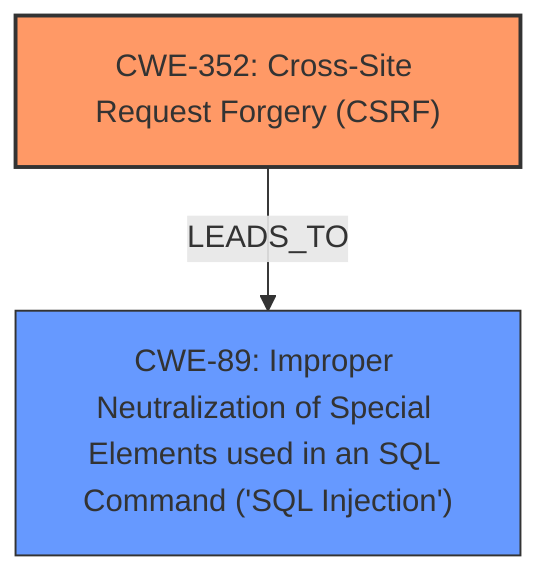

# Analysis for CVE-2025-32547

# Summary
| CWE ID | CWE Name | Confidence | CWE Abstraction Level | CWE Vulnerability Mapping Label | CWE-Vulnerability Mapping Notes |
|---|---|---|---|---|---|
| CWE-352 | Cross-Site Request Forgery (CSRF) | 1.0 | Compound | Primary | Allowed |
| CWE-89 | Improper Neutralization of Special Elements used in an SQL Command ('SQL Injection') | 1.0 | Base | Secondary | Allowed |

## Evidence and Confidence

*   **Confidence Score:** 1.0
*   **Evidence Strength:** HIGH

## Relationship Analysis
The primary weakness is **CWE-352 [Cross-Site Request Forgery (CSRF)]**, which is a compound weakness. The vulnerability description explicitly mentions CSRF as the root cause. The impact of the CSRF vulnerability is **CWE-89 [Improper Neutralization of Special Elements used in an SQL Command ('SQL Injection')]**. This is due to the CSRF allowing for the injection of malicious SQL commands. There isn't a direct parent-child or peer relationship between CWE-352 and CWE-89, but the vulnerability description explicitly states that the CSRF leads to Blind SQL Injection. The abstraction levels are appropriate, with CWE-352 being compound and CWE-89 being base.

## Vulnerability Chain
The vulnerability chain starts with the **CWE-352 [Cross-Site Request Forgery (CSRF)]** vulnerability, which allows an attacker to forge requests on behalf of a user. This leads to **CWE-89 [Improper Neutralization of Special Elements used in an SQL Command ('SQL Injection')]**, allowing the attacker to inject malicious SQL commands.

## Summary of Analysis
The analysis is based on the provided evidence, including the vulnerability description and the CVE Reference Links Content Summary. The vulnerability description states "**Cross-Site Request Forgery** (CSRF) vulnerability in gtlwpdev All push notification for WP allows Blind SQL Injection." The CVE Reference Links Content Summary confirms that the root cause is CSRF and that it allows malicious actors to execute unwanted actions.

The graph relationships show how the CSRF vulnerability directly leads to SQL Injection. The selected CWEs are at the optimal level of specificity, with CWE-352 being a compound weakness and CWE-89 being a base weakness.

CWE-918, CWE-79, CWE-434, CWE-601, CWE-116, CWE-862, CWE-790, and CWE-471 were considered but not selected. CWE-918 [Server-Side Request Forgery (SSRF)], CWE-79 [Improper Neutralization of Input During Web Page Generation ('Cross-site Scripting')], CWE-434 [Unrestricted Upload of File with Dangerous Type], and CWE-601 [URL Redirection to Untrusted Site ('Open Redirect')] are not relevant because the vulnerability is related to CSRF and SQL Injection, not server-side requests, XSS, file uploads, or URL redirection. CWE-116 [Improper Encoding or Escaping of Output] and CWE-790 [Improper Filtering of Special Elements] are not relevant because the core issue is not about encoding/escaping or filtering. CWE-862 [Missing Authorization] is not the root cause but rather a potential consequence of CSRF. CWE-471 [Modification of Assumed-Immutable Data (MAID)] is not relevant to this specific vulnerability.

Relevant CWE Information:

# Enhanced Context (25 CWEs)
The following CWEs were identified as potentially relevant to this vulnerability:

## CWE-352: Cross-Site Request Forgery (CSRF)
**Abstraction Level**: Compound
**Similarity Score**: 0.78
**Source**: dense

**Description**:
The web application does not, or can not, sufficiently verify whether a well-formed, valid, consistent request was intentionally provided by the user who submitted the request.

**Mapping Guidance**:
- Usage: Allowed
- Rationale: This is a well-known Composite of multiple weaknesses that must all occur simultaneously, although it is attack-oriented in nature.

## CWE-425: Direct Request ('Forced Browsing')
**Abstraction Level**: Base
**Similarity Score**: 0.76
**Source**: dense

**Description**:
The web application does not adequately enforce appropriate authorization on all restricted URLs, scripts, or files.

**Mapping Guidance**:
- Usage: Allowed
- Rationale: This CWE entry is at the Base level of abstraction, which is a preferred level of abstraction for mapping to the root causes of vulnerabilities.

## CWE-116: Improper Encoding or Escaping of Output
**Abstraction Level**: Class
**Similarity Score**: 0.75
**Source**: dense

**Description**:
The product prepares a structured message for communication with another component, but encoding or escaping of the data is either missing or done incorrectly. As a result, the intended structure of the message is not preserved.

**Mapping Guidance**:
- Usage: Allowed-with-Review
- Rationale: This CWE entry is a Class and might have Base-level children that would be more appropriate

## CWE-472: External Control of Assumed-Immutable Web Parameter
**Abstraction Level**: Base
**Similarity Score**: 0.75
**Source**: dense

**Description**:
The web application does not sufficiently verify inputs that are assumed to be immutable but are actually externally controllable, such as hidden form fields.

**Mapping Guidance**:
- Usage: Allowed
- Rationale: This CWE entry is at the Base level of abstraction, which is a preferred level of abstraction for mapping to the root causes of vulnerabilities.

## CWE-790: Improper Filtering of Special Elements
**Abstraction Level**: Class
**Similarity Score**: 0.74
**Source**: dense

**Description**:
The product receives data from an upstream component, but does not filter or incorrectly filters special elements before sending it to a downstream component.

**Mapping Guidance**:
- Usage: Allowed-with-Review
- Rationale: This CWE entry is a Class and might have Base-level children that would be more appropriate

## CWE-862: Missing Authorization
**Abstraction Level**: Class
**Similarity Score**: 0.73
**Source**: dense

**Description**:
The product does not perform an authorization check when an actor attempts to access a resource or perform an action.

**Mapping Guidance**:
- Usage: Allowed-with-Review
- Rationale: This CWE entry is a Class and might have Base-level children that would be more appropriate

## CWE-79: Improper Neutralization of Input During Web Page Generation ('Cross-site Scripting')
**Abstraction Level**: Base
**Similarity Score**: 0.73
**Source**: dense

**Description**:
The product does not neutralize or incorrectly neutralizes user-controllable input before it is placed in output that is used as a web page that is served to other users.

**Mapping Guidance**:
- Usage: Allowed
- Rationale: This CWE entry is at the Base level of abstraction, which is a preferred level of abstraction for mapping to the root causes of vulnerabilities.

## CWE-201: Insertion of Sensitive Information Into Sent Data
**Abstraction Level**: Base
**Similarity Score**: 0.73
**Source**: dense

**Description**:
The code transmits data to another actor, but a portion of the data includes sensitive information that should not be accessible to that actor.

**Mapping Guidance**:
- Usage: Allowed
- Rationale: This CWE entry is at the Base level of abstraction, which is a preferred level of abstraction for mapping to the root causes of vulnerabilities.

## CWE-434: Unrestricted Upload of File with Dangerous Type
**Abstraction Level**: Base
**Similarity Score**: 0.73
**Source**: dense

**Description**:
The product allows the upload or transfer of dangerous file types that are automatically processed within its environment.

**Mapping Guidance**:
- Usage: Allowed
- Rationale: This CWE entry is at the Base level of abstraction, which is a preferred level of abstraction for mapping to the root causes of vulnerabilities.

## CWE-1286: Improper Validation of Syntactic Correctness of Input
**Abstraction Level**: Base
**Similarity Score**: 0.73
**Source**: dense

**Description**:
The product receives input that is expected to be well-formed - i.e., to comply with a certain syntax - but it does not validate or incorrectly validates that the input complies with the syntax.

**Mapping Guidance**:
- Usage: Allowed
- Rationale: This CWE entry is at the Base level of abstraction, which is a preferred level of abstraction for mapping to the root causes of vulnerabilities.

## CWE-352: Cross-Site Request Forgery (CSRF)
**Abstraction