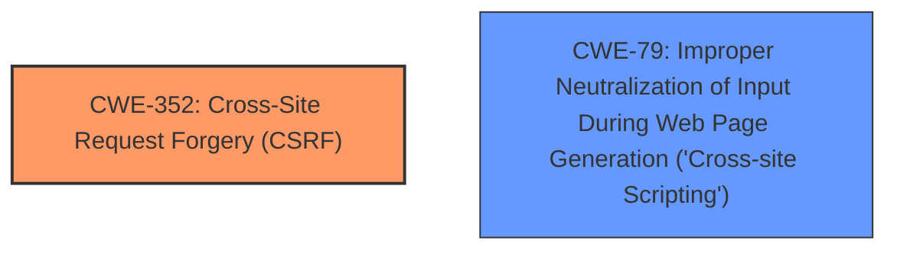

# Raw Analyzer Response for CVE-2025-32556

# Summary
| CWE ID | CWE Name | Confidence | CWE Abstraction Level | CWE Vulnerability Mapping Label | CWE-Vulnerability Mapping Notes |
|---|---|---|---|---|---|
| CWE-352 | Cross-Site Request Forgery (CSRF) | 0.9 | Compound | Allowed | Primary CWE |
| CWE-79 | Improper Neutralization of Input During Web Page Generation ('Cross-site Scripting') | 0.9 | Base | Allowed | Secondary Candidate |

## Evidence and Confidence

*   **Confidence Score:** 0.9
*   **Evidence Strength:** HIGH

## Relationship Analysis
The primary relationship considered was the direct identification of both Cross-Site Request Forgery (CSRF) and Cross-site Scripting (XSS) in the vulnerability description. The retriever results also supported this. CWE-352 is a compound weakness, representing a combination of factors, and is used because the description explicitly mentions CSRF. CWE-79 is included as a separate vulnerability because it's explicitly mentioned and is a Base level CWE.

## Vulnerability Chain
The vulnerability chain starts with the presence of **Cross-Site Request Forgery** and **Cross-site Scripting** vulnerabilities in the Simple Post Meta Manager plugin.

1.  **Root Cause:** The **weakness** is **Cross-Site Request Forgery (CSRF)** which allows an attacker to induce a user to perform actions they did not intend to perform.
2.  **Secondary Weakness:** The **weakness** is also **Cross-site Scripting (XSS)** where the application does not properly neutralize input during web page generation.

## Summary of Analysis
The analysis is based on the provided vulnerability description and the supporting CVE reference links content summary. The description clearly states the presence of both Cross-Site Request Forgery (CSRF) and Cross-site Scripting (XSS) vulnerabilities.

Evidence: "Cross-Site Request Forgery (CSRF) vulnerability in Sandor Kovacs Simple Post Meta Manager allows Reflected XSS."

The retriever results strongly support the inclusion of CWE-79, and CWE-352.

CWE-352 is selected as the primary CWE because the report explicitly mentions CSRF. CWE-79 is included because the report explicitly mentions XSS.

CWE-89, CWE-918, CWE-601, CWE-434, CWE-1275, CWE-1004, CWE-80, and CWE-472 were considered but not selected. They were not selected because the vulnerability description explicitly mentions only Cross-Site Request Forgery (CSRF) and Cross-site Scripting (XSS).

Relevant CWE Information:

# Enhanced Context (25 CWEs)
The following CWEs were identified as potentially relevant to this vulnerability:

## CWE-352: Cross-Site Request Forgery (CSRF)
**Abstraction Level**: Compound
**Similarity Score**: 0.74
**Source**: dense

**Description**:
The web application does not, or can not, sufficiently verify whether a well-formed, valid, consistent request was intentionally provided by the user who submitted the request.

**Mapping Guidance**:
- Usage: Allowed
- Rationale: This is a well-known Composite of multiple weaknesses that must all occur simultaneously, although it is attack-oriented in nature.

**Explanation:** This CWE is directly relevant as the vulnerability description explicitly mentions CSRF.

## CWE-79: Improper Neutralization of Input During Web Page Generation ('Cross-site Scripting')
**Abstraction Level**: Base
**Similarity Score**: 0.72
**Source**: dense

**Description**:
The product does not neutralize or incorrectly neutralizes user-controllable input before it is placed in output that is used as a web page that is served to other users.

**Mapping Guidance**:
- Usage: Allowed
- Rationale: This CWE entry is at the Base level of abstraction, which is a preferred level of abstraction for mapping to the root causes of vulnerabilities.

**Explanation:** This CWE is directly relevant as the vulnerability description explicitly mentions XSS.

## CWE-80: Improper Neutralization of Script-Related HTML Tags in a Web Page (Basic XSS)
**Abstraction Level**: Variant
**Similarity Score**: 0.72
**Source**: dense

**Description**:
The product receives input from an upstream component, but it does not neutralize or incorrectly neutralizes special characters such as "<", ">", and "&" that could be interpreted as web-scripting elements when they are sent to a downstream component that processes web pages.

**Mapping Guidance**:
- Usage: Allowed
- Rationale: This CWE entry is at the Variant level of abstraction, which is a preferred level of abstraction for mapping to the root causes of vulnerabilities.

**Explanation:** CWE-80 is a variant of CWE-79 and could be considered. Since the XSS is described as reflected, this could be a good option. However, I chose to stick with the broader CWE-79 since the description does not explicitly state that the XSS is "Basic".

## CWE-89: Improper Neutralization of Special Elements used in an SQL Command ('SQL Injection')
**Abstraction Level**: Base
**Similarity Score**: 772.73
**Source**: sparse

**Description**:
The product constructs all or part of an SQL command using externally-influenced input from an upstream component, but it does not neutralize or incorrectly neutralizes special elements that could modify the intended SQL command when it is sent to a downstream component. Without sufficient removal or quoting of SQL syntax in user-controllable inputs, the generated SQL query can cause those inputs to be interpreted as SQL instead of ordinary user data.

**Mapping Guidance**:
- Usage: Allowed
- Rationale: This CWE entry is at the Base level of abstraction, which is a preferred level of abstraction for mapping to the root causes of vulnerabilities.

**Explanation:** This CWE is not directly mentioned in the vulnerability description.

## CWE-918: Server-Side Request Forgery (SSRF)
**Abstraction Level**: Base
**Similarity Score**: 745.74
**Source**: sparse

**Description**:
The web server receives a URL or similar request from an upstream component and retrieves the contents of this URL, but it does not sufficiently ensure that the request is being sent to the expected destination.

**Mapping Guidance**:
- Usage: Allowed
- Rationale: This CWE entry is at the Base level of abstraction, which is a preferred level of abstraction for mapping to the root causes of vulnerabilities.

**Explanation:** This CWE is not directly mentioned in the vulnerability description.

## CWE-601: URL Redirection to Untrusted Site ('Open Redirect')
**Abstraction Level**: Base
**Similarity Score**: 740.89
**Source**: sparse

**Description**:
The web application accepts a user-controlled input that specifies a link to an external site, and uses that link in a redirect.

**Mapping Guidance**:
- Usage: Allowed
- Rationale: This CWE entry is at the Base level of abstraction, which is a preferred level of abstraction for mapping to the root causes of vulnerabilities.

**Explanation:** This CWE is not directly mentioned in the vulnerability description.

## CWE-434: Unrestricted Upload of File with Dangerous Type
**Abstraction Level**: Base
**Similarity Score**: 2.61
**Source**: graph

**Description**:
The product allows the upload or transfer of dangerous file types that are automatically processed within its environment.

**Mapping Guidance**:
- Usage: Allowed
- Rationale: This CWE entry is at the Base level of abstraction, which is a preferred level of abstraction for mapping to the root causes of vulnerabilities.

**Explanation:** This CWE is not directly mentioned in the vulnerability description.

## CWE-1275: Sensitive Cookie with Improper SameSite Attribute
**Abstraction Level**: variant
**Similarity Score**: 3.24
**Source**: graph

**Description**:
CWE-1275: Sensitive Cookie with Improper SameSite Attribute

**Mapping Guidance**:
- Usage: Allowed
- Rationale: This CWE entry is at the Variant level of abstraction, which is a preferred level of abstraction for mapping to the root causes of vulnerabilities.

**Explanation:** This CWE is not directly mentioned in the vulnerability description.

## CWE-472: External Control of Assumed-Immutable Web Parameter
**Abstraction Level**: Base
**Similarity Score**: 2.13
**Source**: graph

**Description**:
The web application does not sufficiently verify inputs that are assumed to be immutable but are actually externally controllable, such as hidden form fields.

**Mapping Guidance**:
- Usage: Allowed
- Rationale: This CWE entry is at the Base level of abstraction, which is a preferred level of abstraction for mapping to the root causes of vulnerabilities.

**Explanation:** This CWE is not directly mentioned in the vulnerability description.

**Final Conclusion:**
CWE-352 and CWE-7