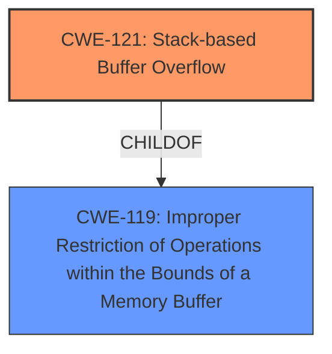

# Raw Analyzer Response for CVE-2025-3259

# Summary
| CWE ID | CWE Name | Confidence | CWE Abstraction Level | CWE Vulnerability Mapping Label | CWE-Vulnerability Mapping Notes |
|---|---|---|---|---|---|
| CWE-121 | Stack-based Buffer Overflow | 1.0 | Variant | Allowed | Primary CWE. The vulnerability description explicitly mentions a stack-based buffer overflow. |

## Evidence and Confidence

*   **Confidence Score:** 1.0
*   **Evidence Strength:** HIGH

## Relationship Analysis
The primary identified CWE is CWE-121 (Stack-based Buffer Overflow), which is a variant of CWE-119 (Improper Restriction of Operations within the Bounds of a Memory Buffer). This parent-child relationship indicates that CWE-121 is a more specific instance of a memory buffer issue.

## Vulnerability Chain
The vulnerability chain consists of a single, directly identified weakness. The **stack-based buffer overflow** (CWE-121) is both the root cause and the primary vulnerability. The manipulation of the `devName` argument leads directly to this overflow.

## Summary of Analysis
The vulnerability description clearly indicates a **stack-based buffer overflow** vulnerability. The phrase "**stack-based buffer overflow**" directly matches the definition and characteristics of CWE-121. This CWE is a variant, which is the preferred level of abstraction. The evidence is strong and explicit, leading to a high confidence score.
The analysis relies heavily on the vulnerability description, specifically the phrase "**stack-based buffer overflow**". The "Retriever Results" list CWE-121 as a strong candidate.

Relevant CWE Information:

# Enhanced Context (25 CWEs)
The following CWEs were identified as potentially relevant to this vulnerability:

## CWE-121: Stack-based Buffer Overflow
**Abstraction Level**: Variant
**Similarity Score**: 0.75
**Source**: dense

**Description**:
A stack-based buffer overflow condition is a condition where the buffer being overwritten is allocated on the stack (i.e., is a local variable or, rarely, a parameter to a function).

**Mapping Guidance**:
- Usage: Allowed
- Rationale: This CWE entry is at the Variant level of abstraction, which is a preferred level of abstraction for mapping to the root causes of vulnerabilities.