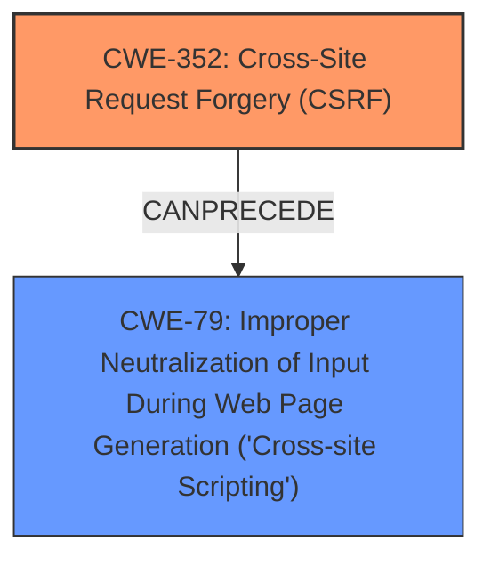

# Analysis for CVE-2025-32612

# Summary
| CWE ID | CWE Name | Confidence | CWE Abstraction Level | CWE Vulnerability Mapping Label | CWE-Vulnerability Mapping Notes |
|---|---|---|---|---|---|
| CWE-352 | Cross-Site Request Forgery (CSRF) | 0.9 | Compound | Primary | Allowed |
| CWE-79 | Improper Neutralization of Input During Web Page Generation ('Cross-site Scripting') | 0.7 | Base | Secondary | Allowed |

## Evidence and Confidence

*   **Confidence Score:** 0.8
*   **Evidence Strength:** MEDIUM

## Relationship Analysis
The primary weakness is **CWE-352 [Cross-Site Request Forgery (CSRF)]**, which can lead to other vulnerabilities if successfully exploited. In this case, the **CSRF** vulnerability can be used to inject **XSS** payloads, leading to **CWE-79 [Improper Neutralization of Input During Web Page Generation ('Cross-site Scripting')]**. The relationship is that a successful **CSRF** attack can *precede* an **XSS** vulnerability.

## Vulnerability Chain
The vulnerability chain starts with the **CWE-352 [Cross-Site Request Forgery (CSRF)]** vulnerability. An attacker can trick a user into making unintended requests, which, in this case, leads to stored **XSS** (**CWE-79 [Improper Neutralization of Input During Web Page Generation ('Cross-site Scripting')]**).

*   **Root Cause:** **CWE-352 [Cross-Site Request Forgery (CSRF)]**
*   **Weakness:** **CWE-79 [Improper Neutralization of Input During Web Page Generation ('Cross-site Scripting')]**

## Summary of Analysis
The primary vulnerability is **CWE-352 [Cross-Site Request Forgery (CSRF)]**, as highlighted in the "Vulnerability Description Key Phrases" and "CVE Reference Links Content Summary": "The vulnerability is a **Cross-Site Request Forgery (CSRF)**." The description also mentions that the **CSRF** vulnerability leads to Stored **XSS**, hence including **CWE-79 [Improper Neutralization of Input During Web Page Generation ('Cross-site Scripting')]** as a secondary vulnerability.

The retriever results also listed **CWE-79 [Improper Neutralization of Input During Web Page Generation ('Cross-site Scripting')]** and **CWE-352 [Cross-Site Request Forgery (CSRF)]** as top candidates, further validating the selection.

The abstraction level for **CWE-352 [Cross-Site Request Forgery (CSRF)]** is Compound. The abstraction level for **CWE-79 [Improper Neutralization of Input During Web Page Generation ('Cross-site Scripting')]** is Base.

Other CWEs were considered but were not selected because they did not directly represent the vulnerability as described. For example, **CWE-89 [Improper Neutralization of Special Elements used in an SQL Command ('SQL Injection')]**, **CWE-601 [URL Redirection to Untrusted Site ('Open Redirect')]**, and **CWE-918 [Server-Side Request Forgery (SSRF)]** were not relevant to the vulnerability description.