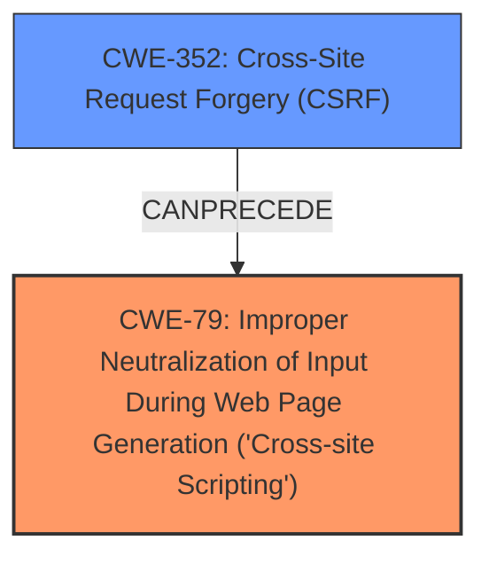

# Analysis Report for CVE-2025-32617

# Vulnerability Analysis Report: CVE-2025-32617

## Description

Cross-Site Request Forgery (CSRF) vulnerability in Ydesignservices Multiple Location Google Map allows Stored **XSS**. This issue affects Multiple Location Google Map from n/a through 1.1.

## Vulnerability Description Key Phrases

- **Weakness:** ['cross-site request forgery', 'XSS']
- **Impact:** stored cross-site scripting
- **Product:** Ydesignservices Multiple Location Google Map
- **Version:** n/a through 1.1

## Analysis (with Relationship Data)

# Summary
| CWE ID  | CWE Name  | Confidence | CWE Abstraction Level | CWE Vulnerability Mapping Label | CWE-Vulnerability Mapping Notes |
| ------------- | ------------- | ------------- | ------------- | ------------- | ------------- |
| CWE-79 | Improper Neutralization of Input During Web Page Generation ('Cross-site Scripting') | 1.0 | Base | Primary | Allowed |
| CWE-352 | Cross-Site Request Forgery (CSRF) | 0.9 | Compound | Secondary | Allowed |

## Evidence and Confidence

*   **Confidence Score:** 0.95
*   **Evidence Strength:** HIGH

## Relationship Analysis
The primary relationship influencing the selection is the standard weakness chain where **CWE-352: Cross-Site Request Forgery (CSRF)** can lead to **CWE-79: Improper Neutralization of Input During Web Page Generation ('Cross-site Scripting')**, in this case, Stored XSS. The chosen CWEs are at the Base and Compound level for optimal specificity.



## Vulnerability Chain
The vulnerability chain starts with **CWE-352: Cross-Site Request Forgery (CSRF)**, where the application **does not sufficiently verify** the origin of the request. This allows an attacker to potentially inject malicious input, which is then **improperly neutralized** by the application, leading to **CWE-79: Improper Neutralization of Input During Web Page Generation ('Cross-site Scripting')**, resulting in stored XSS.

## Summary of Analysis
The vulnerability description clearly indicates a Cross-Site Request Forgery (CSRF) vulnerability leading to Stored Cross-Site Scripting (XSS).

The presence of **"cross-site request forgery"** directly points to **CWE-352: Cross-Site Request Forgery (CSRF)**. The description mentions that the "Multiple Location Google Map allows Stored **XSS**" which is a clear indicator of **CWE-79: Improper Neutralization of Input During Web Page Generation ('Cross-site Scripting')**.

I considered other CWEs, particularly those related to injection and input validation, but these were less directly relevant than CWE-79 and CWE-352. For example, CWE-89 (SQL Injection) was considered due to its presence in the retriever results, but it does not fit the specific vulnerability described.

The chosen CWEs are at the appropriate level of specificity, with CWE-79 being a Base-level CWE and CWE-352 being a Compound-level CWE. This provides a detailed and accurate representation of the vulnerability.


## CWE Relationship Analysis

Current CWEs represent these abstraction levels: .


### Vulnerability Chain Analysis

**Chain starting from CWE-352:**
- 352 (Cross-Site Request Forgery (CSRF)) - ROOT


**Chain starting from CWE-79:**
- 79 (Improper Neutralization of Input During Web Page Generation ('Cross-site Scripting')) - ROOT


### CWE Relationship Diagram

```mermaid
graph TD
    classDef primary fill:#f96,stroke:#333,stroke-width:2px
    classDef secondary fill:#69f,stroke:#333
    classDef tertiary fill:#9e9,stroke:#333
```


*Report generated on 2025-07-14 19:47:34*
