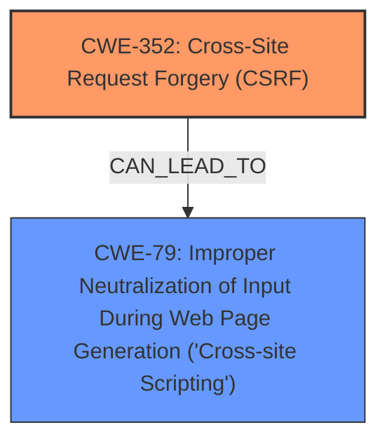

# Raw Analyzer Response for CVE-2025-32619

# Summary
| CWE ID | CWE Name | Confidence | CWE Abstraction Level | CWE Vulnerability Mapping Label | CWE-Vulnerability Mapping Notes |
|---|---|---|---|---|---|
| CWE-352 | Cross-Site Request Forgery (CSRF) | 0.9 | Compound | Primary | Allowed |
| CWE-79 | Improper Neutralization of Input During Web Page Generation ('Cross-site Scripting') | 0.9 | Base | Secondary | Allowed |

## Evidence and Confidence

*   **Confidence Score:** 0.9
*   **Evidence Strength:** HIGH

## Relationship Analysis
The primary weakness is CWE-352 Cross-Site Request Forgery (CSRF). The vulnerability description mentions that the CSRF vulnerability allows Stored XSS (CWE-79). Therefore, CWE-79 is a secondary weakness that arises due to the CSRF vulnerability. Both CWE-352 and CWE-79 are weaknesses related to web application security and involve improper handling of user input or requests. There are no direct parent-child relationships between CWE-352 and CWE-79.

## Vulnerability Chain
The vulnerability chain starts with **Cross-Site Request Forgery (CSRF)** (CWE-352). Due to the CSRF vulnerability, an attacker can inject malicious scripts. The application fails to neutralize this malicious input, leading to Stored XSS (CWE-79).

CWE-352 (Root Cause) -> CWE-79 (Impact)

## Summary of Analysis
The vulnerability description clearly states a "Cross-Site Request Forgery (CSRF)" vulnerability exists. The CVE Reference Links Content Summary confirms this by stating "Root cause of vulnerability: Cross-Site Request Forgery (CSRF). The vulnerability allows a malicious actor to force higher privileged users to execute unwanted actions." The description also mentions that the CSRF vulnerability allows "Stored XSS".

CWE-352 (Cross-Site Request Forgery) is a compound weakness, and CWE-79 (Improper Neutralization of Input During Web Page Generation ('Cross-site Scripting')) is a base weakness. Both are at appropriate levels of specificity.

I am choosing CWE-352 and CWE-79 based on the evidence provided in the vulnerability description and the CVE Reference Links Content Summary. The retriever results also support these choices, with CWE-352 and CWE-79 having high scores.

**CWE Considerations:**

*   **CWE-352:** The vulnerability is explicitly identified as a CSRF. The CWE definition matches the description.
*   **CWE-79:** The vulnerability description states that the CSRF allows Stored XSS. The CWE definition matches the description.
*   **CWE-89:** While SQL Injection is a common web vulnerability, there's no mention of SQL databases or queries in the provided text. So, it is not appropriate.
*   **CWE-601:** URL Redirection is not mentioned in the vulnerability, so it is not appropriate.
*   **CWE-425:** Direct Request ('Forced Browsing') is similar to CSRF, but CSRF is a more precise description of the **weakness**, so it is not appropriate.
*   **CWE-116:** Improper Encoding or Escaping of Output is related to XSS, but CWE-79 is a more direct match, so it is not appropriate.