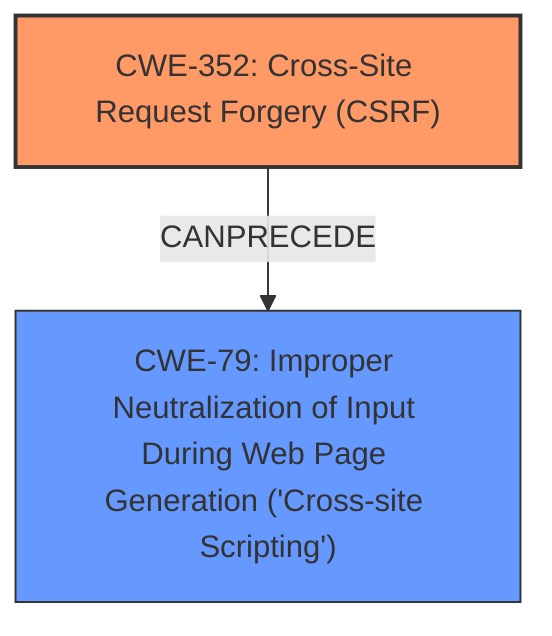

# Analysis Report for CVE-2025-32623

# Vulnerability Analysis Report: CVE-2025-32623

## Description

Cross-Site Request Forgery (CSRF) vulnerability in plainware PlainInventory allows Stored XSS. This issue affects PlainInventory from n/a through 3.1.9.

## Vulnerability Description Key Phrases

- **Weakness:** Stored XSS, cross-site scripting
- **Product:** plainware PlainInventory
- **Version:** n/a through 3.1.9

## Analysis (with Relationship Data)

# Summary
| CWE ID | CWE Name | Confidence | CWE Abstraction Level | CWE Vulnerability Mapping Label | CWE-Vulnerability Mapping Notes |
|---|---|---|---|---|---|
| CWE-352 | Cross-Site Request Forgery (CSRF) | 0.9 | Compound | Primary | Allowed |
| CWE-79 | Improper Neutralization of Input During Web Page Generation ('Cross-site Scripting') | 0.9 | Base | Secondary | Allowed |

## Evidence and Confidence

*   **Confidence Score:** 0.9
*   **Evidence Strength:** HIGH

## Relationship Analysis
The primary weakness is **CWE-352 [Cross-Site Request Forgery (CSRF)]**, which allows for the execution of unwanted actions. This can lead to **CWE-79 [Improper Neutralization of Input During Web Page Generation ('Cross-site Scripting')]**, where the attacker injects malicious scripts. **CWE-79 [Improper Neutralization of Input During Web Page Generation ('Cross-site Scripting')]** is a consequence of the **CWE-352 [Cross-Site Request Forgery (CSRF)]** in this particular case, as the attacker leverages the CSRF to inject the script. The abstraction levels are appropriate, with **CWE-352 [Cross-Site Request Forgery (CSRF)]** being a Compound weakness and **CWE-79 [Improper Neutralization of Input During Web Page Generation ('Cross-site Scripting')]** being a Base weakness, which is preferred.



## Vulnerability Chain
The vulnerability chain starts with **CWE-352 [Cross-Site Request Forgery (CSRF)]**, where the application **does not sufficiently verify** the request's origin. This **allows** an attacker to **force** a user to perform actions, leading to a **CWE-79 [Improper Neutralization of Input During Web Page Generation ('Cross-site Scripting')]** attack where **malicious scripts are injected due to improper neutralization of input**.
  - **CWE-352 [Cross-Site Request Forgery (CSRF)]**: Root cause, the application's **failure to validate request origin**.
  - **CWE-79 [Improper Neutralization of Input During Web Page Generation ('Cross-site Scripting')]**: Impact, **malicious script injection** due to the successful CSRF attack.

## Summary of Analysis
The initial assessment, based on the description and reference links, points to a Cross-Site Request Forgery (CSRF) vulnerability that allows for Stored XSS. The evidence strongly supports this, specifically the description highlighting the **CSRF** vulnerability leading to **Stored XSS, cross-site scripting**.

The graph relationships helped solidify the understanding that **CWE-352 [Cross-Site Request Forgery (CSRF)]** can precede **CWE-79 [Improper Neutralization of Input During Web Page Generation ('Cross-site Scripting')]**. This is because a successful CSRF attack can be leveraged to inject malicious scripts if the application **fails to properly neutralize input**.

The selected CWEs are at the optimal level of specificity. **CWE-352 [Cross-Site Request Forgery (CSRF)]** accurately captures the root cause. **CWE-79 [Improper Neutralization of Input During Web Page Generation ('Cross-site Scripting')]** accurately captures the weakness i.e. the impact of the CSRF.

The content **relates** to CVE-2025-32623 indicating the Cross-Site Request Forgery (**CSRF**) vulnerability in the PlainInventory WordPress plugin. A malicious actor can force higher privileged users to execute unwanted actions.

**CWE Considerations:**

*   **CWE-352 [Cross-Site Request Forgery (CSRF)]**: The primary vulnerability. The application does not properly verify the origin of requests, making it susceptible to CSRF attacks.
*   **CWE-79 [Improper Neutralization of Input During Web Page Generation ('Cross-site Scripting')]**: This is a direct result of the **CSRF vulnerability**, where the attacker can inject malicious scripts into the application due to **improper input neutralization**.

**CWEs Not Used and Why:**

*   CWE-89 [Improper Neutralization of Special Elements used in an SQL Command ('SQL Injection')]: While SQL injection is a common web vulnerability, there is no evidence in the description or reference links to suggest that SQL injection is involved in this particular case.
*   CWE-434 [Unrestricted Upload of File with Dangerous Type]: There is no mention of file uploads in the vulnerability description, so this CWE is not applicable.
*   CWE-425 [Direct Request ('Forced Browsing')]: While related to access control, it doesn't fully capture the nature of the CSRF vulnerability, where a valid user is tricked into performing unwanted actions.
*   CWE-472 [External Control of Assumed-Immutable Web Parameter]: This CWE focuses on the modification of assumed-immutable parameters, which isn't the core issue in this CSRF vulnerability.
*   CWE-116 [Improper Encoding or Escaping of Output]: While related to output handling, **CWE-79 [Improper Neutralization of Input During Web Page Generation ('Cross-site Scripting')]** is a more direct and specific match for the stored XSS aspect of the vulnerability.


## CWE Relationship Analysis

Current CWEs represent these abstraction levels: .


### Vulnerability Chain Analysis

**Chain starting from CWE-89:**
- 89 (Improper Neutralization of Special Elements used in an SQL Command ('SQL Injection')) - ROOT


**Chain starting from CWE-116:**
- 116 (Improper Encoding or Escaping of Output) - ROOT


### CWE Relationship Diagram

```mermaid
graph TD
    classDef primary fill:#f96,stroke:#333,stroke-width:2px
    classDef secondary fill:#69f,stroke:#333
    classDef tertiary fill:#9e9,stroke:#333
```


*Report generated on 2025-07-14 19:48:09*
