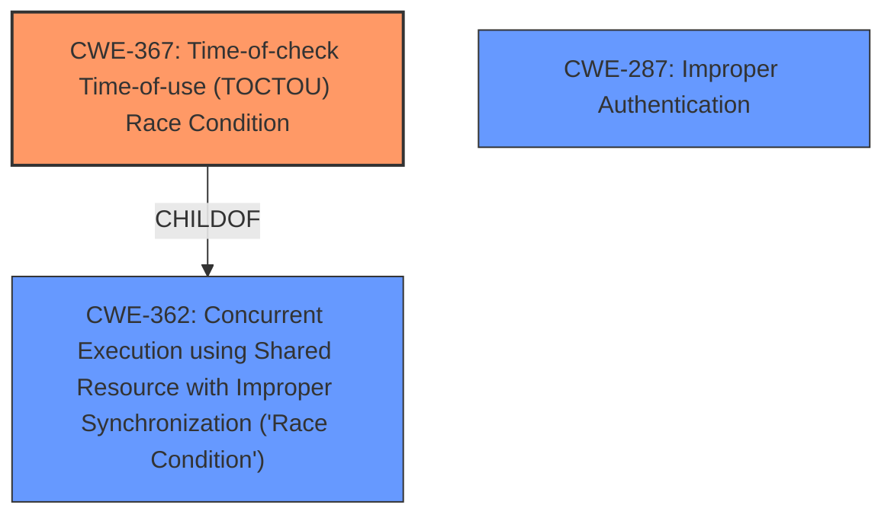

# Analysis Report for CVE-2025-32784

# Vulnerability Analysis Report: CVE-2025-32784

## Description

conda-forge-webservices is the web app deployed to run conda-forge admin commands and linting. In versions prior to 2025.4.10, a **race condition** vulnerability has been identified in the conda-forge-webservices component used within the shared build infrastructure. This vulnerability, categorized as a **Time-of-Check to Time-of-Use (TOCTOU) issue**, can be exploited to introduce unauthorized modifications to build artifacts stored in the cf-staging Anaconda channel. Exploitation may result in the unauthorized publication of malicious artifacts to the production conda-forge channel. The core vulnerability results from the absence of atomicity between the hash validation and the artifact copy operation. This gap allows an attacker, with access to the cf-staging token, to overwrite the validated artifact with a malicious version immediately after hash verification, but before the copy action is executed. As the cf-staging channel permits artifact overwrites, such an operation can be carried out using the anaconda upload --force command. This vulnerability is fixed in 2025.4.10.

## Vulnerability Description Key Phrases

- **Rootcause:** ['Time-of-Check to Time-of-Use (TOCTOU) issue', 'race condition']
- **Impact:** ['unauthorized publication of malicious artifacts', 'unauthorized modifications to build artifacts']
- **Attacker:** attacker with access to cf-staging token
- **Product:** conda-forge-webservices
- **Version:** prior to 2025.4.10
- **Component:** conda-forge-webservices component used within the shared build infrastructure

## Analysis (with Relationship Data)

# Summary
| CWE ID    | CWE Name                                                                    | Confidence | CWE Abstraction Level | CWE Vulnerability Mapping Label | CWE-Vulnerability Mapping Notes |
| --------- | --------------------------------------------------------------------------- | ---------- | --------------------- | ------------------------------- | ------------------------------- |
| CWE-367   | Time-of-check Time-of-use (TOCTOU) Race Condition                           | 1          | Base                  | Primary CWE                     | Allowed                         |
| CWE-287   | Improper Authentication                                                     | 0.6        | Base                  | Secondary Candidate             | Allowed                         |
| CWE-362   | Concurrent Execution using Shared Resource with Improper Synchronization ('Race Condition') | 0.5        | Class                 | Secondary Candidate             | Allowed-with-Review                         |

## Evidence and Confidence

*   **Confidence Score:** 0.8
*   **Evidence Strength:** HIGH

## Relationship Analysis
The primary CWE is CWE-367, which describes the core **TOCTOU race condition**. CWE-362, a class-level CWE, is a broader category of race conditions, and CWE-367 is a specific type. CWE-287 is included as a secondary consideration because the attacker needs to authenticate to the `cf-staging` token to perform the overwrite.



## Vulnerability Chain
The vulnerability chain starts with a **race condition** (CWE-367) where the state of the artifact can change between the time it's checked and the time it's used. The attacker authenticates (or has already authenticated) to the cf-staging channel (potentially CWE-287 if authentication is **improper**). Then, the attacker overwrites the validated artifact with a malicious version. This leads to the **unauthorized publication of malicious artifacts**.

## Summary of Analysis
The primary weakness is the **TOCTOU race condition** (CWE-367). The vulnerability description explicitly mentions this issue: "This vulnerability, categorized as a **Time-of-Check to Time-of-Use (TOCTOU) issue**...". The description further explains, "The core vulnerability results from the absence of atomicity between the hash validation and the artifact copy operation." This directly aligns with the definition of CWE-367: "The product checks the state of a resource before using that resource, but the resource's state can change between the check and the use in a way that invalidates the results of the check."

CWE-362 is a broader Class-level CWE, and while applicable, CWE-367 is a more specific Base-level CWE and thus a better fit. CWE-287 is considered because the attacker needs to authenticate, but the description doesn't explicitly state that the authentication mechanism is **improper**, so it's a secondary consideration.

I am confident in this assessment because the vulnerability description directly points to a **TOCTOU race condition**, and CWE-367 accurately captures this weakness.

Relevant CWE Information:

# Enhanced Context (25 CWEs)
The following CWEs were identified as potentially relevant to this vulnerability:

## CWE-367: Time-of-check Time-of-use (TOCTOU) Race Condition
**Abstraction Level**: Base
**Similarity Score**: 0.75
**Source**: dense

**Description**:
The product checks the state of a resource before using that resource, but the resource's state can change between the check and the use in a way that invalidates the results of the check. This can cause the product to perform invalid actions when the resource is in an unexpected state.

**Mapping Guidance**:
- Usage: Allowed
- Rationale: This CWE entry is at the Base level of abstraction, which is a preferred level of abstraction for mapping to the root causes of vulnerabilities.


## CWE-668: Exposure of Resource to Wrong Sphere
**Abstraction Level**: Class
**Similarity Score**: 0.75
**Source**: dense

**Description**:
The product exposes a resource to the wrong control sphere, providing unintended actors with inappropriate access to the resource.

**Mapping Guidance**:
- Usage: Discouraged
- Rationale: CWE-668 is high-level and is often misused as a catch-all when lower-level CWE IDs might be applicable. It is sometimes used for low-information vulnerability reports [REF-1287]. It is a level-1 Class (i.e., a child of a Pillar). It is not useful for trend analysis.


## CWE-208: Observable Timing Discrepancy
**Abstraction Level**: Base
**Similarity Score**: 0.74
**Source**: dense

**Description**:
Two separate operations in a product require different amounts of time to complete, in a way that is observable to an actor and reveals security-relevant information about the state of the product, such as whether a particular operation was successful or not.

**Mapping Guidance**:
- Usage: Allowed
- Rationale: This CWE entry is at the Base level of abstraction, which is a preferred level of abstraction for mapping to the root causes of vulnerabilities.


## CWE-497: Exposure of Sensitive System Information to an Unauthorized Control Sphere
**Abstraction Level**: Base
**Similarity Score**: 0.74
**Source**: dense

**Description**:
The product does not properly prevent sensitive system-level information from being accessed by unauthorized actors who do not have the same level of access to the underlying system as the product does.

**Mapping Guidance**:
- Usage: Allowed
- Rationale: This CWE entry is at the Base level of abstraction, which is a preferred level of abstraction for mapping to the root causes of vulnerabilities.


## CWE-303: Incorrect Implementation of Authentication Algorithm
**Abstraction Level**: Base
**Similarity Score**: 0.74
**Source**: dense

**Description**:
The requirements for the product dictate the use of an established authentication algorithm, but the implementation of the algorithm is incorrect.

**Mapping Guidance**:
- Usage: Allowed
- Rationale: This CWE entry is at the Base level of abstraction, which is a preferred level of abstraction for mapping to the root causes of vulnerabilities.


## CWE-703: Improper Check or Handling of Exceptional Conditions
**Abstraction Level**: Pillar
**Similarity Score**: 0.73
**Source**: dense

**Description**:
The product does not properly anticipate or handle exceptional conditions that rarely occur during normal operation of the product.

**Mapping Guidance**:
- Usage: Discouraged
- Rationale: This CWE entry is extremely high-level, a Pillar.


## CWE-345: Insufficient Verification of Data Authenticity
**Abstraction Level**: Class
**Similarity Score**: 0.73
**Source**: dense

**Description**:
The product does not sufficiently verify the origin or authenticity of data, in a way that causes it to accept invalid data.

**Mapping Guidance**:
- Usage: Discouraged
- Rationale: This CWE entry is a level-1 Class (i.e., a child of a Pillar). It might have lower-level children that would be more appropriate


## CWE-696: Incorrect Behavior Order
**Abstraction Level**: Class
**Similarity Score**: 0.73
**Source**: dense

**Description**:
The product performs multiple related behaviors, but the behaviors are performed in the wrong order in ways which may produce resultant weaknesses.

**Mapping Guidance**:
- Usage: Allowed-with-Review
- Rationale: This CWE entry is a Class and might have Base-level children that would be more appropriate


## CWE-923: Improper Restriction of Communication Channel to Intended Endpoints
**Abstraction Level**: Class
**Similarity Score**: 0.73
**Source**: dense

**Description**:
The product establishes a communication channel to (or from) an endpoint for privileged or protected operations, but it does not properly ensure that it is communicating with the correct endpoint.

**Mapping Guidance**:
- Usage: Allowed-with-Review
- Rationale: This CWE entry is a Class and might have Base-level children that would be more appropriate


## CWE-1391: Use of Weak Credentials
**Abstraction Level**: Class
**Similarity Score**: 0.73
**Source**: dense

**Description**:
The product uses weak credentials (such as a default key or hard-coded password) that can be calculated, derived, reused, or guessed by an attacker.

**Mapping Guidance**:
- Usage: Allowed-with-Review
- Rationale: This CWE entry is a Class and might have Base-level children that would be more appropriate


## CWE-367: Time-of-check


## CWE Relationship Analysis

Current CWEs represent these abstraction levels: .


### Vulnerability Chain Analysis

**Chain starting from CWE-1391:**
- 1391 (Use of Weak Credentials) - ROOT


**Chain starting from CWE-345:**
- 345 (Insufficient Verification of Data Authenticity) - ROOT


### CWE Relationship Diagram

```mermaid
graph TD
    classDef primary fill:#f96,stroke:#333,stroke-width:2px
    classDef secondary fill:#69f,stroke:#333
    classDef tertiary fill:#9e9,stroke:#333
```


*Report generated on 2025-07-14 19:56:44*
