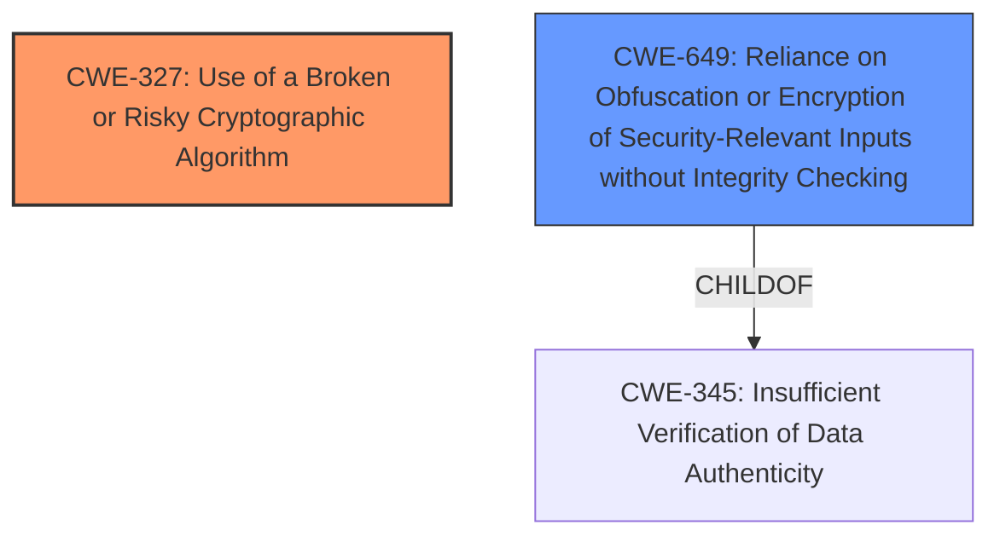

# Analysis Report for CVE-2025-32882

# Vulnerability Analysis Report: CVE-2025-32882

## Description

An issue was discovered on goTenna v1 devices with app 5.5.3 and firmware 0.25.5. The app uses a **custom implementation of encryption without any additional integrity checking mechanisms**. This leaves messages malleable to an attacker that can access the message.

## Vulnerability Description Key Phrases

- **Weakness:** custom implementation of encryption without any additional integrity checking mechanisms
- **Impact:** messages malleable
- **Attacker:** attacker
- **Product:** goTenna
- **Version:** v1 devices with app 5.5.3 and firmware 0.25.5

## Analysis (with Relationship Data)

# Summary
| CWE ID | CWE Name | Confidence | CWE Abstraction Level | CWE Vulnerability Mapping Label | CWE-Vulnerability Mapping Notes |
|---|---|---|---|---|---|
| CWE-327 | Use of a Broken or Risky Cryptographic Algorithm | 0.8 | Class | Primary | Allowed-with-Review |
| CWE-649 | Reliance on Obfuscation or Encryption of Security-Relevant Inputs without Integrity Checking | 0.7 | Base | Secondary | Allowed |

## Evidence and Confidence

*   **Confidence Score:** 0.75
*   **Evidence Strength:** MEDIUM

## Relationship Analysis
The primary CWE is CWE-327 [CWE-327: Use of a Broken or Risky Cryptographic Algorithm], a Class-level CWE. A more specific Base or Variant level CWE might be more appropriate, but the provided information does not indicate which specific algorithm is broken or risky. CWE-649 [CWE-649: Reliance on Obfuscation or Encryption of Security-Relevant Inputs without Integrity Checking] is a ChildOf CWE-345 [CWE-345: Insufficient Verification of Data Authenticity].



## Vulnerability Chain
The vulnerability chain starts with the **use of a custom encryption implementation without integrity checks** (CWE-327 [CWE-327: Use of a Broken or Risky Cryptographic Algorithm]), leading to malleable messages (CWE-649 [CWE-649: Reliance on Obfuscation or Encryption of Security-Relevant Inputs without Integrity Checking]).

## Summary of Analysis
The vulnerability description indicates a **custom implementation of encryption without any additional integrity checking mechanisms**. This directly aligns with CWE-327 [CWE-327: Use of a Broken or Risky Cryptographic Algorithm], "Use of a Broken or Risky Cryptographic Algorithm," as it suggests a non-standard or potentially flawed cryptographic approach. The absence of integrity checks also points to CWE-649 [CWE-649: Reliance on Obfuscation or Encryption of Security-Relevant Inputs without Integrity Checking], "Reliance on Obfuscation or Encryption of Security-Relevant Inputs without Integrity Checking," because without integrity checks, the system relies solely on the encryption which can be bypassed or manipulated if the cryptographic implementation is weak.

I considered other CWEs from the Retriever Results, but they were less directly relevant:

*   CWE-807 [CWE-807: Reliance on Untrusted Inputs in a Security Decision]: While untrusted inputs are always a concern, the primary issue here is the cryptographic implementation itself.
*   CWE-319 [CWE-319: Cleartext Transmission of Sensitive Information]: This is not the case since encryption is present, albeit weak.
*   CWE-321 [CWE-321: Use of Hard-coded Cryptographic Key]: There's no information about hard-coded keys.

The selection of CWE-327 [CWE-327: Use of a Broken or Risky Cryptographic Algorithm] as the primary CWE is based on the explicit mention of a **custom implementation of encryption**, which implies a deviation from established and vetted cryptographic algorithms. This increases the risk of using a **broken or risky algorithm**. The addition of CWE-649 [CWE-649: Reliance on Obfuscation or Encryption of Security-Relevant Inputs without Integrity Checking] highlights the fact that the vulnerability also stems from the **lack of integrity checking** which means that the system is relying on broken cryptography.

Relevant CWE Information:

# Enhanced Context (25 CWEs)
The following CWEs were identified as potentially relevant to this vulnerability:

## CWE-319: Cleartext Transmission of Sensitive Information
**Abstraction Level**: Base
**Similarity Score**: 0.70
**Source**: dense

**Description**:
The product transmits sensitive or security-critical data in cleartext in a communication channel that can be sniffed by unauthorized actors.

**Mapping Guidance**:
- Usage: Allowed
- Rationale: This CWE entry is at the Base level of abstraction, which is a preferred level of abstraction for mapping to the root causes of vulnerabilities.


## CWE-941: Incorrectly Specified Destination in a Communication Channel
**Abstraction Level**: Base
**Similarity Score**: 0.70
**Source**: dense

**Description**:
The product creates a communication channel to initiate an outgoing request to an actor, but it does not correctly specify the intended destination for that actor.

**Mapping Guidance**:
- Usage: Allowed
- Rationale: This CWE entry is at the Base level of abstraction, which is a preferred level of abstraction for mapping to the root causes of vulnerabilities.


## CWE-203: Observable Discrepancy
**Abstraction Level**: Base
**Similarity Score**: 0.70
**Source**: dense

**Description**:
The product behaves differently or sends different responses under different circumstances in a way that is observable to an unauthorized actor, which exposes security-relevant information about the state of the product, such as whether a particular operation was successful or not.

**Mapping Guidance**:
- Usage: Allowed
- Rationale: This CWE entry is at the Base level of abstraction, which is a preferred level of abstraction for mapping to the root causes of vulnerabilities.


## CWE-330: Use of Insufficiently Random Values
**Abstraction Level**: Class
**Similarity Score**: 0.68
**Source**: dense

**Description**:
The product uses insufficiently random numbers or values in a security context that depends on unpredictable numbers.

**Mapping Guidance**:
- Usage: Discouraged
- Rationale: This CWE entry is a level-1 Class (i.e., a child of a Pillar). It might have lower-level children that would be more appropriate


## CWE-345: Insufficient Verification of Data Authenticity
**Abstraction Level**: Class
**Similarity Score**: 0.68
**Source**: dense

**Description**:
The product does not sufficiently verify the origin or authenticity of data, in a way that causes it to accept invalid data.

**Mapping Guidance**:
- Usage: Discouraged
- Rationale: This CWE entry is a level-1 Class (i.e., a child of a Pillar). It might have lower-level children that would be more appropriate


## CWE-1391: Use of Weak Credentials
**Abstraction Level**: Class
**Similarity Score**: 0.68
**Source**: dense

**Description**:
The product uses weak credentials (such as a default key or hard-coded password) that can be calculated, derived, reused, or guessed by an attacker.

**Mapping Guidance**:
- Usage: Allowed-with-Review
- Rationale: This CWE entry is a Class and might have Base-level children that would be more appropriate


## CWE-303: Incorrect Implementation of Authentication Algorithm
**Abstraction Level**: Base
**Similarity Score**: 0.67
**Source**: dense

**Description**:
The requirements for the product dictate the use of an established authentication algorithm, but the implementation of the algorithm is incorrect.

**Mapping Guidance**:
- Usage: Allowed
- Rationale: This CWE entry is at the Base level of abstraction, which is a preferred level of abstraction for mapping to the root causes of vulnerabilities.


## CWE-1240: Use of a Cryptographic Primitive with a Risky Implementation
**Abstraction Level**: Base
**Similarity Score**: 0.67
**Source**: dense

**Description**:
To fulfill the need for a cryptographic primitive, the product implements a cryptographic algorithm using a non-standard, unproven, or disallowed/non-compliant cryptographic implementation.

**Mapping Guidance**:
- Usage: Allowed
- Rationale: This CWE entry is at the Base level of abstraction, which is a preferred level of abstraction for mapping to the root causes of vulnerabilities.


## CWE-754: Improper Check for Unusual or Exceptional Conditions
**Abstraction Level**: Class
**Similarity Score**: 0.67
**Source**: dense

**Description**:
The product does not check or incorrectly checks for unusual or exceptional conditions that are not expected to occur frequently during day to day operation of the product.

**Mapping Guidance**:
- Usage: Allowed-with-Review
- Rationale: This CWE entry is a Class and might have Base-level children that would be more appropriate


## CWE-346: Origin Validation Error
**Abstraction Level**: Class
**Similarity Score**: 0.67
**Source**: dense

**Description**:
The product does not properly verify that the source of data or communication is valid.

**Mapping Guidance**:
- Usage: Allowed-with-Review
- Rationale: This CWE entry is a Class and might have Base-level children that would


## CWE Relationship Analysis

Current CWEs represent these abstraction levels: .


### Vulnerability Chain Analysis

**Chain starting from CWE-321:**
- 321 (Use of Hard-coded Cryptographic Key) - ROOT


**Chain starting from CWE-649:**
- 649 (Reliance on Obfuscation or Encryption of Security-Relevant Inputs without Integrity Checking) - ROOT


### CWE Relationship Diagram

```mermaid
graph TD
    classDef primary fill:#f96,stroke:#333,stroke-width:2px
    classDef secondary fill:#69f,stroke:#333
    classDef tertiary fill:#9e9,stroke:#333
```


*Report generated on 2025-07-14 20:00:27*
