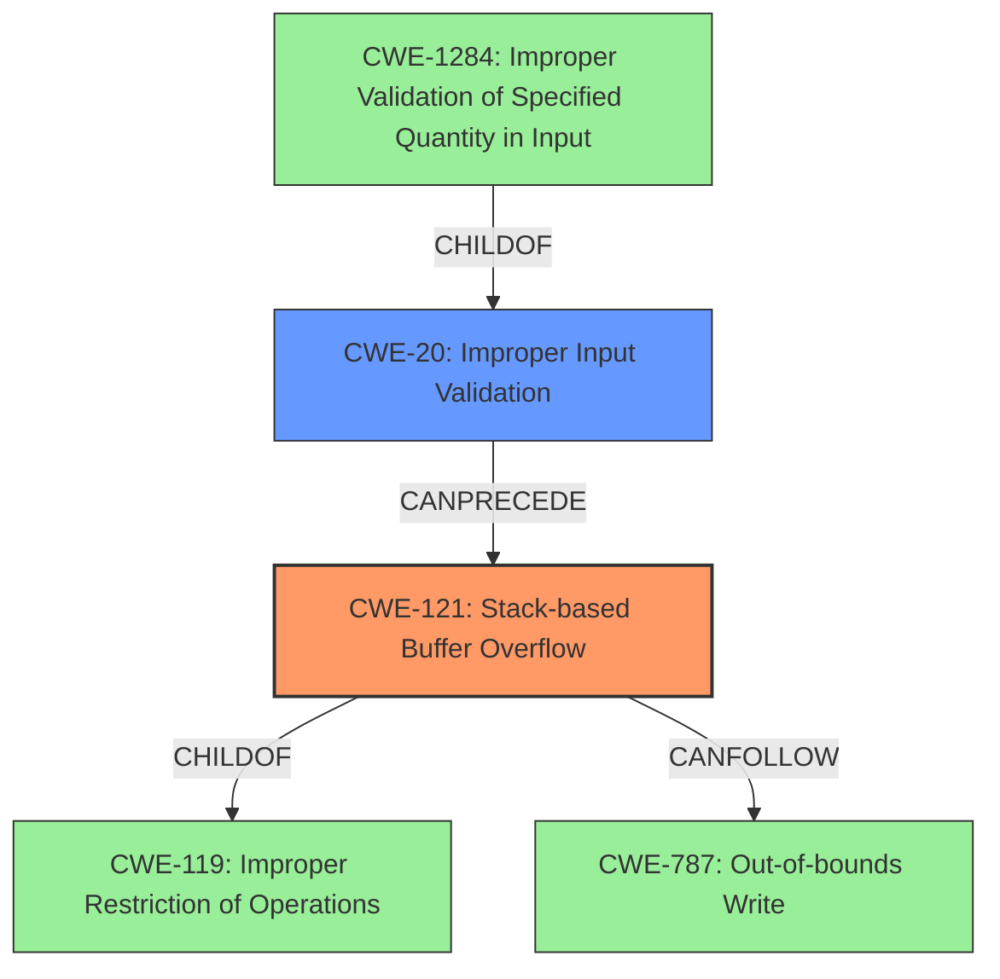

# Enhanced Analysis for CVE-2025-3289

# Summary
| CWE ID | CWE Name | Confidence | CWE Abstraction Level | CWE Vulnerability Mapping Label | CWE-Vulnerability Mapping Notes |
|---|---|---|---|---|---|
| CWE-121 | Stack-based Buffer Overflow | 1.0 | Variant | Primary | Allowed |
| CWE-20 | Improper Input Validation | 0.8 | Class | Secondary | Discouraged |

## Evidence and Confidence

*   **Confidence Score:** 0.9
*   **Evidence Strength:** HIGH

## Relationship Analysis
The primary CWE is CWE-121, a variant of buffer overflow that specifically occurs on the stack. This is a child of the more general CWE-119 (Improper Restriction of Operations within the Bounds of a Memory Buffer), which is a class-level CWE. The root cause, **improper validation of user-supplied data**, maps to CWE-20 (Improper Input Validation), which can precede a buffer overflow. CWE-20 is a parent of CWE-1284. The overflow can lead to out-of-bounds write (CWE-787).



## Vulnerability Chain
The vulnerability chain starts with **improper validation of user-supplied data** (CWE-20), which allows a malicious DOE file to be opened. This leads to a **stack-based memory buffer overflow** (CWE-121), which then allows for arbitrary code execution and information disclosure. The overflow could result in an out-of-bounds write (CWE-787).

## Summary of Analysis
The vulnerability is primarily a **stack-based memory buffer overflow** (CWE-121) caused by **improper validation of user-supplied data** (CWE-20).

The evidence includes:
*   "The flaw is result of **improper validation of user-supplied data**"
*   "**stack-based memory buffer overflow**"
*   "To exploit the vulnerability a legitimate user must open a malicious DOE file"

CWE-121 is chosen as the primary CWE because the vulnerability description explicitly mentions a stack-based buffer overflow, which aligns directly with the CWE's definition. The root cause is **improper validation of user-supplied data** (CWE-20) since the vulnerability is caused by a failure to properly validate the data within the malicious DOE file.

Other CWEs considered but not selected:
*   CWE-119 (Improper Restriction of Operations within the Bounds of a Memory Buffer): This is a more general class of weakness, and CWE-121 provides a more specific description of the vulnerability.
*   CWE-787 (Out-of-bounds Write): This is a potential consequence of the buffer overflow but not the root cause.
*   CWE-1284 (Improper Validation of Specified Quantity in Input): While input validation is part of the issue, it is not specifically about the *quantity* but more about the content and format of the data, making CWE-20 a better fit.
*   CWE-190 (Integer Overflow or Wraparound): Not directly related to the described buffer overflow.


## CWE Relationship Analysis

Current CWEs represent these abstraction levels: .


### Vulnerability Chain Analysis

**Chain starting from CWE-121:**
- 121 (Stack-based Buffer Overflow) - ROOT


**Chain starting from CWE-1284:**
- 1284 (Improper Validation of Specified Quantity in Input) - ROOT


### CWE Relationship Diagram

```mermaid
graph TD
    classDef primary fill:#f96,stroke:#333,stroke-width:2px
    classDef secondary fill:#69f,stroke:#333
    classDef tertiary fill:#9e9,stroke:#333
```