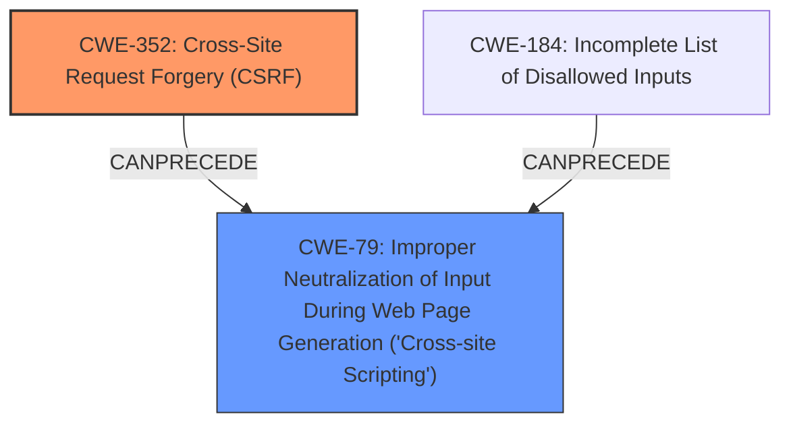

# Raw Analyzer Response for CVE-2025-32922

# Summary
| CWE ID | CWE Name | Confidence | CWE Abstraction Level | CWE Vulnerability Mapping Label | CWE-Vulnerability Mapping Notes |
|---|---|---|---|---|---|
| CWE-352 | Cross-Site Request Forgery (CSRF) | 0.9 | Compound | Primary | Allowed |
| CWE-79 | Improper Neutralization of Input During Web Page Generation ('Cross-site Scripting') | 0.8 | Base | Secondary | Allowed |

## Evidence and Confidence

*   **Confidence Score:** 0.85
*   **Evidence Strength:** MEDIUM

## Relationship Analysis
The primary relationship identified is that **CWE-352** (Cross-Site Request Forgery (CSRF)) can often lead to other vulnerabilities like **CWE-79** (Improper Neutralization of Input During Web Page Generation ('Cross-site Scripting')). The CSRF vulnerability allows an attacker to induce unintended actions by an authenticated user. If these actions involve injecting malicious scripts, it can lead to XSS. **CWE-352** is a Compound CWE. **CWE-79** is a Base CWE.

## Vulnerability Chain
The vulnerability chain starts with **CWE-352** (Cross-Site Request Forgery (CSRF)), which allows an attacker to perform actions on behalf of an authenticated user. If the application **does not properly** neutralize input, this can lead to **CWE-79** (Improper Neutralization of Input During Web Page Generation ('Cross-site Scripting')).

## Summary of Analysis
The vulnerability description clearly states a **Cross-Site Request Forgery** (CSRF) vulnerability leading to Stored **XSS**.

The evidence from the "CVE Reference Links Content Summary" section supports the presence of **CWE-352** (Cross-Site Request Forgery (CSRF)): "Root cause of vulnerability: The content does not detail the root cause, only stating it is a CSRF vulnerability" and the impact is "Allows a malicious actor to force higher privileged users to execute unwanted actions under their current authentication."

The description also indicates that this leads to Stored **XSS**, suggesting **CWE-79** (Improper Neutralization of Input During Web Page Generation ('Cross-site Scripting')).

The Retriever Results also lists **CWE-79** (Improper Neutralization of Input During Web Page Generation ('Cross-site Scripting')) and **CWE-352** (Cross-Site Request Forgery (CSRF)) as top candidates.

I am classifying **CWE-352** (Cross-Site Request Forgery (CSRF)) as the primary CWE because it is the initial **rootcause** that enables the subsequent **XSS** vulnerability. **CWE-79** (Improper Neutralization of Input During Web Page Generation ('Cross-site Scripting')) is a secondary weakness that results from the **CSRF** and the application's failure to properly handle user input.

Relevant CWE Information:

# Enhanced Context (25 CWEs)
The following CWEs were identified as potentially relevant to this vulnerability:

## CWE-352: Cross-Site Request Forgery (CSRF)
**Abstraction Level**: Compound
**Similarity Score**: 0.76
**Source**: dense

**Description**:
The web application does not, or can not, sufficiently verify whether a well-formed, valid, consistent request was intentionally provided by the user who submitted the request.

**Mapping Guidance**:
- Usage: Allowed
- Rationale: This is a well-known Composite of multiple weaknesses that must all occur simultaneously, although it is attack-oriented in nature.

## CWE-79: Improper Neutralization of Input During Web Page Generation ('Cross-site Scripting')
**Abstraction Level**: Base
**Similarity Score**: 0.73
**Source**: dense

**Description**:
The product does not neutralize or incorrectly neutralizes user-controllable input before it is placed in output that is used as a web page that is served to other users.

**Mapping Guidance**:
- Usage: Allowed
- Rationale: This CWE entry is at the Base level of abstraction, which is a preferred level of abstraction for mapping to the root causes of vulnerabilities.

## CWE-80: Improper Neutralization of Script-Related HTML Tags in a Web Page (Basic XSS)
**Abstraction Level**: Variant
**Similarity Score**: 0.73
**Source**: dense

**Description**:
The product receives input from an upstream component, but it does not neutralize or incorrectly neutralizes special characters such as "<", ">", and "&" that could be interpreted as web-scripting elements when they are sent to a downstream component that processes web pages.

**Mapping Guidance**:
- Usage: Allowed
- Rationale: This CWE entry is at the Variant level of abstraction, which is a preferred level of abstraction for mapping to the root causes of vulnerabilities.

## CWE-89: Improper Neutralization of Special Elements used in an SQL Command ('SQL Injection')
**Abstraction Level**: Base
**Similarity Score**: 0.73
**Source**: dense

**Description**:
The product constructs all or part of an SQL command using externally-influenced input from an upstream component, but it does not neutralize or incorrectly neutralizes special elements that could modify the intended SQL command when it is sent to a downstream component. Without sufficient removal or quoting of SQL syntax in user-controllable inputs, the generated SQL query can cause those inputs to be interpreted as SQL instead of ordinary user data.

**Mapping Guidance**:
- Usage: Allowed
- Rationale: This CWE entry is at the Base level of abstraction, which is a preferred level of abstraction for mapping to the root causes of vulnerabilities.

## CWE-918: Server-Side Request Forgery (SSRF)
**Abstraction Level**: Base
**Similarity Score**: 0.73
**Source**: dense

**Description**:
The web server receives a URL or similar request from an upstream component and retrieves the contents of this URL, but it does not sufficiently ensure that the request is being sent to the expected destination.

**Mapping Guidance**:
- Usage: Allowed
- Rationale: This CWE entry is at the Base level of abstraction, which is a preferred level of abstraction for mapping to the root causes of vulnerabilities.

## CWE-425: Direct Request ('Forced Browsing')
**Abstraction Level**: Base
**Similarity Score**: 0.73
**Source**: dense

**Description**:
The web application does not adequately enforce appropriate authorization on all restricted URLs, scripts, or files.

**Mapping Guidance**:
- Usage: Allowed
- Rationale: This CWE entry is at the Base level of abstraction, which is a preferred level of abstraction for mapping to the root causes of vulnerabilities.

## CWE-472: External Control of Assumed-Immutable Web Parameter
**Abstraction Level**: Base
**Similarity Score**: 0.73
**Source**: dense

**Description**:
The web application does not sufficiently verify inputs that are assumed to be immutable but are actually externally controllable, such as hidden form fields.

**Mapping Guidance**:
- Usage: Allowed
- Rationale: This CWE entry is at the Base level of abstraction, which is a preferred level of abstraction for mapping to the root causes of vulnerabilities.