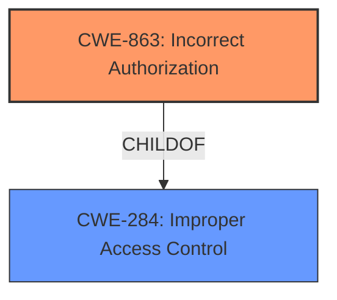

# Analysis Report for CVE-2025-32982

# Vulnerability Analysis Report: CVE-2025-32982

## Description

NETSCOUT nGeniusONE before 6.4.0 b2350 has a **Broken Authorization Schema** for the report module.

## Vulnerability Description Key Phrases

- **Rootcause:** Broken Authorization Schema
- **Product:** NETSCOUT nGeniusONE
- **Version:** before 6.4.0 b2350
- **Component:** report module

## Analysis (with Relationship Data)

# Summary
| CWE ID | CWE Name | Confidence | CWE Abstraction Level | CWE Vulnerability Mapping Label | CWE-Vulnerability Mapping Notes |
|---|---|---|---|---|---|
| CWE-863 | Incorrect Authorization | 0.9 | Class | Primary | Allowed-with-Review |
| CWE-284 | Improper Access Control | 0.5 | Pillar | Secondary | Discouraged |

## Evidence and Confidence

*   **Confidence Score:** 0.7
*   **Evidence Strength:** MEDIUM

## Relationship Analysis
The primary CWE selected is CWE-863 (Incorrect Authorization), which is a Class-level CWE. It is related to CWE-284 (Improper Access Control) at a higher level (Pillar). CWE-863 is a more specific form of access control issue where the authorization check is performed but is done incorrectly. If evidence was insufficient, CWE-284 could be the choice.



## Vulnerability Chain
The vulnerability chain starts with a **Broken Authorization Schema** (CWE-863), which leads to unauthorized access to the report module in NETSCOUT nGeniusONE.

## Summary of Analysis
The vulnerability description clearly states a **"Broken Authorization Schema"** as the root cause, making CWE-863 (Incorrect Authorization) the most appropriate primary CWE. The retriever results also list CWE-863 as a potential candidate. While CWE-284 (Improper Access Control) is also a candidate, it's a higher-level category. Given the explicit mention of the authorization schema being broken, CWE-863 is more specific and thus preferred. The provided guidance also supports this decision: "CWE-863: Incorrect Authorization – the application checks authorization, but does it incorrectly (e.g., flawed logic)."

The evidence is directly from the "Vulnerability Description Key Phrases" which states **rootcause:** **Broken Authorization Schema** and "CVE Reference Links Content Summary" which says "Broken Authorization Schema CVE-2025-32982".

# Enhanced Context (25 CWEs)
The following CWEs were identified as potentially relevant to this vulnerability:

## CWE-668: Exposure of Resource to Wrong Sphere
**Rationale for not selecting:** This CWE is too general. The vulnerability description is more specific about the authorization component being broken.

## CWE-41: Improper Resolution of Path Equivalence
**Rationale for not selecting:** This CWE is irrelevant to the vulnerability description as it concerns file system path equivalence, which is not mentioned in the description.

## CWE-807: Reliance on Untrusted Inputs in a Security Decision
**Rationale for not selecting:** This CWE is not directly applicable. The core issue is a broken authorization schema, not necessarily reliance on untrusted inputs.

## CWE-280: Improper Handling of Insufficient Permissions or Privileges
**Rationale for not selecting:** This CWE is about the product not handling insufficient privileges correctly. It is not the case here.

## CWE-639: Authorization Bypass Through User-Controlled Key
**Rationale for not selecting:** This CWE is more specific, involving user-controlled keys. The current description doesn't provide that level of detail.

## CWE-345: Insufficient Verification of Data Authenticity
**Rationale for not selecting:** This CWE is about data authenticity, not authorization.

## CWE-497: Exposure of Sensitive System Information to an Unauthorized Control Sphere
**Rationale for not selecting:** This CWE is about exposing sensitive system information. The vulnerability here is about a broken authorization schema for the report module, not the exposure of sensitive information.

## CWE-267: Privilege Defined With Unsafe Actions
**Rationale for not selecting:** This CWE is about unsafe actions being linked to privileges, which is not the core issue described.

## CWE-472: External Control of Assumed-Immutable Web Parameter
**Rationale for not selecting:** This CWE is specific to web parameters assumed to be immutable, which isn't mentioned in the vulnerability description.

## CWE-1390: Weak Authentication
**Rationale for not selecting:** The vulnerability description specifies an authorization issue, not authentication.

## CWE-863: Incorrect Authorization
**Technical Explanation:** The product performs an authorization check, but the logic or implementation is flawed, leading to unauthorized access. This aligns directly with the **"Broken Authorization Schema"** described in the vulnerability. The security implication is that unauthorized users can access the report module, potentially gaining access to sensitive data or functionality. This is the primary weakness.

## CWE-285: Improper Authorization
**Rationale for not selecting:** While related, CWE-285 is more general. CWE-863 is a better fit because the authorization exists but is incorrect.

## CWE-306: Missing Authentication for Critical Function
**Rationale for not selecting:** The vulnerability is about authorization, not authentication.

## CWE-287: Improper Authentication
**Rationale for not selecting:** The vulnerability is about authorization, not authentication.

## CWE-184: Incomplete List of Disallowed Inputs
**Rationale for not selecting:** This CWE is about disallowed inputs, not authorization issues.

## CWE-79: Improper Neutralization of Input During Web Page Generation ('Cross-site Scripting')
**Rationale for not selecting:** This CWE concerns cross-site scripting (XSS), which is unrelated to the described authorization issue.

## CWE-73: External Control of File Name or Path
**Rationale for not selecting:** This CWE is about file path manipulation, which is irrelevant to the authorization issue.

## CWE-942: Permissive Cross-domain Policy with Untrusted Domains
**Rationale for not selecting:** This CWE concerns cross-domain policies, which are not related to the authorization issue.

## CWE-306: Missing Authentication for Critical Function
**Rationale for not selecting:** This CWE is about missing authentication, not authorization.

## CWE-22: Improper Limitation of a Pathname to a Restricted Directory ('Path Traversal')
**Rationale for not selecting:** This CWE is about path traversal, not authorization.

## CWE-112: Missing XML Validation
**Rationale for not selecting:** This CWE is about missing XML validation, not authorization.

## CWE-41: Improper Resolution of Path Equivalence
**Rationale for not selecting:** This CWE is about path equivalence, which is unrelated to authorization.

## CWE-613: Insufficient Session Expiration
**Rationale for not selecting:** This CWE concerns session expiration, not authorization.

## CWE-434: Unrestricted Upload of File with Dangerous Type
**Rationale for not selecting:** This CWE is about file uploads, which is irrelevant to the authorization issue.


## CWE Relationship Analysis

Current CWEs represent these abstraction levels: .


### Vulnerability Chain Analysis

**Chain starting from CWE-345:**
- 345 (Insufficient Verification of Data Authenticity) - ROOT


**Chain starting from CWE-639:**
- 639 (Authorization Bypass Through User-Controlled Key) - ROOT


### CWE Relationship Diagram

```mermaid
graph TD
    classDef primary fill:#f96,stroke:#333,stroke-width:2px
    classDef secondary fill:#69f,stroke:#333
    classDef tertiary fill:#9e9,stroke:#333
```


*Report generated on 2025-07-14 20:06:56*
