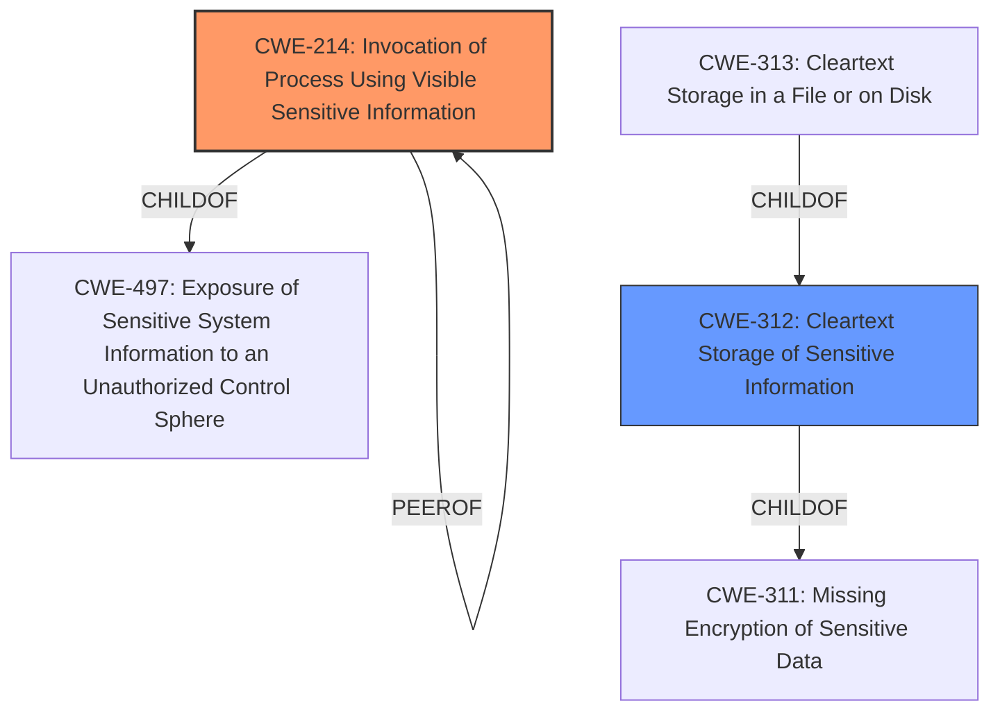

# Enhanced Analysis for CVE-2025-32987

# Summary
| CWE ID | CWE Name | Confidence | CWE Abstraction Level | CWE Vulnerability Mapping Label | CWE-Vulnerability Mapping Notes |
|---|---|---|---|---|---|
| CWE-214 | Invocation of Process Using Visible Sensitive Information | 1.0 | Base | Allowed | Primary CWE. The password is passed as a command line argument. |
| CWE-312 | Cleartext Storage of Sensitive Information | 0.7 | Base | Allowed | Secondary candidate. The password is being stored in cleartext, but the primary issue is how it is being used. |

## Evidence and Confidence

*   **Confidence Score:** 0.9
*   **Evidence Strength:** HIGH

## Relationship Analysis
The primary CWE is CWE-214, which has a parent CWE of CWE-497 (Exposure of Sensitive System Information to an Unauthorized Control Sphere). CWE-214 also has a peer relationship with itself, indicating that it can be both the cause and the result in some scenarios. It is a base level CWE. CWE-312 is a child of CWE-311 (Missing Encryption of Sensitive Data), and it has children like CWE-313 (Cleartext Storage in a File or on Disk). CWE-312 is a base level CWE.



## Vulnerability Chain
The vulnerability chain starts with the **cleartext password** being included in the command line, which leads to the **invocation of process using visible sensitive information** and finally the exposure of Arctera Enterprise Vault credentials.
  - Root Cause: **Cleartext password on command line**
  - Weakness: CWE-214 Invocation of Process Using Visible Sensitive Information
  - Impact: Exposure of Arctera Enterprise Vault credentials

## Summary of Analysis
The primary weakness is the exposure of the password via the command line. The vulnerability description key phrases call out the **cleartext password on command line** directly. The CVE Reference Links Content Summary also indicates the root cause is due to the execution of the `EVSearcher.bat` file, where the password is passed in plain text on the command line. The vulnerability present is CWE-214.

The retriever results list CWE-214 as the top candidate with a score of 0.155. It is a base level CWE, and the usage is ALLOWED. CWE-312 is also a candidate, but the primary issue is how the password is used. CWE-214 is a better fit.

CWE-311 was considered but not used because it is a class level CWE, and there are more specific children available.
CWE-319 was considered but not used because the sensitive information is not being transmitted, but rather stored and then used in a command line argument.
CWE-306 was considered but not used because authentication is present, but the password is exposed on the command line.
CWE-522 was considered but not used because it is a class level CWE.

CWE-214 is the best fit because it directly addresses the **invocation of process using visible sensitive information**.


## CWE Relationship Analysis

Current CWEs represent these abstraction levels: .


### Vulnerability Chain Analysis

**Chain starting from CWE-319:**
- 319 (Cleartext Transmission of Sensitive Information) - ROOT


**Chain starting from CWE-306:**
- 306 (Missing Authentication for Critical Function) - ROOT


### CWE Relationship Diagram

```mermaid
graph TD
    classDef primary fill:#f96,stroke:#333,stroke-width:2px
    classDef secondary fill:#69f,stroke:#333
    classDef tertiary fill:#9e9,stroke:#333
```