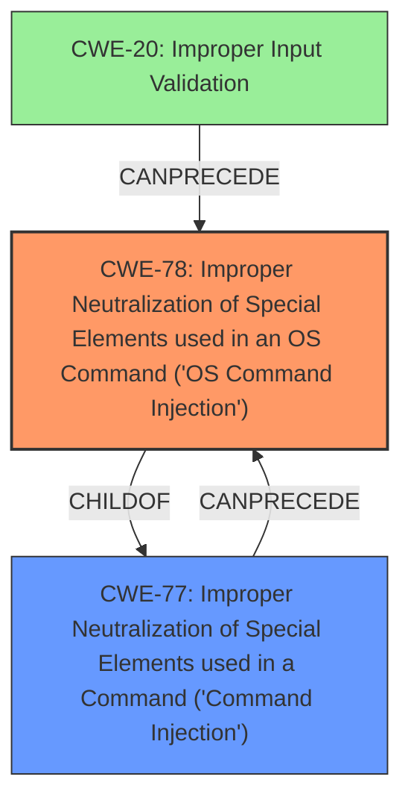

# Analysis for CVE-2025-33024

# Summary
| CWE ID | CWE Name | Confidence | CWE Abstraction Level | CWE Vulnerability Mapping Label | CWE-Vulnerability Mapping Notes |
|---|---|---|---|---|---|
| CWE-78 | Improper Neutralization of Special Elements used in an OS Command ('OS Command Injection') | 1.0 | Base | Primary CWE | Allowed |
| CWE-20 | Improper Input Validation | 0.7 | Class | Secondary Candidate | Discouraged |

## Evidence and Confidence

*   **Confidence Score:** 0.9
*   **Evidence Strength:** HIGH

## Relationship Analysis
The primary relationship that influenced the CWE selection was the parent-child relationship between CWE-77 (Improper Neutralization of Special Elements used in a Command ('Command Injection')) and CWE-78 (Improper Neutralization of Special Elements used in an OS Command ('OS Command Injection')). Since the vulnerability specifically involves OS commands, the more specific child, CWE-78, was chosen. CWE-20 (Improper Input Validation) was considered as a broader weakness, but the description clearly indicates a **command injection** vulnerability, making CWE-78 a more precise fit. The abstraction level of CWE-78 (Base) is also preferred over the Class level of CWE-77.

## Vulnerability Chain
The vulnerability chain starts with the **missing server-side input sanitation**, which leads to **improper neutralization of special elements** within the `tcpdump` command. This allows an authenticated remote attacker to inject arbitrary OS commands, resulting in arbitrary code execution with root privileges.

Missing Server-Side Input Sanitation --> Improper Neutralization of Special Elements in OS Command --> Command Injection --> Arbitrary Code Execution with Root Privileges

  - **Root Cause:** Missing Server-Side Input Sanitation
  - **Weakness:** Improper Neutralization of Special Elements in OS Command
  - **Impact:** Arbitrary Code Execution with Root Privileges

## Summary of Analysis
The initial analysis strongly pointed towards **command injection** due to the **missing server-side input sanitation**. The Retriever Results also favored CWE-77 and CWE-78. Given that the injection occurs in the context of OS commands, CWE-78 (Improper Neutralization of Special Elements used in an OS Command ('OS Command Injection')) was chosen as the primary CWE.

The vulnerability description explicitly states: "The tcpdump tool in the web interface of affected devices is vulnerable to **command injection** due to **missing server side input sanitation**." This, coupled with the CVSS scores and the ability to execute arbitrary code with root privileges, supports the selection of CWE-78.

The selection is based on solid evidence and aligns with the principle of selecting the most specific CWE possible. CWE-78 accurately captures the nature of the vulnerability, which is the improper neutralization of special elements used in an OS command, leading to command injection.

Relevant CWE Information:

# Enhanced Context (25 CWEs)

## CWE-78: Improper Neutralization of Special Elements used in an OS Command ('OS Command Injection')

**Abstraction Level**: base
**Similarity Score**: 4.33
**Source**: graph

**Description**:
CWE-78: Improper Neutralization of Special Elements used in an OS Command ('OS Command Injection')

**Mapping Guidance**:
- Usage: Allowed
- Rationale: This CWE entry is at the Base level of abstraction, which is a preferred level of abstraction for mapping to the root causes of vulnerabilities.

**Relationships**:
- CANFOLLOW -> CWE-184
- CANALSOBE -> CWE-88
- CHILDOF -> CWE-77
- CHILDOF -> CWE-77
- CHILDOF -> CWE-74