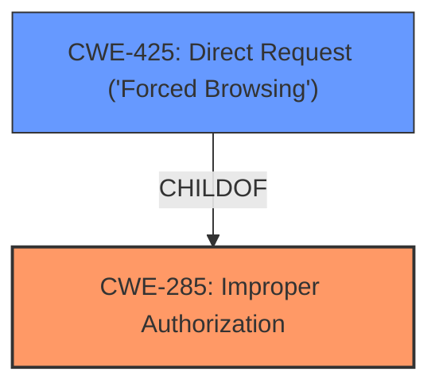

# Raw Analyzer Response for CVE-2025-3305

# Summary

| CWE ID | CWE Name | Confidence | CWE Abstraction Level | CWE Vulnerability Mapping Label | CWE-Vulnerability Mapping Notes |
|---|---|---|---|---|---|
| CWE-285 | Improper Authorization | 0.8 | Class | Primary | Allowed-with-Review |
| CWE-425 | Direct Request ('Forced Browsing') | 0.6 | Base | Secondary Candidate | Allowed |

## Evidence and Confidence

*   **Confidence Score:** 0.7
*   **Evidence Strength:** MEDIUM

## Relationship Analysis
The primary relationship influencing the CWE selection is the hierarchical relationship between CWE-285 (Improper Authorization) and its potential child CWEs, such as CWE-425 (Direct Request ('Forced Browsing')). While CWE-425 is more specific, the evidence supporting direct request is limited. Therefore, CWE-285 is chosen due to the explicit mention of "**improper access controls**".

## Vulnerability Chain
The vulnerability chain starts with the **improper access controls** in the `addInterceptors` function of `MvcConfig.java`, leading to potential unauthorized access to resources.

## Summary of Analysis
The initial assessment focused on identifying the root cause of the vulnerability. The vulnerability description explicitly states "**improper access controls**," which aligns with CWE-285 (Improper Authorization). While more specific CWEs exist, like CWE-425, the description doesn't provide enough detail to confidently select them. Therefore, CWE-285 is the most appropriate choice based on the available evidence.

The graph relationships support this decision, as CWE-285 is a parent to more specific authorization-related CWEs. The selection of CWE-285 is at a suitable level of specificity, given the limited information provided.

Relevant CWE Information:

# Enhanced Context (25 CWEs)
The following CWEs were identified as potentially relevant to this vulnerability:

## CWE-425: Direct Request ('Forced Browsing')
**Abstraction Level**: Base
**Similarity Score**: 0.77
**Source**: dense

**Description**:
The web application does not adequately enforce appropriate authorization on all restricted URLs, scripts, or files.

**Mapping Guidance**:
- Usage: Allowed
- Rationale: This CWE entry is at the Base level of abstraction, which is a preferred level of abstraction for mapping to the root causes of vulnerabilities.

## CWE-285: Improper Authorization
**Abstraction Level**: Class
**Similarity Score**: 0.318
**Source**: sparse

**Description**:
The software performs authorization for a security-critical task, but does not correctly perform the authorization.

## CWE Details

### CWE-285: Improper Authorization

**Technical Explanation:**
CWE-285 (Improper Authorization) occurs when software does not correctly perform authorization checks for security-critical tasks. This can lead to unauthorized access to sensitive data or functionality. In this case, the `addInterceptors` function in `MvcConfig.java` seems to have **improper access controls**, which could allow attackers to bypass intended authorization mechanisms.

**Security Implications:**
The security implications of CWE-285 include unauthorized access to data, modification of data, or execution of privileged operations.

**Parent-Child Relationships:**
CWE-285 is a class-level CWE, with potential child CWEs like CWE-425 (Direct Request ('Forced Browsing')) representing more specific scenarios.

**Mapping Guidance Analysis:**
CWE-285 is a Class and might have Base-level children that would be more appropriate.

### CWE-425: Direct Request ('Forced Browsing')

**Technical Explanation:**
CWE-425 (Direct Request ('Forced Browsing')) occurs when a web application does not adequately enforce authorization on restricted URLs, scripts, or files. An attacker can directly request these resources by guessing or manipulating their URLs, bypassing intended access controls.

**Security Implications:**
The security implications of CWE-425 include unauthorized access to sensitive information, execution of privileged functions, and potential compromise of the entire application.

**Parent-Child Relationships:**
CWE-425 is a child of CWE-285 (Improper Authorization), representing a specific type of authorization bypass.

**Mapping Guidance Analysis:**
CWE-425 is a Base level CWE, which is a preferred level of abstraction for mapping.

## Candidates Considered and Rejected

*   CWE-79, CWE-89, CWE-1336: These CWEs relate to injection vulnerabilities, which are not the primary issue described in the vulnerability description. The description focuses on authorization, not input handling.
*   CWE-94: This CWE relates to code injection, which is not directly indicated in the vulnerability description.
*   CWE-266: This CWE relates to incorrect privilege assignment. This is close, but the description is closer to authorization than privilege assignment.
*   CWE-73: This CWE relates to external control of file name or path. It is not related to the vulnerability description.