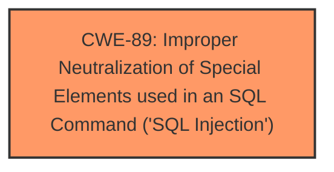

# Analysis for CVE-2025-3311

# Summary
| CWE ID | CWE Name | Confidence | CWE Abstraction Level | CWE Vulnerability Mapping Label | CWE-Vulnerability Mapping Notes |
|---|---|---|---|---|---|
| CWE-89 | Improper Neutralization of Special Elements used in an SQL Command ('SQL Injection') | 1.0 | Base | Allowed | Primary CWE. The vulnerability description clearly indicates SQL Injection. |

## Evidence and Confidence

*   **Confidence Score:** 1.0
*   **Evidence Strength:** HIGH

## Relationship Analysis
The primary relationship that influenced the decision was the direct match between the vulnerability description and the definition of CWE-89. Although other CWEs like CWE-74 (Injection) were considered, CWE-89 provides a more specific and accurate representation of the **SQL Injection** vulnerability. There are no applicable parent-child or chain relationships in this case, as the focus is on identifying the root cause.

## Vulnerability Chain
The vulnerability chain consists of a single point:

1.  **Root Cause:** **Improper Neutralization** of special elements in the `pagetitle` parameter, leading to **SQL Injection** (CWE-89).

There are no further links in the chain as the description focuses solely on the injection vulnerability itself.

## Summary of Analysis
The analysis is based heavily on the provided evidence, particularly the "Vulnerability Description Key Phrases" and "CVE Reference Links Content Summary" sections, both of which explicitly mention **SQL Injection**. The description states: "The manipulation of the argument pagetitle leads to **sql injection**" and "A SQL injection vulnerability was found in the '/admin/about-us.php' file of the 'Men Salon Management System' project. The reason for this issue is that attackers inject malicious code from the parameter 'pagetitle' and use it directly in SQL queries without the need for appropriate cleaning or validation."

The retriever results also strongly support CWE-89 as the primary candidate. The graph relationships were not significant in this case as the evidence points directly to a specific type of injection.

The selected CWE is at the optimal level of specificity because it directly addresses the identified weakness, which is **SQL Injection**. More generic CWEs like CWE-74 were considered but deemed less appropriate due to the availability of a more precise classification.

Relevant CWE Information:

# Enhanced Context (25 CWEs)
The following CWEs were identified as potentially relevant to this vulnerability:

## CWE-89: Improper Neutralization of Special Elements used in an SQL Command ('SQL Injection')
**Abstraction Level**: Base
**Similarity Score**: 0.79
**Source**: dense

**Description**:
The product constructs all or part of an SQL command using externally-influenced input from an upstream component, but it does not neutralize or incorrectly neutralizes special elements that could modify the intended SQL command when it is sent to a downstream component. Without sufficient removal or quoting of SQL syntax in user-controllable inputs, the generated SQL query can cause those inputs to be interpreted as SQL instead of ordinary user data.

**Mapping Guidance**:
- Usage: Allowed
- Rationale: This CWE entry is at the Base level of abstraction, which is a preferred level of abstraction for mapping to the root causes of vulnerabilities.

## CWE-89: Improper Neutralization of Special Elements used in an SQL Command ('SQL Injection')
**Abstraction Level**: Base
**Similarity Score**: 917.84
**Source**: sparse

**Description**:
The product constructs all or part of an SQL command using externally-influenced input from an upstream component, but it does not neutralize or incorrectly neutralizes special elements that could modify the intended SQL command when it is sent to a downstream component. Without sufficient removal or quoting of SQL syntax in user-controllable inputs, the generated SQL query can cause those inputs to be interpreted as SQL instead of ordinary user data.

**Mapping Guidance**:
- Usage: Allowed
- Rationale: This CWE entry is at the Base level of abstraction, which is a preferred level of abstraction for mapping to the root causes of vulnerabilities.

## CWE-74: Improper Neutralization of Special Elements in Output Used by a Downstream Component ('Injection')
**Abstraction Level**: Class
**Similarity Score**: 0.75
**Source**: dense

**Description**:
The product constructs all or part of a command, data structure, or record using externally-influenced input from an upstream component, but it does not neutralize or incorrectly neutralizes special elements that could modify how it is parsed or interpreted when it is sent to a downstream component.

**Mapping Guidance**:
- Usage: Discouraged
- Rationale: CWE-74 is high-level and often misused when lower-level weaknesses are more appropriate.

## CWE-74: Improper Neutralization of Special Elements in Output Used by a Downstream Component ('Injection')
**Abstraction Level**: Class
**Similarity Score**: 752.71
**Source**: sparse

**Description**:
The product constructs all or part of a command, data structure, or record using externally-influenced input from an upstream component, but it does not neutralize or incorrectly neutralizes special elements that could modify how it is parsed or interpreted when it is sent to a downstream component.

**Mapping Guidance**:
- Usage: Discouraged
- Rationale: CWE-74 is high-level and often misused when lower-level weaknesses are more appropriate.

CWE-74 was considered but rejected because it is a high-level "Class" CWE, and CWE-89 is a more specific "Base" CWE that directly describes the vulnerability. The mapping guidance for CWE-74 also discourages its use when lower-level weaknesses are more appropriate.