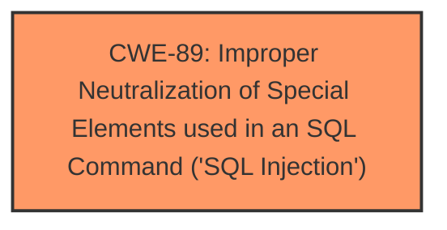

# Raw Analyzer Response for CVE-2025-3316

# Summary

| CWE ID | CWE Name | Confidence | CWE Abstraction Level | CWE Vulnerability Mapping Label | CWE-Vulnerability Mapping Notes |
|---|---|---|---|---|---|
| CWE-89 | Improper Neutralization of Special Elements used in an SQL Command ('SQL Injection') | 1.0 | Base | Allowed | Primary CWE |

## Evidence and Confidence

*   **Confidence Score:** 1.0
*   **Evidence Strength:** HIGH

## Relationship Analysis
The primary relationship impacting the decision is the direct match of the vulnerability to the definition of CWE-89. There are no apparent parent-child or chain relationships that would suggest a different or more specific CWE. The abstraction level of Base is appropriate for this root cause.

## Vulnerability Chain
The vulnerability chain is straightforward:
1.  **Root Cause:** **Improper Neutralization of Special Elements used in an SQL Command ('SQL Injection')** (CWE-89) due to lack of input validation and sanitization on the `searchdata` parameter.
2.  **Impact:** Unauthorized database access, sensitive data leakage, data tampering, system control, and service interruption.

## Summary of Analysis
The analysis is based on the provided vulnerability description, which explicitly states that the manipulation of the `searchdata` argument leads to **SQL Injection**. The CVE reference links confirm this by stating, "attackers inject malicious code from the parameter 'searchdata' and use it directly in SQL queries without the need for appropriate cleaning or validation."

The retriever results strongly support CWE-89 as the primary CWE, with a score of 1.0.

The CWE-89 is selected because it directly reflects the **weakness** described in the vulnerability: the product **does not neutralize** special elements in the SQL command. This aligns perfectly with the definition and examples provided for CWE-89. The evidence clearly supports this classification.

Other CWEs Considered:

*   CWE-79 (Improper Neutralization of Input During Web Page Generation ('Cross-site Scripting')): While the description involves input, it's specifically related to SQL commands, not web page generation.
*   CWE-74 (Improper Neutralization of Special Elements in Output Used by a Downstream Component ('Injection')): This is a more general injection CWE and is discouraged when more specific CWEs like CWE-89 are applicable.
*   CWE-434 (Unrestricted Upload of File with Dangerous Type): This is not relevant as the vulnerability is related to SQL injection, not file uploads.
*   CWE-1336 (Improper Neutralization of Special Elements Used in a Template Engine): This is not relevant since a template engine is not mentioned.
*   CWE-116 (Improper Encoding or Escaping of Output): This is a more general weakness that does not specifically address SQL injection.
*   CWE-425 (Direct Request ('Forced Browsing')): This is about authorization bypass, which is not the primary issue here.

The selected CWE is at the optimal level of specificity because it directly describes the **SQL Injection** vulnerability present in the application.