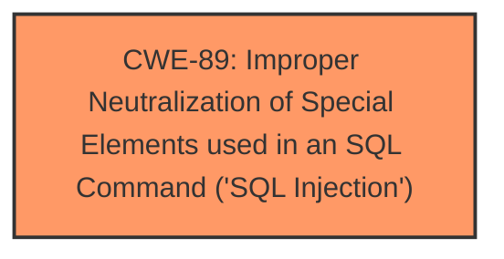

# Analysis Report for CVE-2025-3323

# Vulnerability Analysis Report: CVE-2025-3323

## Description

A vulnerability classified as critical was found in godcheese/code-projects Nimrod 0.8. Affected by this vulnerability is an unknown functionality of the file ViewMenuCategoryRestController.java. The manipulation of the argument Name leads to **sql injection**. The attack can be launched remotely. The exploit has been disclosed to the public and may be used.

## Vulnerability Description Key Phrases

- **Weakness:** sql injection
- **Product:** godcheese/code-projects Nimrod
- **Version:** 0.8
- **Component:** ViewMenuCategoryRestController.java

## Analysis (with Relationship Data)

# Summary
| CWE ID | CWE Name | Confidence | CWE Abstraction Level | CWE Vulnerability Mapping Label | CWE-Vulnerability Mapping Notes |
|---|---|---|---|---|---|
| CWE-89 | Improper Neutralization of Special Elements used in an SQL Command ('SQL Injection') | 1.0 | Base | Allowed | Primary CWE |

## Evidence and Confidence

*   **Confidence Score:** 1.0
*   **Evidence Strength:** HIGH

## Relationship Analysis
The primary CWE identified is CWE-89. There are no parent-child or chain relationships that significantly impact the decision, as the description clearly indicates an SQL Injection vulnerability.



## Vulnerability Chain
The vulnerability chain consists of a single step: **Improper Neutralization of Special Elements used in an SQL Command** leading directly to SQL Injection.

## Summary of Analysis
The vulnerability description clearly states that the manipulation of the 'Name' argument leads to **sql injection** in the ViewMenuCategoryRestController.java file of the godcheese/code-projects Nimrod 0.8 product. This aligns directly with the definition of CWE-89, "Improper Neutralization of Special Elements used in an SQL Command ('SQL Injection')". The retriever results also strongly suggest CWE-89 as the primary candidate.

Relevant evidence from the vulnerability description:
- "**weakness:** **sql injection**"
- "The manipulation of the argument Name leads to **sql injection**."

The other CWEs were considered but deemed less relevant:
- CWE-79: Improper Neutralization of Input During Web Page Generation ('Cross-site Scripting') - While input neutralization is relevant, the specific vulnerability is SQL injection, not XSS.
- CWE-434: Unrestricted Upload of File with Dangerous Type - This is not related to file uploads.
- CWE-1336: Improper Neutralization of Special Elements Used in a Template Engine - Not related to template engines.
- CWE-117: Improper Output Neutralization for Logs - Not related to log injection.

The selection of CWE-89 is at the optimal level of specificity as it directly addresses the SQL Injection vulnerability described.


## CWE Relationship Analysis

Current CWEs represent these abstraction levels: .


### Vulnerability Chain Analysis

**Chain starting from CWE-89:**
- 89 (Improper Neutralization of Special Elements used in an SQL Command ('SQL Injection')) - ROOT


**Chain starting from CWE-79:**
- 79 (Improper Neutralization of Input During Web Page Generation ('Cross-site Scripting')) - ROOT


### CWE Relationship Diagram

```mermaid
graph TD
    classDef primary fill:#f96,stroke:#333,stroke-width:2px
    classDef secondary fill:#69f,stroke:#333
    classDef tertiary fill:#9e9,stroke:#333
```


*Report generated on 2025-07-14 20:15:18*
