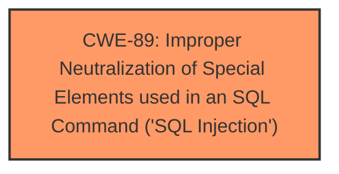

# Analysis Report for CVE-2025-3340

# Vulnerability Analysis Report: CVE-2025-3340

## Description

A vulnerability, which was classified as critical, has been found in codeprojects Online Restaurant Management System 1.0. Affected by this issue is some unknown functionality of the file /admin/combo_update.php. The manipulation of the argument ID leads to **sql injection**. The attack may be launched remotely. The exploit has been disclosed to the public and may be used.

## Vulnerability Description Key Phrases

- **Weakness:** sql injection
- **Product:** codeprojects Online Restaurant Management System
- **Version:** 1
- **Component:** /admin/combo_update.php

## Analysis (with Relationship Data)

# Summary
| CWE ID | CWE Name | Confidence | CWE Abstraction Level | CWE Vulnerability Mapping Label | CWE-Vulnerability Mapping Notes |
|---|---|---|---|---|---|
| CWE-89 | Improper Neutralization of Special Elements used in an SQL Command ('SQL Injection') | 1.0 | Base | Allowed | Primary CWE. The vulnerability description states that the manipulation of the argument ID leads to **sql injection**. |

## Evidence and Confidence

*   **Confidence Score:** 1.0
*   **Evidence Strength:** HIGH

## Relationship Analysis
The primary identified weakness is CWE-89, which is a Base level CWE. There are no child or parent relationships that are important in this case because the description maps directly to the base condition.



## Vulnerability Chain
The vulnerability chain is straightforward:

1.  Improper Input Validation (**ROOT CAUSE**: CWE-89) on the `id` parameter in `/admin/combo_update.php`
2.  SQL Injection
3.  Unauthorized Database Access / Data Modification (IMPACT)

## Summary of Analysis
The vulnerability description clearly states that the manipulation of the 'ID' argument leads to **SQL injection** in the `/admin/combo_update.php` file of the codeprojects Online Restaurant Management System 1.0. The CVE Reference Links Content Summary confirms this, stating that the root cause is insufficient user input validation of the 'id' parameter, allowing attackers to inject malicious SQL queries. The remediation steps listed (prepared statements, input validation, minimizing database user permissions) are all standard mitigations for SQL Injection vulnerabilities.

The retriever results also strongly suggest CWE-89 as the primary candidate, with a score of 1.0.

Based on this evidence, CWE-89 is the most appropriate mapping. This CWE is at the Base level of abstraction, which is preferred.

Other CWEs Considered:

*   CWE-74: Improper Neutralization of Special Elements in Output Used by a Downstream Component ('Injection') - This is a class level CWE and is too general. CWE-89 is a specific type of injection and is therefore more appropriate.
*   CWE-79: Improper Neutralization of Input During Web Page Generation ('Cross-site Scripting') - This is related to Cross-Site Scripting, which is a different type of vulnerability than SQL Injection.
*   CWE-434: Unrestricted Upload of File with Dangerous Type - This is related to file uploads, which is not relevant to the described vulnerability.
*   CWE-425: Direct Request ('Forced Browsing') - This vulnerability involves inadequate authorization. Although the CVE states that no authorization is required, the root cause of the vulnerability is **SQL injection**, making CWE-425 less appropriate.


## CWE Relationship Analysis

Current CWEs represent these abstraction levels: .


### Vulnerability Chain Analysis

**Chain starting from CWE-89:**
- 89 (Improper Neutralization of Special Elements used in an SQL Command ('SQL Injection')) - ROOT


**Chain starting from CWE-79:**
- 79 (Improper Neutralization of Input During Web Page Generation ('Cross-site Scripting')) - ROOT


### CWE Relationship Diagram

```mermaid
graph TD
    classDef primary fill:#f96,stroke:#333,stroke-width:2px
    classDef secondary fill:#69f,stroke:#333
    classDef tertiary fill:#9e9,stroke:#333
```


*Report generated on 2025-07-14 20:20:47*
