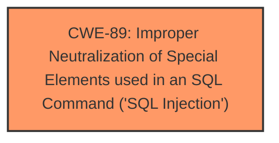

# Raw Analyzer Response for CVE-2025-3344

# Summary

| CWE ID | CWE Name | Confidence | CWE Abstraction Level | CWE Vulnerability Mapping Label | CWE-Vulnerability Mapping Notes |
|---|---|---|---|---|---|
| CWE-89 | Improper Neutralization of Special Elements used in an SQL Command ('SQL Injection') | 1.0 | Base | Allowed | Primary CWE: The **root cause** is the **improper neutralization** of SQL special elements. |

## Evidence and Confidence

*   **Confidence Score:** 1.0
*   **Evidence Strength:** HIGH

## Relationship Analysis
The primary relationship that influenced the decision was the direct match of the vulnerability description with the definition of CWE-89. The other CWEs listed in the Retriever Results are related to injection or input validation issues, but CWE-89 is the most specific and accurate representation of the vulnerability.

## Vulnerability Chain
The vulnerability chain starts with the **improper neutralization** of special elements used in an SQL command, leading directly to the **SQL Injection** vulnerability.

## Summary of Analysis
The analysis is primarily based on the provided evidence, which explicitly states that the vulnerability is due to **SQL Injection** caused by the **manipulation of the 'ID' argument** in the `/admin/assign_save.php` file. The "CVE Reference Links Content Summary" section further confirms this by stating that there is **insufficient user input validation** of the 'id' parameter, which allows malicious code to be injected into SQL queries.

The selection of CWE-89 is at the optimal level of specificity because it directly addresses the root cause of the vulnerability: the **improper neutralization** of special elements used in an SQL command, which leads to **SQL Injection**.

Relevant CWE Information:

# Enhanced Context (25 CWEs)
The following CWEs were identified as potentially relevant to this vulnerability:

## CWE-89: Improper Neutralization of Special Elements used in an SQL Command ('SQL Injection')
**Abstraction Level**: Base
**Similarity Score**: 0.80
**Source**: dense

**Description**:
The product constructs all or part of an SQL command using externally-influenced input from an upstream component, but it does not neutralize or incorrectly neutralizes special elements that could modify the intended SQL command when it is sent to a downstream component. Without sufficient removal or quoting of SQL syntax in user-controllable inputs, the generated SQL query can cause those inputs to be interpreted as SQL instead of ordinary user data.

**Mapping Guidance**:
- Usage: Allowed
- Rationale: This CWE entry is at the Base level of abstraction, which is a preferred level of abstraction for mapping to the root causes of vulnerabilities.

## CWE-434: Unrestricted Upload of File with Dangerous Type
This CWE was not selected because the vulnerability is specifically about SQL injection, not file uploads.

## CWE-425: Direct Request ('Forced Browsing')
This CWE was not selected because the vulnerability is specifically about SQL injection, not authorization bypass.

## CWE-96: Improper Neutralization of Directives in Statically Saved Code ('Static Code Injection')
This CWE was not selected because the vulnerability is specifically about SQL injection, not static code injection.

## CWE-472: External Control of Assumed-Immutable Web Parameter
This CWE was not selected because the vulnerability is specifically about SQL injection, not modification of immutable web parameters.

## CWE-74: Improper Neutralization of Special Elements in Output Used by a Downstream Component ('Injection')
This CWE was considered but not selected because it is a more general class of injection vulnerabilities. CWE-89 is more specific to SQL injection, which is the identified vulnerability.

## CWE-79: Improper Neutralization of Input During Web Page Generation ('Cross-site Scripting')
This CWE was considered but not selected because the vulnerability is specifically about SQL injection, not cross-site scripting.

## CWE-95: Improper Neutralization of Directives in Dynamically Evaluated Code ('Eval Injection')
This CWE was not selected because the vulnerability is specifically about SQL injection, not eval injection.

## CWE-80: Improper Neutralization of Script-Related HTML Tags in a Web Page (Basic XSS)
This CWE was not selected because the vulnerability is specifically about SQL injection, not XSS.

## CWE-639: Authorization Bypass Through User-Controlled Key
This CWE was not selected because the vulnerability is specifically about SQL injection, not authorization bypass.

## CWE-89: Improper Neutralization of Special Elements used in an SQL Command ('SQL Injection')
**Abstraction Level**: Base
**Similarity Score**: 1086.98
**Source**: sparse

**Description**:
The product constructs all or part of an SQL command using externally-influenced input from an upstream component, but it does not neutralize or incorrectly neutralizes special elements that could modify the intended SQL command when it is sent to a downstream component. Without sufficient removal or quoting of SQL syntax in user-controllable inputs, the generated SQL query can cause those inputs to be interpreted as SQL instead of ordinary user data.

**Mapping Guidance**:
- Usage: Allowed
- Rationale: This CWE entry is at the Base level of abstraction, which is a preferred level of abstraction for mapping to the root causes of vulnerabilities.

## CWE-79: Improper Neutralization of Input During Web Page Generation ('Cross-site Scripting')
This CWE was considered but not selected because the vulnerability is specifically about SQL injection, not cross-site scripting.

## CWE-116: Improper Encoding or Escaping of Output
This CWE was not selected because the vulnerability is specifically about SQL injection, not general encoding/escaping issues.

## CWE-1336: Improper Neutralization of Special Elements Used in a Template Engine
This CWE was not selected because the vulnerability is specifically about SQL injection, not template engine injection.

## CWE-434: Unrestricted Upload of File with Dangerous Type
This CWE was not selected because the vulnerability is specifically about SQL injection, not file uploads.

## CWE-73: External Control of File Name or Path
This CWE was not selected because the vulnerability is specifically about SQL injection, not file path manipulation.

## CWE-117: Improper Output Neutralization for Logs
This CWE was not selected because the vulnerability is specifically about SQL injection, not log injection.

## CWE-79: Improper Neutralization of Input During Web Page Generation ('Cross-site Scripting')
This CWE was considered but not selected because the vulnerability is specifically about SQL injection, not cross-site scripting.

## CWE-434: Unrestricted Upload of File with Dangerous Type
This CWE was not selected because the vulnerability is specifically about SQL injection, not file uploads.

## CWE-93: Improper Neutralization of CRLF Sequences ('CRLF Injection')
This CWE was not selected because the vulnerability is specifically about SQL injection, not CRLF injection.

## CWE-471: Modification of Assumed-Immutable Data (MAID)
This CWE was not selected because the vulnerability is specifically about SQL injection, not modification of immutable data.

## CWE-113: Improper Neutralization of CRLF Sequences in HTTP Headers ('HTTP Request/Response Splitting')
This CWE was not selected because the vulnerability is specifically about SQL injection, not HTTP request splitting.

## CWE-352: Cross-Site Request Forgery (CSRF)
This CWE was not selected because the vulnerability is specifically about SQL injection, not CSRF.

## CWE-425: Direct Request ('Forced Browsing')
This CWE was not selected because the vulnerability is specifically about SQL injection, not forced browsing.

## CWE-94: Improper Control of Generation of Code ('Code Injection')
This CWE was not selected because the vulnerability is specifically about SQL injection, not general code injection.