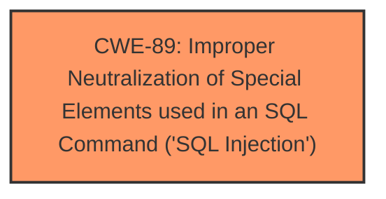

# Enhanced Analysis for CVE-2025-3353

# Summary

| CWE ID | CWE Name | Confidence | CWE Abstraction Level | CWE Vulnerability Mapping Label | CWE-Vulnerability Mapping Notes |
|---|---|---|---|---|---|
| CWE-89 | Improper Neutralization of Special Elements used in an SQL Command ('SQL Injection') | 1.0 | Base | Allowed | Primary CWE: The **root cause** is that the application does not properly neutralize special elements in the cost argument when constructing SQL queries. |

## Evidence and Confidence

*   **Confidence Score:** 1.0
*   **Evidence Strength:** HIGH

## Relationship Analysis
The primary relationship impacting the decision is the direct match of the vulnerability description to the CWE-89 description. No other parent, child, or peer relationships significantly influence the mapping decision in this case. The Base level of abstraction is appropriate as it directly describes the **SQL injection** weakness.



## Vulnerability Chain
The vulnerability chain consists of:
1.  **Root Cause:** **Improper neutralization** of special elements in the 'cost' argument leading to **SQL injection (CWE-89)**.
2.  **Impact:** Unauthorized database access, potential data leakage, data tampering, system control, and service interruption.

## Summary of Analysis
The analysis indicates that the vulnerability is due to **improper neutralization** of input in the 'cost' argument, leading to **SQL injection**. The provided evidence explicitly mentions the lack of sanitization and validation of the 'cost' parameter, which is then directly used in SQL queries. This aligns perfectly with the description of CWE-89.

The selection of CWE-89 is based on the following evidence from the "CVE Reference Links Content Summary":

*   "The vulnerability is caused by the 'cost' parameter...which allows attackers to inject malicious code."
*   "The input validation is insufficient, and user input from the 'cost' parameter is directly used in SQL queries without sanitization or validation."
*   "SQL injection vulnerability."

This evidence clearly supports the selection of CWE-89 as the primary weakness. The retriever results also ranked CWE-89 as the top match.

Other CWEs considered but not used:

*   CWE-79 (Improper Neutralization of Input During Web Page Generation ('Cross-site Scripting')): While neutralization is a general concept, this CWE is specific to web page generation, which is not the primary issue here. The vulnerability lies in the database interaction rather than web page output.
*   CWE-434 (Unrestricted Upload of File with Dangerous Type): This CWE is not relevant as the vulnerability does not involve file uploads.
*   CWE-73 (External Control of File Name or Path): This CWE is not relevant as the vulnerability does not involve file path manipulation.
*   CWE-94 (Improper Control of Generation of Code ('Code Injection')): While SQL injection can lead to code execution, the root cause is the lack of proper neutralization, not the generation of code itself.
*   CWE-306 (Missing Authentication for Critical Function): While the content states that no login is required, the **root cause** is the **SQL injection**, not the missing authentication.

The selection of CWE-89 is at the optimal level of specificity because it directly addresses the **SQL injection** vulnerability caused by **improper neutralization** of special elements in SQL commands.


## CWE Relationship Analysis

Current CWEs represent these abstraction levels: .


### Vulnerability Chain Analysis

**Chain starting from CWE-89:**
- 89 (Improper Neutralization of Special Elements used in an SQL Command ('SQL Injection')) - ROOT


**Chain starting from CWE-94:**
- 94 (Improper Control of Generation of Code ('Code Injection')) - ROOT


### CWE Relationship Diagram

```mermaid
graph TD
    classDef primary fill:#f96,stroke:#333,stroke-width:2px
    classDef secondary fill:#69f,stroke:#333
    classDef tertiary fill:#9e9,stroke:#333
```