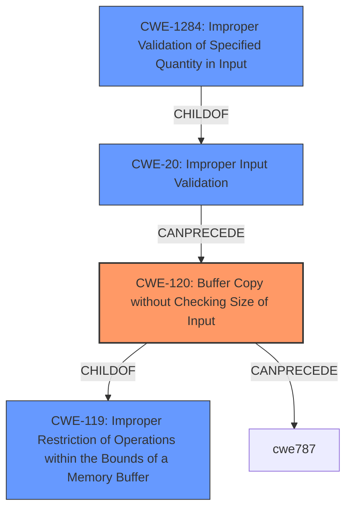

# Analysis for CVE-2025-3375

# Summary
| CWE ID | CWE Name | Confidence | CWE Abstraction Level | CWE Vulnerability Mapping Label | CWE-Vulnerability Mapping Notes |
|---|---|---|---|---|---|
| CWE-120 | Buffer Copy without Checking Size of Input ('Classic Buffer Overflow') | 1.0 | Base | Allowed-with-Review | Primary CWE. The vulnerability is a buffer overflow due to the server not validating the length of the input. |
| CWE-119 | Improper Restriction of Operations within the Bounds of a Memory Buffer | 0.7 | Class | Discouraged | Secondary candidate. This is a broader category that includes buffer overflows. |
| CWE-20 | Improper Input Validation | 0.5 | Class | Discouraged | Secondary candidate. The lack of input validation is a contributing factor to the overflow, but CWE-120 is a more specific root cause.|

## Evidence and Confidence

*   **Confidence Score:** 0.9
*   **Evidence Strength:** HIGH

## Relationship Analysis
The primary CWE is CWE-120, which is a Base level CWE describing a classic buffer overflow. CWE-120 is a child of CWE-119, which describes improper restriction of operations within the bounds of a memory buffer. CWE-20, Improper Input Validation, is a contributing factor but is a parent Class of CWE-1284, which is Improper Validation of Specified Quantity in Input. The relationship indicates a flow from missing input validation leading to the buffer overflow.

## Vulnerability Chain
The vulnerability chain starts with the **lack of input validation** which leads to the **buffer overflow** and then to the ability to overwrite the instruction pointer and execute arbitrary code.

## Summary of Analysis
The primary weakness is CWE-120, Buffer Copy without Checking Size of Input ('Classic Buffer Overflow'). The vulnerability description clearly states that the manipulation leads to a **buffer overflow** and the CVE Reference Links Content Summary indicates that the server does not properly validate the length of the input. This allows an attacker to send a larger-than-expected string, overwriting adjacent memory regions. The evidence supports the selection of CWE-120. CWE-119 is a broader category that includes buffer overflows, and CWE-20 is a contributing factor, but CWE-120 is the most specific and appropriate choice.

Relevant CWE Information: