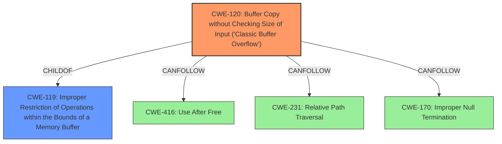

# Enhanced Analysis for CVE-2025-3376

# Summary

| CWE ID  | CWE Name                                                                | Confidence | CWE Abstraction Level | CWE Vulnerability Mapping Label | CWE-Vulnerability Mapping Notes |
|---------|-------------------------------------------------------------------------|------------|-----------------------|---------------------------------|-----------------------------------|
| CWE-120 | Buffer Copy without Checking Size of Input ('Classic Buffer Overflow') | 0.95       | Base                  | Primary                          | Allowed-with-Review               |
| CWE-119 | Improper Restriction of Operations within the Bounds of a Memory Buffer | 0.75       | Class                 | Secondary                        | Discouraged                      |

## Evidence and Confidence

*   **Confidence Score:** 0.90
*   **Evidence Strength:** HIGH

## Relationship Analysis

The primary CWE is CWE-120, which is a base-level CWE describing a classic buffer overflow due to copying without checking the size of the input. It is a child of CWE-119, a more general class. Although CWE-119 was the top hit in the Retriever Results, the evidence clearly points to a buffer *copy* operation without checking size, making CWE-120 more appropriate. CWE-120 can precede CWE-416 (Use After Free), CWE-231 (Relative Path Traversal), and CWE-170 (Improper Null Termination), although those are not directly relevant to this particular vulnerability description.



## Vulnerability Chain

The vulnerability chain starts with the **lack of input validation**, leading to a **buffer overflow** when the input is copied, which could then lead to arbitrary code execution.

## Summary of Analysis

The analysis indicates a classic buffer overflow vulnerability in PCMan FTP Server 2.0.7 within the CONF command handler. The server **fails to validate the size of the input**, allowing an attacker to send a larger-than-expected buffer, overwriting adjacent memory regions. The **root cause** is the **missing input validation** on the size of the data being copied into a buffer.

The primary CWE selected is CWE-120 (Buffer Copy without Checking Size of Input ('Classic Buffer Overflow')), which accurately reflects the **root cause** of the vulnerability. The "CVE Reference Links Content Summary" explicitly states, "The server does not properly validate the size of the input provided with the 'CONF' command, allowing an attacker to send a larger-than-expected buffer, overwriting adjacent memory regions." The vulnerability description confirms that the manipulation leads to a **buffer overflow**.

CWE-119 (Improper Restriction of Operations within the Bounds of a Memory Buffer) was considered as a broader classification, and was the top result from Retriever. However, the specific nature of the vulnerability (a buffer *copy* without size checking) makes CWE-120 a more accurate and specific choice. CWE-119 is a parent of CWE-120. Using CWE-119 would be a less precise mapping because it is a more abstract class.

Other CWEs from the Retriever Results were deemed less relevant:
*   CWE-190 (Integer Overflow or Wraparound): Not directly related to the buffer overflow issue.
*   CWE-89 (Improper Neutralization of Special Elements used in an SQL Command ('SQL Injection')): Not related to SQL injection.
*   CWE-79 (Improper Neutralization of Input During Web Page Generation ('Cross-site Scripting')): Not related to XSS.
*   CWE-125 (Out-of-bounds Read): While related to memory safety, the core issue is a write overflow, not a read.
*   CWE-434 (Unrestricted Upload of File with Dangerous Type): Not related to file uploads.

The final selection of CWE-120 is based on the evidence of a buffer copy operation without input size validation, directly leading to a buffer overflow. The CWE is at the base level of abstraction, providing sufficient specificity for the vulnerability.


## CWE Relationship Analysis

Current CWEs represent these abstraction levels: .


### Vulnerability Chain Analysis

**Chain starting from CWE-89:**
- 89 (Improper Neutralization of Special Elements used in an SQL Command ('SQL Injection')) - ROOT


**Chain starting from CWE-416:**
- 416 (Use After Free) - ROOT


### CWE Relationship Diagram

```mermaid
graph TD
    classDef primary fill:#f96,stroke:#333,stroke-width:2px
    classDef secondary fill:#69f,stroke:#333
    classDef tertiary fill:#9e9,stroke:#333
```