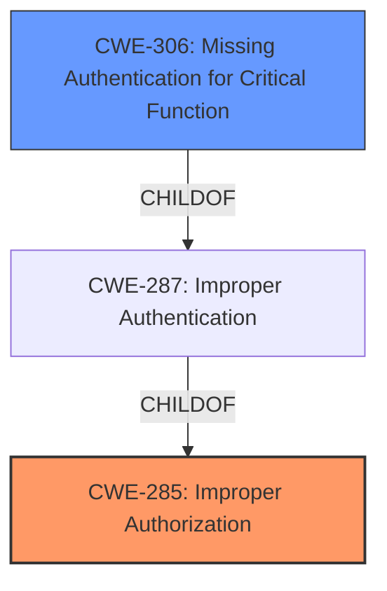

# Raw Analyzer Response for CVE-2025-3398

# Summary
| CWE ID | CWE Name | Confidence | CWE Abstraction Level | CWE Vulnerability Mapping Label | CWE-Vulnerability Mapping Notes |
|---|---|---|---|---|---|
| CWE-285 | Improper Authorization | 0.8 | Class | Primary | Allowed-with-Review |
| CWE-306 | Missing Authentication for Critical Function | 0.6 | Base | Secondary | Allowed |

## Evidence and Confidence

*   **Confidence Score:** 0.7
*   **Evidence Strength:** MEDIUM

## Relationship Analysis
The primary CWE is CWE-285, which is a class-level CWE. While it can be used, it's preferred to use a more specific Base-level CWE when possible. CWE-306 is a child of CWE-287 (Improper Authentication), which is in turn a child of CWE-285. CWE-306 represents a more specific case of authorization failure due to missing authentication, making it a strong candidate to further refine the classification. Since the vulnerability is described as **improper access controls**, and the description indicates a failure in the `configure` function related to web security, authentication is a likely component of access control.

## Vulnerability Chain
The vulnerability chain starts with **improper access controls** (CWE-285) due to a potential **missing authentication** (CWE-306) in the `configure` function, leading to unauthorized access.

## Summary of Analysis
The initial assessment identifies CWE-285 as the primary weakness based on the description "**improper access controls**". Further analysis of the retriever results suggests CWE-306 as a secondary candidate because it is more specific and relates to missing authentication, which could be the root cause of the **improper access controls**. The evidence is somewhat limited, as the description only mentions **improper access controls** without detailing the exact mechanism.

CWE-285 is a Class-level weakness, while CWE-306 is a Base-level weakness, providing a more specific description of the issue if authentication is indeed the root cause. I am choosing CWE-285 as the primary because it aligns directly with the description provided. I am including CWE-306 as a secondary candidate.

Here's why other CWEs from the retriever results were not selected:

*   CWE-89, CWE-79, CWE-22, CWE-1336: These relate to injection and path traversal, which are not indicated in the vulnerability description.
*   CWE-923: Improper Restriction of Communication Channel to Intended Endpoints: This is too specific and there is no evidence to support this.
*   CWE-266: Incorrect Privilege Assignment: There is no evidence to suggest that privilege assignments are incorrect, only that access controls are **improper**.
*   CWE-434: Unrestricted Upload of File with Dangerous Type: This is not related to access controls.
*   CWE-322: Key Exchange without Entity Authentication: This is too specific and there is no evidence to support this.
Relevant CWE Information: