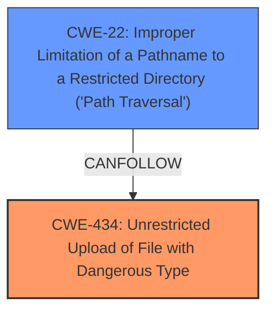

# Analysis for CVE-2025-3410

# Summary
| CWE ID | CWE Name | Confidence | CWE Abstraction Level | CWE Vulnerability Mapping Label | CWE-Vulnerability Mapping Notes |
|---|---|---|---|---|---|
| CWE-434 | Unrestricted Upload of File with Dangerous Type | 1.0 | Base | Allowed | Primary CWE |
| CWE-22 | Improper Limitation of a Pathname to a Restricted Directory ('Path Traversal') | 0.5 | Base | Allowed | Secondary Candidate |

## Evidence and Confidence

*   **Confidence Score:** 0.75
*   **Evidence Strength:** MEDIUM

## Relationship Analysis
The primary CWE is CWE-434, which directly addresses the **unrestricted upload** vulnerability. CWE-22 is considered as a secondary candidate because an **unrestricted upload** may lead to writing files in arbitrary locations.

## Vulnerability Chain
The vulnerability chain starts with the **unrestricted upload** (**weakness**) due to the manipulation of the File argument. This allows an attacker to upload arbitrary files, which may lead to code execution or other malicious activities if the uploaded files are processed by the system.
  - **Root Cause:** **Unrestricted Upload** (CWE-434)
  - **Impact:** Potential for code execution or other malicious activities (depending on how the uploaded file is handled)

## Summary of Analysis
The primary assessment is based on the provided vulnerability description, which explicitly states that the vulnerability involves an **unrestricted upload**. The "Retriever Results" also lists CWE-434 as a potential candidate. The selection of CWE-434 is also influenced by the fact that the vulnerability description mentions the manipulation of the File argument, which directly relates to the concept of **unrestricted upload**.

The graph relationship shows that CWE-22 can follow CWE-434. This means that an **unrestricted upload** vulnerability can lead to path traversal, where an attacker can upload files to arbitrary locations on the system.

The selected CWEs are at the optimal level of specificity because they directly address the **weakness** described in the vulnerability description. CWE-434 is a Base level CWE, which is a preferred level of abstraction for mapping to the root causes of vulnerabilities.

Relevant CWE Information:

# Enhanced Context (25 CWEs)
The following CWEs were identified as potentially relevant to this vulnerability:

## CWE-434: Unrestricted Upload of File with Dangerous Type
**Abstraction Level**: Base
**Similarity Score**: 0.79
**Source**: dense

**Description**:
The product allows the upload or transfer of dangerous file types that are automatically processed within its environment.

**Mapping Guidance**:
- Usage: Allowed
- Rationale: This CWE entry is at the Base level of abstraction, which is a preferred level of abstraction for mapping to the root causes of vulnerabilities.

## CWE-434: Unrestricted Upload of File with Dangerous Type
**Abstraction Level**: Base
**Similarity Score**: 511.02
**Source**: sparse

**Description**:
The product allows the upload or transfer of dangerous file types that are automatically processed within its environment.

**Mapping Guidance**:
- Usage: Allowed
- Rationale: This CWE entry is at the Base level of abstraction, which is a preferred level of abstraction for mapping to the root causes of vulnerabilities.

## CWE-434: Unrestricted Upload of File with Dangerous Type
**Abstraction Level**: Base
**Similarity Score**: 2.92
**Source**: graph

**Description**:
The product allows the upload or transfer of dangerous file types that are automatically processed within its environment.

**Mapping Guidance**:
- Usage: Allowed
- Rationale: This CWE entry is at the Base level of abstraction, which is a preferred level of abstraction for mapping to the root causes of vulnerabilities.

**CWE-434**: **Unrestricted Upload of File with Dangerous Type**

The vulnerability description states, "The manipulation of the argument File leads to **unrestricted upload**." This directly matches the description of CWE-434, which is "The product allows the upload or transfer of dangerous file types that are automatically processed within its environment." This vulnerability allows an attacker to upload arbitrary files, potentially leading to code execution or other malicious activities. This is the primary **weakness**. Confidence: 1.0

**CWE-22**: **Improper Limitation of a Pathname to a Restricted Directory ('Path Traversal')**

While the primary issue is the **unrestricted upload**, if the uploaded file can be placed in an arbitrary location, it could also be considered a path traversal issue. However, the provided description focuses on the upload itself. It is a secondary concern. Confidence: 0.5

CWEs Considered but Not Used:

*   CWE-89, CWE-79, CWE-1336: These CWEs relate to improper neutralization of special elements in SQL commands, web page generation, and template engines, respectively. They do not directly apply to the vulnerability, which is primarily about an **unrestricted upload**.
*   CWE-306: This CWE relates to missing authentication for critical functions. While authentication might be a missing component, the primary **weakness** described is the **unrestricted upload** itself, not the lack of authentication.
*   CWE-184: This CWE relates to an incomplete list of disallowed inputs. While related to input validation issues, the **unrestricted upload** is more directly addressed by CWE-434.
*   CWE-269: Improper Privilege Management, is a Class and might have Base-level children that would be more appropriate
*   CWE-674: Uncontrolled Recursion
*   CWE-1391: Use of Weak Credentials
*   CWE-425: Direct Request ('Forced Browsing')
*   CWE-471: Modification of Assumed-Immutable Data (MAID)
*   CWE-183: Permissive List of Allowed Inputs
*   CWE-94: Improper Control of Generation of Code ('Code Injection')
*   CWE-78: Improper Neutralization of Special Elements used in an OS Command ('OS Command Injection')
*   CWE-425: Direct Request ('Forced Browsing')
*   CWE-1336: Improper Neutralization of Special Elements Used in a Template Engine
*   CWE-79: Improper Neutralization of Input During Web Page Generation ('Cross-site Scripting')
*   CWE-184: Incomplete List of Disallowed Inputs