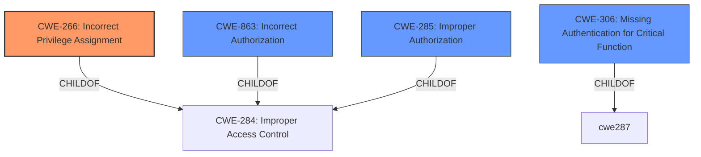

# Analysis Report for CVE-2025-3438

# Vulnerability Analysis Report: CVE-2025-3438

## Description

The MStore API Create Native Android & iOS Apps On The Cloud plugin for WordPress is vulnerable to limited privilege escalation in all versions up to, and including, 4.17.4. This is due to a **lack of restriction of role when registering**. This makes it possible for unauthenticated attackers to to register with the wcfm_vendor role, which is a Store Vendor role in the WCFM Marketplace Multivendor Marketplace for WooCommerce plugin for WordPress. The vulnerability can only be exploited if the WCFM Marketplace Multivendor Marketplace for WooCommerce plugin is installed and activated. The vulnerability was partially patched in version 4.17.3.

## Vulnerability Description Key Phrases

- **Rootcause:** lack of restriction of role when registering
- **Impact:** limited privilege escalation
- **Attacker:** unauthenticated attackers
- **Product:** MStore API Create Native Android & iOS Apps On The Cloud plugin for WordPress
- **Version:** up to and including 4.17.4

## Analysis (with Relationship Data)

# Summary
| CWE ID | CWE Name | Confidence | CWE Abstraction Level | CWE Vulnerability Mapping Label | CWE-Vulnerability Mapping Notes |
|---|---|---|---|---|---|
| CWE-266 | Incorrect Privilege Assignment | 0.8 | Base | Allowed | Primary CWE: **Lack of restriction of role when registering** |
| CWE-863 | Incorrect Authorization | 0.6 | Class | Allowed-with-Review | Secondary Candidate: The product performs an authorization check, but it does not correctly perform the check. |
| CWE-285 | Improper Authorization | 0.4 | Class | Discouraged | Secondary Candidate: Authorization is incorrectly performed, but CWE-266 is a better fit. |
| CWE-306 | Missing Authentication for Critical Function | 0.3 | Base | Allowed | Secondary Candidate: Registration does not require authentication |

## Evidence and Confidence

*   **Confidence Score:** 0.7
*   **Evidence Strength:** MEDIUM

## Relationship Analysis
The primary relationship that influenced the decision was the parent-child relationship and privilege guidance.
CWE-266 (Incorrect Privilege Assignment) is a base-level CWE that directly addresses the root cause of the vulnerability of **lack of restriction of role when registering**. While CWE-863 (Incorrect Authorization) and CWE-285 (Improper Authorization) were considered, they are class-level CWEs and less specific. CWE-306 (Missing Authentication for Critical Function) was considered because registration was open to unauthenticated users.



## Vulnerability Chain
The vulnerability chain starts with the **lack of restriction of role when registering** (CWE-266), which allows unauthenticated attackers to register as wcfm_vendors, ultimately leading to a limited privilege escalation.

## Summary of Analysis
The primary focus of the analysis was on identifying the root cause of the vulnerability. The vulnerability description clearly states that the vulnerability is due to a **lack of restriction of role when registering**.
The vulnerability description states "This is due to a **lack of restriction of role when registering**. This makes it possible for unauthenticated attackers to to register with the wcfm_vendor role". This indicates that users are being assigned incorrect privileges during registration.
The selection of CWE-266 is based on the fact that it directly addresses the root cause of the issue. The privilege guidance clearly makes the distinction between privileges and permissions, and highlights CWE-266 as the correct mapping when a user is assigned the wrong role.
CWE-266 is at the optimal level of specificity because it is a base-level CWE and directly addresses the vulnerability's root cause.

Relevant CWE Information:

*   **CWE-266: Incorrect Privilege Assignment:** The system assigns incorrect privileges to a user (e.g., admin instead of guest). The **lack of restriction of role when registering** directly fits this description.
*   **CWE-863: Incorrect Authorization:** The product performs an authorization check when an actor attempts to access a resource or perform an action, but it does not correctly perform the check. This is a more general case of an authorization failure but could be related.
*   **CWE-285: Improper Authorization:** The product does not perform or incorrectly performs an authorization check when an actor attempts to access a resource or perform an action. This is a more general case of an authorization failure but could be related.
*   **CWE-306: Missing Authentication for Critical Function:** There is no authentication for registration.


## CWE Relationship Analysis

Current CWEs represent these abstraction levels: .


### Vulnerability Chain Analysis

**Chain starting from CWE-863:**
- 863 (Incorrect Authorization) - ROOT


**Chain starting from CWE-306:**
- 306 (Missing Authentication for Critical Function) - ROOT


### CWE Relationship Diagram

```mermaid
graph TD
    classDef primary fill:#f96,stroke:#333,stroke-width:2px
    classDef secondary fill:#69f,stroke:#333
    classDef tertiary fill:#9e9,stroke:#333
```


*Report generated on 2025-07-14 20:39:06*
