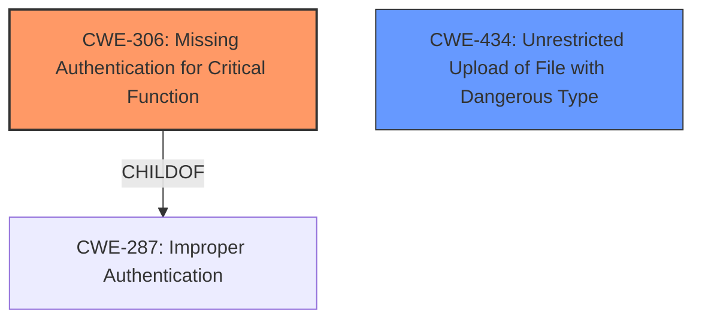

# Analysis Report for CVE-2025-3518

# Vulnerability Analysis Report: CVE-2025-3518

## Description

It technically possible for a user to upload a file to a conversation despite the file upload functionality being disabled. The file upload functionality can be enabled or disabled for specific use cases through configuration. In case the functionality is disabled for at least one use case, the system nevertheless allows files to be uploaded through direct API requests. During the upload file, interception and allowed file type rules are still applied correctly. If file sharing is generally enabled, this issue is not of concern.

## Vulnerability Description Key Phrases

- **Impact:** upload file
- **Vector:** direct API requests

## Analysis (with Relationship Data)

# Summary

| CWE ID  | CWE Name                                                                  | Confidence | CWE Abstraction Level | CWE Vulnerability Mapping Label | CWE-Vulnerability Mapping Notes |
| ------- | ------------------------------------------------------------------------- | ---------- | ----------------------- | --------------------------------- | ------------------------------- |
| CWE-306 | Missing Authentication for Critical Function                                | 0.9        | Base                    | Primary                           | Allowed                         |
| CWE-434 | Unrestricted Upload of File with Dangerous Type                           | 0.6        | Base                    | Secondary                         | Allowed                         |

## Evidence and Confidence

*   **Confidence Score:** 0.8
*   **Evidence Strength:** HIGH

## Relationship Analysis

The primary relationship influencing the decision is the parent-child relationship. CWE-306 (Missing Authentication for Critical Function) is chosen because the vulnerability allows file uploads via direct API requests even when the feature is disabled, indicating a lack of authentication for that specific function. The relationship to CWE-434 (Unrestricted Upload of File with Dangerous Type) is considered because the vulnerability allows file uploads but this is dependent on whether file sharing is enabled. CWE-306 is the better choice because of the **missing authentication** root cause.



## Vulnerability Chain

The vulnerability chain starts with a **missing authentication** check for the file upload functionality when accessed via direct API requests (CWE-306). This leads to the potential for **unrestricted upload** of files (CWE-434) even when the feature is intended to be disabled through configuration.

## Summary of Analysis

The initial analysis focused on identifying the root cause of the vulnerability. The vulnerability description highlights that file uploads are possible via direct API requests even when the file upload functionality is disabled through configuration. This points to a **missing authentication** or authorization check for the API endpoint. The Retriever Results also suggests CWE-306, which aligns with the **missing authentication** aspect.

The key evidence from the vulnerability description is: "In case the functionality is disabled for at least one use case, the system nevertheless allows files to be uploaded through direct API requests." This clearly indicates that the system is not properly enforcing the disabled file upload functionality when accessed through the API.

CWE-306 (Missing Authentication for Critical Function) is the most appropriate primary CWE because it directly addresses the root cause of the vulnerability: the absence of authentication for a critical function (file upload via API). The other CWEs were considered but deemed less relevant because they focus on other aspects. For example, CWE-434 (Unrestricted Upload of File with Dangerous Type) is a consequence of the missing authentication, but not the root cause.

The decision is based on the evidence provided and the alignment of the vulnerability description with the CWE specifications. The selected CWE is at the optimal level of specificity (Base) as it directly addresses the root cause of the vulnerability.

Relevant CWE Information:
*   **CWE-306: Missing Authentication for Critical Function**
    *   **Description:** The product does not perform any authentication for functionality that requires a provable user identity or consumes a significant amount of resources.
    *   **Why it applies:** The file upload functionality, when accessed through direct API requests, does not require authentication, allowing users to bypass the intended configuration settings.
*   **CWE-434: Unrestricted Upload of File with Dangerous Type**
    *   **Description:** The product allows the upload or transfer of dangerous file types that are automatically processed within its environment.
    *   **Why it applies:** The system allows files to be uploaded through direct API requests, even when the file upload functionality is disabled for certain use cases.

The alternative CWEs were considered and rejected because they didn't directly address the lack of authentication. For example, CWE-22 (Improper Limitation of a Pathname to a Restricted Directory ('Path Traversal')) is related to file path manipulation, which is not the primary issue here. Similarly, CWE-863 (Incorrect Authorization) is about incorrect authorization checks, while the primary issue here is the absence of authentication.


## CWE Relationship Analysis

Current CWEs represent these abstraction levels: .


### Vulnerability Chain Analysis

**Chain starting from CWE-863:**
- 863 (Incorrect Authorization) - ROOT


**Chain starting from CWE-22:**
- 22 (Improper Limitation of a Pathname to a Restricted Directory ('Path Traversal')) - ROOT


### CWE Relationship Diagram

```mermaid
graph TD
    classDef primary fill:#f96,stroke:#333,stroke-width:2px
    classDef secondary fill:#69f,stroke:#333
    classDef tertiary fill:#9e9,stroke:#333
```


*Report generated on 2025-07-14 20:41:47*
