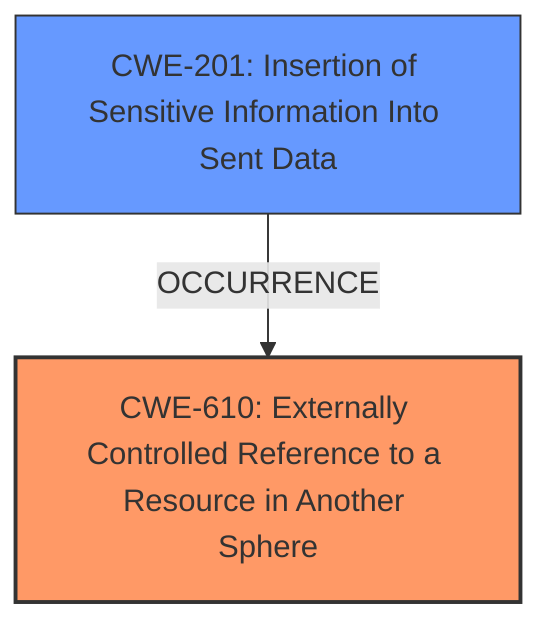

# Raw Analyzer Response for CVE-2025-3522

# Summary
| CWE ID | CWE Name | Confidence | CWE Abstraction Level | CWE Vulnerability Mapping Label | CWE-Vulnerability Mapping Notes |
|---|---|---|---|---|---|
| CWE-610 | Externally Controlled Reference to a Resource in Another Sphere | 0.9 | Class | Allowed-with-Review | Primary CWE |
| CWE-201 | Insertion of Sensitive Information Into Sent Data | 0.7 | Base | Allowed | Secondary Candidate |

## Evidence and Confidence

*   **Confidence Score:** 0.8
*   **Evidence Strength:** HIGH

## Relationship Analysis
The primary CWE selected is CWE-610, "Externally Controlled Reference to a Resource in Another Sphere", as the Thunderbird vulnerability allows an attacker to control the URL used to access an external attachment. This URL can then be pointed to internal resources leading to information disclosure. While CWE-610 is a Class-level CWE, it directly captures the essence of the vulnerability. The Retriever also lists CWE-201 "Insertion of Sensitive Information Into Sent Data" which is a Base level CWE, and is a possible secondary weakness.

## Vulnerability Chain
The vulnerability chain starts with the **improper URL sanitization** in the Thunderbird application. An attacker can insert a crafted URL into the `X-Mozilla-External-Attachment-URL` header. Because of the **lack of sanitization**, this URL can point to internal resources. When Thunderbird processes this URL, it may inadvertently leak sensitive information, such as hashed Windows credentials.

## Summary of Analysis
The vulnerability is caused by Thunderbird's **improper URL sanitization** of the `X-Mozilla-External-Attachment-URL` header. This allows an attacker to control the URL and point it to internal resources. The primary weakness is CWE-610 because the URL, which is a reference to a resource, is controlled externally. The secondary weakness is CWE-201, as pointing the URL to internal resources can result in the leakage of sensitive information.

The evidence for CWE-610 is based on the vulnerability description, which states: "Because the URL is not validated or sanitized, it can reference internal resources like chrome// or SMB share file// links". This directly indicates that an externally controlled reference is being used.

The retriever suggested CWE-79 (Cross-site Scripting), CWE-88 (Argument Injection), and CWE-787 (Out-of-bounds Write) but these do not fit the description as well as CWE-610. The vulnerability involves pointing to unintended resources and not necessarily injecting code or overflowing buffers. CWE-78 (OS Command Injection) is not relevant either.
I am overriding the retriever results because CWE-610 directly describes the root cause which is an externally controlled reference.
CWE-610 is at the Class level, but its children do not fit as well, and the mapping guidance allows for its use in this context with review.

Relevant CWE Information:

# Enhanced Context (25 CWEs)
The following CWEs were identified as potentially relevant to this vulnerability:

## CWE-610: Externally Controlled Reference to a Resource in Another Sphere
**Abstraction Level**: Class
**Similarity Score**: 0.76
**Source**: dense

**Description**:
The product uses an externally controlled name or reference that resolves to a resource that is outside of the intended control sphere.

**Mapping Guidance**:
- Usage: Discouraged
- Rationale: This CWE entry is a level-1 Class (i.e., a child of a Pillar). It might have lower-level children that would be more appropriate