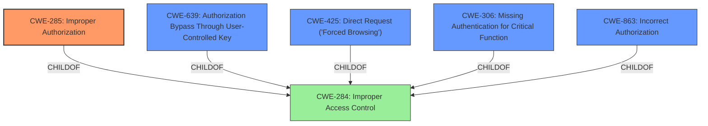

# Raw Analyzer Response for CVE-2025-3536

# Summary
| CWE ID | CWE Name | Confidence | CWE Abstraction Level | CWE Vulnerability Mapping Label | CWE-Vulnerability Mapping Notes |
|---|---|---|---|---|---|
| CWE-285 | Improper Authorization | 0.9 | Class | Primary CWE | Allowed-with-Review |
| CWE-639 | Authorization Bypass Through User-Controlled Key | 0.7 | Base | Secondary Candidate | Allowed |
| CWE-425 | Direct Request ('Forced Browsing') | 0.6 | Base | Secondary Candidate | Allowed |
| CWE-306 | Missing Authentication for Critical Function | 0.5 | Base | Secondary Candidate | Allowed |
| CWE-863 | Incorrect Authorization | 0.5 | Class | Secondary Candidate | Allowed-with-Review |

## Evidence and Confidence

*   **Confidence Score:** 0.8
*   **Evidence Strength:** HIGH

## Relationship Analysis
The primary CWE is CWE-285, which is a class-level CWE. The analysis considered more specific base-level CWEs like CWE-639 and CWE-425, which are children of the pillar CWE-284 (Improper Access Control). The relationship analysis helped refine the selection to CWE-285 initially and further considered CWE-639 and CWE-425 due to the IDOR nature and direct request aspect of the vulnerability.

## Vulnerability Chain
The vulnerability chain starts with **improper authorization** in the `/admin/delete-user.php` file. This allows an attacker to manipulate the `id` parameter and delete user accounts, leading to unauthorized data access, data manipulation, and potentially privilege escalation.

Vulnerability Chain:
1.  **Improper Authorization (CWE-285)**: The application **fails to properly authorize** the user before allowing them to delete user accounts.
2.  Insecure Direct Object Reference (IDOR): By manipulating the `id` parameter, an attacker can directly reference and modify objects (user accounts) they should not have access to.
3.  Impact: Unauthorized data access, data manipulation, account takeover, and privilege escalation.

## Summary of Analysis
The initial analysis identified **improper authorization** as the root cause. The provided information indicates that the application **does not properly authorize** users before allowing them to delete accounts via the `/admin/delete-user.php` endpoint. The vulnerability description key phrases explicitly mention "**improper authorization**".

The choice of CWE-285 is based on the vulnerability description and the retriever results. Although CWE-285 is a class-level CWE, it accurately describes the high-level flaw, which is **improper authorization**. More specific CWEs like CWE-639 (Authorization Bypass Through User-Controlled Key) and CWE-425 (Direct Request) were considered, but CWE-285 was selected as the primary due to its direct match with the description. However, CWE-639 and CWE-425 are noted as secondary candidates due to the IDOR and direct request aspects. The evidence supports this classification because the application **fails to properly validate** whether the user has the necessary permissions to delete the specified user account.

The final decision is to classify this as CWE-285 (Improper Authorization) as the primary CWE, with CWE-639 and CWE-425 as secondary candidates. This is based on the **improper authorization** being the direct root cause of the vulnerability, as stated in the description.

Relevant CWE Information:

# Enhanced Context (25 CWEs)
The following CWEs were identified as potentially relevant to this vulnerability:

## CWE-472: External Control of Assumed-Immutable Web Parameter
**Abstraction Level**: Base
**Similarity Score**: 0.79
**Source**: dense

**Description**:
The web application does not sufficiently verify inputs that are assumed to be immutable but are actually externally controllable, such as hidden form fields.

**Mapping Guidance**:
- Usage: Allowed
- Rationale: This CWE entry is at the Base level of abstraction, which is a preferred level of abstraction for mapping to the root causes of vulnerabilities.

*This was not selected as the primary CWE because it focuses on externally controlled immutable parameters, which is a contributing factor but not the core authorization issue.*

## CWE-639: Authorization Bypass Through User-Controlled Key
**Abstraction Level**: Base
**Similarity Score**: 0.78
**Source**: dense

**Description**:
The system's authorization functionality does not prevent one user from gaining access to another user's data or record by modifying the key value identifying the data.

**Mapping Guidance**:
- Usage: Allowed
- Rationale: This CWE entry is at the Base level of abstraction, which is a preferred level of abstraction for mapping to the root causes of vulnerabilities.

*This was considered as a secondary candidate because the `id` parameter is user-controlled and allows access to other user's data, bypassing authorization.*

## CWE-425: Direct Request ('Forced Browsing')
**Abstraction Level**: Base
**Similarity Score**: 0.78
**Source**: dense

**Description**:
The web application does not adequately enforce appropriate authorization on all restricted URLs, scripts, or files.

**Mapping Guidance**:
- Usage: Allowed
- Rationale: This CWE entry is at the Base level of abstraction, which is a preferred level of abstraction for mapping to the root causes of vulnerabilities.

*This was considered as a secondary candidate because the attacker can directly request the deletion of a user without proper authorization checks.*

## CWE-41: Improper Resolution of Path Equivalence
**Abstraction Level**: Base
**Similarity Score**: 0.77
**Source**: dense

**Description**:
The product is vulnerable to file system contents disclosure through path equivalence. Path equivalence involves the use of special characters in file and directory names. The associated manipulations are intended to generate multiple names for the same object.

**Mapping Guidance**:
- Usage: Allowed
- Rationale: This CWE entry is at the Base level of abstraction, which is a preferred level of abstraction for mapping to the root causes of vulnerabilities.

*This was not selected because the vulnerability is not related to path equivalence.*

## CWE-807: Reliance on Untrusted Inputs in a Security Decision
**Abstraction Level**: Base
**Similarity Score**: 0.77
**Source**: dense

**Description**:
The product uses a protection mechanism that relies on the existence or values of an input, but the input can be modified by an untrusted actor in a way that bypasses the protection mechanism.

**Mapping Guidance**:
- Usage: Allowed
- Rationale: This CWE entry is at the Base level of abstraction, which is a preferred level of abstraction for mapping to the root causes of vulnerabilities.

*This was not selected because the primary issue is missing or **improper authorization**, not reliance on untrusted inputs for a security decision.*

## CWE-267: Privilege Defined With Unsafe Actions
**Abstraction Level**: Base
**Similarity Score**: 0.77
**Source**: dense

**Description**:
A particular privilege, role, capability, or right can be used to perform unsafe actions that were not intended, even when it is assigned to the correct entity.

**Mapping Guidance**:
- Usage: Allowed
- Rationale: This CWE entry is at the Base level of abstraction, which is a preferred level of abstraction for mapping to the root causes of vulnerabilities.

*This was not selected because the issue is not related to privileges being defined with unsafe actions.*

## CWE-74: Improper Neutralization of Special Elements in Output Used by a Downstream Component ('Injection')
**Abstraction Level**: Class
**Similarity Score**: 0.76
**Source**: dense

**Description**:
The product constructs all or part of a command, data structure, or record using externally-influenced input from an upstream component, but it does not neutralize or incorrectly neutralizes special elements that could modify how it is parsed or interpreted when it is sent to a downstream component.

**Mapping