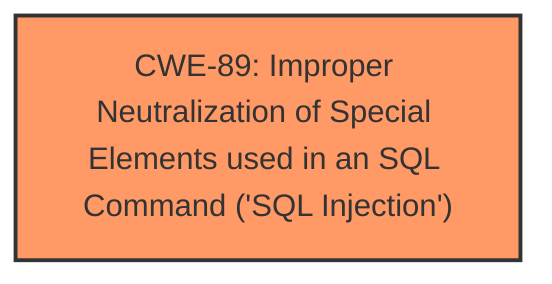

# Raw Analyzer Response for CVE-2025-3553

# Summary

| CWE ID | CWE Name | Confidence | CWE Abstraction Level | CWE Vulnerability Mapping Label | CWE-Vulnerability Mapping Notes |
|---|---|---|---|---|---|
| CWE-89 | Improper Neutralization of Special Elements used in an SQL Command ('SQL Injection') | 1.0 | Base | Allowed | Primary CWE. The vulnerability occurs due to the improper neutralization of special elements used in an SQL command. |

## Evidence and Confidence

*   **Confidence Score:** 1.0
*   **Evidence Strength:** HIGH

## Relationship Analysis

The primary CWE identified is CWE-89, which is a Base level CWE. There are no direct parent-child or chain relationships that significantly influenced the decision in this specific case, as the description clearly points to SQL Injection as the root cause. The abstraction level of CWE-89 (Base) is appropriate as it directly represents the **root cause** of the vulnerability.

## Vulnerability Chain

The vulnerability chain consists of:
1.  **Root Cause:** Improper neutralization of special elements in SQL commands (CWE-89).
2.  **Impact:** SQL Injection leading to potential data breach or unauthorized access.

## Summary of Analysis

The initial analysis strongly suggests CWE-89 as the primary weakness. The vulnerability description explicitly mentions "**sql injection**" due to the manipulation of the argument brand_id[], which directly aligns with the characteristics of CWE-89. The retriever results also list CWE-89 as the top match with a score of 1.0.

The evidence from the Vulnerability Description Key Phrases states:
- **weakness:** **sql injection**

The selection of CWE-89 is at the optimal level of specificity (Base) as it accurately captures the **root cause** of the vulnerability.

Relevant CWE Information:

# Enhanced Context (25 CWEs)
The following CWEs were identified as potentially relevant to this vulnerability:

## CWE-89: Improper Neutralization of Special Elements used in an SQL Command ('SQL Injection')
**Abstraction Level**: Base
**Similarity Score**: 1.0
**Source**: alternate_terms

**Description**:
The product constructs all or part of an SQL command using externally-influenced input from an upstream component, but it does not neutralize or incorrectly neutralizes special elements that could modify the intended SQL command when it is sent to a downstream component. Without sufficient removal or quoting of SQL syntax in user-controllable inputs, the generated SQL query can cause those inputs to be interpreted as SQL instead of ordinary user data.

**Mapping Guidance**:
- Usage: Allowed
- Rationale: This CWE entry is at the Base level of abstraction, which is a preferred level of abstraction for mapping to the root causes of vulnerabilities.