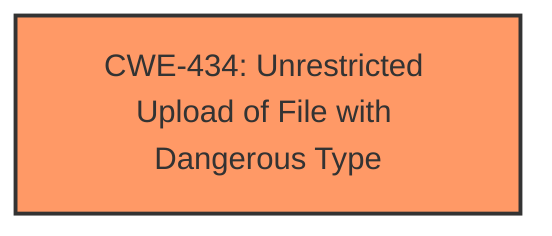

# Raw Analyzer Response for CVE-2025-3558

# Summary

| CWE ID | CWE Name | Confidence | CWE Abstraction Level | CWE Vulnerability Mapping Label | CWE-Vulnerability Mapping Notes |
|---|---|---|---|---|---|
| CWE-434 | Unrestricted Upload of File with Dangerous Type | 1.0 | Base | Allowed | Primary CWE: The vulnerability description and CVE reference summary both explicitly state that the vulnerability is due to **unrestricted file uploads**, allowing attackers to upload arbitrary and potentially dangerous files. |

## Evidence and Confidence

*   **Confidence Score:** 1.0
*   **Evidence Strength:** HIGH

## Relationship Analysis

The primary identified weakness is CWE-434, **Unrestricted Upload of File with Dangerous Type**. This CWE stands alone as the root cause. While other CWEs like CWE-73 (External Control of File Name or Path) and CWE-22 (Improper Limitation of a Pathname to a Restricted Directory) could be related in other file upload vulnerabilities, they are not directly implicated in this specific case based on the provided information. The relationships of CWE-434 include CANFOLLOW to CWE-73, CWE-184, and PEEROF to CWE-430, and CWE-436.

## Vulnerability Chain

The vulnerability chain is straightforward:

1.  **Root Cause:** CWE-434 (**Unrestricted Upload of File with Dangerous Type**) - The application **lacks proper validation** on uploaded files.
2.  **Impact:** Attackers upload malicious files, potentially gaining server access.

## Summary of Analysis

The analysis is based on the explicit description of the vulnerability as an **unrestricted upload**. The CVE reference summary reinforces this by stating the **lack of input validation** on file uploads as the root cause. This directly maps to CWE-434, which describes the scenario where a product allows the upload of dangerous file types.

The retriever results also list CWE-434 as a top candidate, further supporting this classification. While other CWEs such as CWE-73 (External Control of File Name or Path) and CWE-79 (Improper Neutralization of Input During Web Page Generation ('Cross-site Scripting')) are present in the retriever results, they don't directly address the core issue of **unrestricted file upload**.

The selected CWE is at the optimal level of specificity because it directly describes the vulnerability and its root cause.