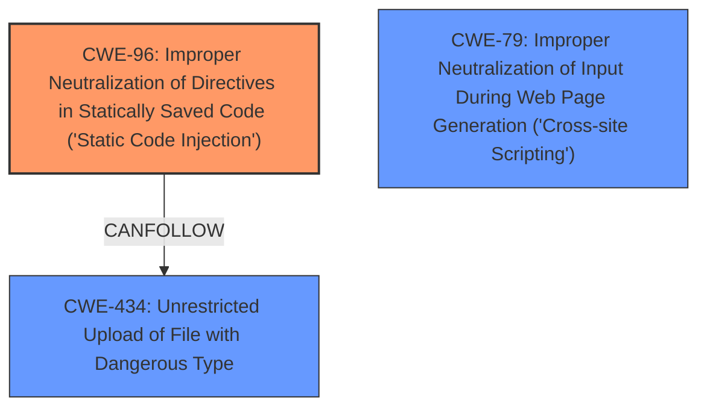

# Raw Analyzer Response for CVE-2025-3563

# Summary
| CWE ID | CWE Name | Confidence | CWE Abstraction Level | CWE Vulnerability Mapping Label | CWE-Vulnerability Mapping Notes |
|---|---|---|---|---|---|
| CWE-96 | Improper Neutralization of Directives in Statically Saved Code ('Static Code Injection') | 1.0 | Base | Allowed | Primary CWE: The **code injection** occurs because the input is not neutralized before being saved as code. |
| CWE-434 | Unrestricted Upload of File with Dangerous Type | 0.8 | Base | Allowed | Secondary CWE: The vulnerability can be triggered due to the ability to upload a file with a dangerous type without restrictions. |
| CWE-79 | Improper Neutralization of Input During Web Page Generation ('Cross-site Scripting') | 0.6 | Base | Allowed | Secondary CWE: The vulnerability can be triggered due to the improper neutralization of input during web page generation. |

## Evidence and Confidence

*   **Confidence Score:** 0.9
*   **Evidence Strength:** HIGH

## Relationship Analysis
The primary CWE is CWE-96, which describes the **improper neutralization of directives in statically saved code**. This is directly supported by the description of the vulnerability where input is not neutralized before being written to a file.

CWE-434 is a peer of other file upload related CWEs like CWE-430 and CWE-436, and describes the unrestricted upload of files with dangerous types. This is a closely related weakness because the **code injection** is made possible by uploading a file containing malicious code.

CWE-79 represents Cross-site Scripting which may occur due to improper neutralization of web page generation.

## Vulnerability Chain
The vulnerability chain starts with the **improper neutralization of input**, which leads to the possibility of **code injection** via a file upload:
1.  The `setting` parameter is not properly validated or sanitized.
2.  This allows an attacker to inject code into a file.
3.  The injected code is then executed by the server.

CWE-96 is the root cause, as it describes the initial coding error. CWE-434 and CWE-79 represent the means by which the code is injected.

## Summary of Analysis
The initial assessment was based on the provided evidence, particularly the description of the vulnerability as a **"code injection"** vulnerability in the setting handler, and the **lack of input validation**. The retriever results pointed towards CWE-96 (Improper Neutralization of Directives in Statically Saved Code) as a potential match, and this was confirmed by the CVE Reference Links Content Summary, which stated that the root cause was "Insufficient input filtering and validation of the setting parameter" and that the "parameter's content is directly written to a file without proper sanitization". This confirms that the code is being injected into a statically saved file due to **improper neutralization**, making CWE-96 the most appropriate primary CWE. The relationship analysis further reinforced this decision.

CWE-434 is included as a secondary CWE because the vulnerability is triggered by uploading a file with dangerous content, indicating that the product allows the "Unrestricted Upload of File with Dangerous Type".

CWE-79 is also included as a secondary CWE because the injected code may result in improper neutralization of input during web page generation.

The chosen CWEs are at the Base level of abstraction, which is the preferred level for mapping to the root causes of vulnerabilities. Other CWEs were considered, such as CWE-78 (Improper Neutralization of Special Elements used in an OS Command), but were deemed less relevant because the injection does not directly involve OS commands.