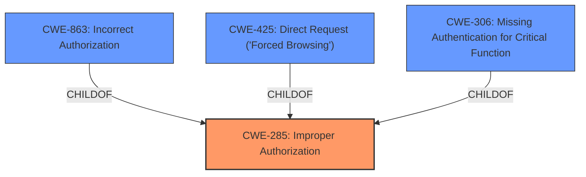

# Enhanced Analysis for CVE-2025-3564

# Summary
| CWE ID | CWE Name | Confidence | CWE Abstraction Level | CWE Vulnerability Mapping Label | CWE-Vulnerability Mapping Notes |
|---|---|---|---|---|---|
| CWE-285 | Improper Authorization | 0.85 | Class | Primary CWE | Allowed-with-Review |
| CWE-863 | Incorrect Authorization | 0.70 | Class | Secondary Candidate | Allowed-with-Review |
| CWE-425 | Direct Request ('Forced Browsing') | 0.60 | Base | Secondary Candidate | Allowed |
| CWE-306 | Missing Authentication for Critical Function | 0.50 | Base | Secondary Candidate | Allowed |

## Evidence and Confidence

*   **Confidence Score:** 0.80
*   **Evidence Strength:** MEDIUM

## Relationship Analysis
The primary CWE is CWE-285, Improper Authorization, which is a Class-level CWE. CWE-863, Incorrect Authorization, and CWE-425, Direct Request ('Forced Browsing'), are considered as potential related CWEs. CWE-863 is a more specific type of improper authorization where the authorization check is performed but done incorrectly. CWE-425 represents direct access to resources without proper authorization enforcement. CWE-306 is for missing authentication entirely.



## Vulnerability Chain
The vulnerability chain starts with **improper authorization**, potentially leading to unauthorized access to sensitive data or functionality.
  - Root Cause: **Improper Authorization** (CWE-285)
  - Potential Impact: Unauthorized access to teacher string handler functionality.

## Summary of Analysis
The vulnerability description explicitly states "**improper authorization**," making CWE-285 the most appropriate primary CWE. The retriever results also list CWE-285 as a candidate, although with a lower score compared to CWE-284 (Improper Access Control). However, given the guidance on Authentication vs Authorization vs Access Control, CWE-285 is favored over the more general CWE-284.

CWE-863 (Incorrect Authorization) is a strong secondary candidate because it represents a more specific case of improper authorization where a check is present but flawed. However, without more information on the specific implementation, CWE-285 is chosen as the primary.

CWE-425 (Direct Request ('Forced Browsing')) is another candidate, as it describes the lack of authorization enforcement on specific URLs or files. It is less likely than CWE-863 because the vulnerability description focuses on a component ("Teacher String Handler") rather than direct URL access.

CWE-306 (Missing Authentication for Critical Function) is considered but less likely because the description implies that authorization, rather than authentication, is the primary issue. The guidance clearly distinguishes between the two.

The selection is based on the provided evidence, primarily the "**improper authorization**" phrase in the vulnerability description. The graph relationships influenced the decision by highlighting potential child CWEs, but the lack of specific implementation details makes CWE-285 the most appropriate choice at its abstraction level. The selection is at the optimal level of specificity given the available information.

Relevant CWE Information:
* **CWE-285 (Improper Authorization):** This CWE is applicable because the vulnerability description explicitly mentions "**improper authorization**". This indicates that the system does not properly perform authorization checks, allowing unauthorized access to resources or functionalities. The security implication is that an attacker can gain access to sensitive information or perform actions they are not supposed to.
* **CWE-863 (Incorrect Authorization):** This CWE is a more specific case of CWE-285, where the authorization check is present but flawed. If the authorization logic is implemented incorrectly, it could still lead to unauthorized access. It's considered a secondary candidate because the provided description does not explicitly state that an authorization check exists but is flawed.
* **CWE-425 (Direct Request ('Forced Browsing'))**: The web application does not adequately enforce appropriate authorization on all restricted URLs, scripts, or files. The vulnerability description does not provide evidence for this.
* **CWE-306 (Missing Authentication for Critical Function):** This CWE is for cases where authentication is completely missing for critical functions. The vulnerability description does not explicitly state that authentication is missing, so CWE-306 is not a strong match.


## CWE Relationship Analysis

Current CWEs represent these abstraction levels: .


### Vulnerability Chain Analysis

**Chain starting from CWE-863:**
- 863 (Incorrect Authorization) - ROOT


**Chain starting from CWE-306:**
- 306 (Missing Authentication for Critical Function) - ROOT


### CWE Relationship Diagram

```mermaid
graph TD
    classDef primary fill:#f96,stroke:#333,stroke-width:2px
    classDef secondary fill:#69f,stroke:#333
    classDef tertiary fill:#9e9,stroke:#333
```