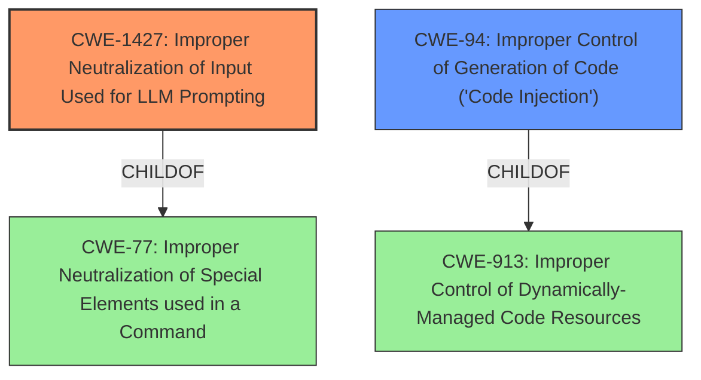

# Analysis Report for CVE-2025-3579

# Vulnerability Analysis Report: CVE-2025-3579

## Description

In versions prior to Aidex 1.7, an authenticated malicious user, taking advantage of an **open registry**, could execute unauthorised commands within the system. This includes executing operating system (Unix) commands, interacting with internal services such as PHP or MySQL, and even invoking native functions of the framework used, such as Laravel or Symfony. This execution is achieved by **Prompt Injection** attacks through the /api//message endpoint, manipulating the content of the content parameter.

## Vulnerability Description Key Phrases

- **Component:** /api//message endpoint
- **Rootcause:** open registry
- **Weakness:** Prompt Injection
- **Product:** Aidex
- **Impact:** execute unauthorised commands within the system, execute operating system (Unix) commands, interacting with internal services such as PHP or MySQL, invoking native functions of the framework used, such as Laravel or Symfony
- **Attacker:** authenticated malicious user
- **Version:** prior to 1.7

## Analysis (with Relationship Data)

# Summary
| CWE ID | CWE Name | Confidence | CWE Abstraction Level | CWE Vulnerability Mapping Label | CWE-Vulnerability Mapping Notes |
|---|---|---|---|---|---|
| CWE-1427 | Improper Neutralization of Input Used for LLM Prompting | 1.0 | Base | Allowed | Primary CWE. The vulnerability stems from **Prompt Injection** attacks through the `/api/<string-chat>/message` endpoint, specifically manipulating the ‘content’ parameter. |
| CWE-94 | Improper Control of Generation of Code ('Code Injection') | 0.7 | Base | Allowed-with-Review | Secondary Candidate. An authenticated malicious user can execute unauthorized commands within the system due to an **open registry**, including executing operating system (Unix) commands, interacting with internal services (PHP, MySQL), and invoking native framework functions (Laravel, Symfony). The underlying weakness is improper input validation and sanitization within the LLM chatbot, allowing for code injection via crafted prompts.|

## Evidence and Confidence

*   **Confidence Score:** 0.9
*   **Evidence Strength:** HIGH

## Relationship Analysis
The primary CWE is CWE-1427, which represents the **improper neutralization** of input used for LLM prompting. A secondary CWE is CWE-94, which represents **improper control of code generation** leading to code injection. CWE-1427 is related to CWE-77 (Improper Neutralization of Special Elements used in a Command) through a ChildOf relationship. CWE-94 can follow CWE-98 (Improper Control of Filename for Include/Require Statement in PHP Program) and is a child of CWE-913 (Improper Control of Dynamically-Managed Code Resources).



## Vulnerability Chain
The vulnerability chain starts with **Prompt Injection (CWE-1427)**, due to an **open registry**, allowing a malicious user to inject commands into the LLM. This leads to the execution of unauthorized commands (CWE-94) within the system, including OS commands, interactions with internal services, and invocation of native framework functions.

## Summary of Analysis
The primary weakness is CWE-1427 because the vulnerability stems from the ability to inject prompts into the LLM, leading to the execution of unauthorized commands. The evidence supporting this is the vulnerability description which mentions **Prompt Injection** attacks through the `/api/<string-chat>/message` endpoint, specifically manipulating the ‘content’ parameter. The CVE reference links content summary also mentions the same root cause. CWE-94 is added as a secondary weakness because the prompt injection leads to code execution.

I am basing my assessment on the provided evidence only. The evidence from the "Vulnerability Description Key Phrases" include:
- **rootcause:** **open registry**
- **weakness:** **Prompt Injection**

The evidence from the "CVE Reference Links Content Summary" include:
- The vulnerability stems from Prompt Injection attacks through the `/api/<string-chat>/message` endpoint, specifically manipulating the ‘content’ parameter.
- The underlying weakness is improper input validation and sanitization within the LLM chatbot, allowing for code injection via crafted prompts.

The selection of CWE-1427 is at the optimal level of specificity because it directly addresses the **improper neutralization** of input used for LLM prompting.

Relevant CWE Information:

# Enhanced Context (25 CWEs)
The following CWEs were identified as potentially relevant to this vulnerability:

## CWE-74: Improper Neutralization of Special Elements in Output Used by a Downstream Component ('Injection')
**Abstraction Level**: Class
**Similarity Score**: 0.78
**Source**: dense

**Description**:
The product constructs all or part of a command, data structure, or record using externally-influenced input from an upstream component, but it does not neutralize or incorrectly neutralizes special elements that could modify how it is parsed or interpreted when it is sent to a downstream component.

**Mapping Guidance**:
- Usage: Discouraged
- Rationale: CWE-74 is high-level and often misused when lower-level weaknesses are more appropriate.

## CWE-116: Improper Encoding or Escaping of Output
**Abstraction Level**: Class
**Similarity Score**: 0.76
**Source**: dense

**Description**:
The product prepares a structured message for communication with another component, but encoding or escaping of the data is either missing or done incorrectly. As a result, the intended structure of the message is not preserved.

**Mapping Guidance**:
- Usage: Allowed-with-Review
- Rationale: This CWE entry is a Class and might have Base-level children that would be more appropriate

## CWE-95: Improper Neutralization of Directives in Dynamically Evaluated Code ('Eval Injection')
**Abstraction Level**: Variant
**Similarity Score**: 0.76
**Source**: dense

**Description**:
The product receives input from an upstream component, but it does not neutralize or incorrectly neutralizes code syntax before using the input in a dynamic evaluation call (e.g. "eval").

**Mapping Guidance**:
- Usage: Allowed
- Rationale: This CWE entry is at the Variant level of abstraction, which is a preferred level of abstraction for mapping to the root causes of vulnerabilities.

## CWE-138: Improper Neutralization of Special Elements
**Abstraction Level**: Class
**Similarity Score**: 0.76
**Source**: dense

**Description**:
The product receives input from an upstream component, but it does not neutralize or incorrectly neutralizes special elements that could be interpreted as control elements or syntactic markers when they are sent to a downstream component.

**Mapping Guidance**:
- Usage: Discouraged
- Rationale: This CWE entry is a level-1 Class (i.e., a child of a Pillar). It might have lower-level children that would be more appropriate

## CWE-88: Improper Neutralization of Argument Delimiters in a Command ('Argument Injection')
**Abstraction Level**: Base
**Similarity Score**: 0.76
**Source**: dense

**Description**:
The product constructs a string for a command to be executed by a separate component
in another control sphere, but it does not properly delimit the
intended arguments, options, or switches within that command string.

**Mapping Guidance**:
- Usage: Allowed
- Rationale: This CWE entry is at the Base level of abstraction, which is a preferred level of abstraction for mapping to the root causes of vulnerabilities.

## CWE-184: Incomplete List of Disallowed Inputs
**Abstraction Level**: Base
**Similarity Score**: 0.76
**Source**: dense

**Description**:
The product implements a protection mechanism that relies on a list of inputs (or properties of inputs) that are not allowed by policy or otherwise require other action to neutralize before additional processing takes place, but the list is incomplete.

**Mapping Guidance**:
- Usage: Allowed
- Rationale: This CWE entry is at the Base level of abstraction, which is a preferred level of abstraction for mapping to the root causes of vulnerabilities.

## CWE-79: Improper Neutralization of Input During Web Page Generation ('Cross-site Scripting')
**Abstraction Level**: Base
**Similarity Score**: 0.75
**Source**: dense

**Description**:
The product does not neutralize or incorrectly neutralizes user-controllable input before it is placed in output that is used as a web page that is served to other users.

**Mapping Guidance**:
- Usage: Allowed
- Rationale: This CWE entry is at the Base level of abstraction, which is a preferred level of abstraction for mapping to the root causes of vulnerabilities.

## CWE-639: Authorization Bypass Through User-Controlled Key
**Abstraction Level**: Base
**Similarity Score**: 0.75
**Source**: dense

**Description**:
The system's authorization functionality does not prevent one user from gaining access to another user's data or record by modifying the key value identifying the data.

**Mapping Guidance**:
- Usage: Allowed
- Rationale: This CWE entry is at the Base level of abstraction, which is a preferred level of abstraction for mapping to the root causes of vulnerabilities.

## CWE-472: External Control of Assumed-Immutable Web Parameter
**Abstraction Level**: Base
**Similarity Score**: 0.75
**Source**: dense

**Description**:
The web application does not sufficiently verify inputs that are assumed to be immutable but are actually externally controllable, such as hidden form fields.

**


## CWE Relationship Analysis

Current CWEs represent these abstraction levels: .


### Vulnerability Chain Analysis

**Chain starting from CWE-94:**
- 94 (Improper Control of Generation of Code ('Code Injection')) - ROOT


**Chain starting from CWE-116:**
- 116 (Improper Encoding or Escaping of Output) - ROOT


### CWE Relationship Diagram

```mermaid
graph TD
    classDef primary fill:#f96,stroke:#333,stroke-width:2px
    classDef secondary fill:#69f,stroke:#333
    classDef tertiary fill:#9e9,stroke:#333
```


*Report generated on 2025-07-14 20:52:07*
