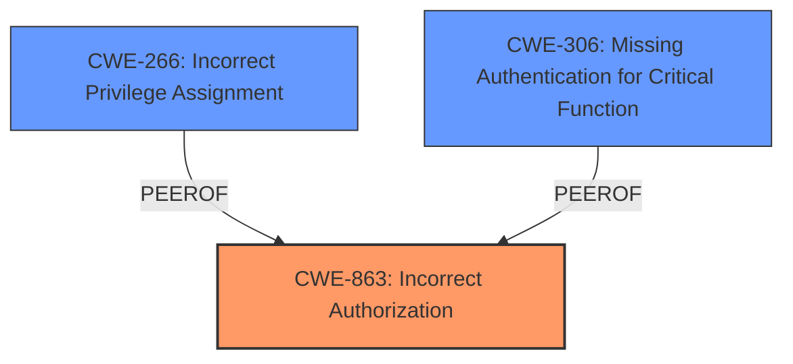

# Raw Analyzer Response for CVE-2025-3580

# Summary
| CWE ID  | CWE Name                                                       | Confidence | CWE Abstraction Level | CWE Vulnerability Mapping Label | CWE-Vulnerability Mapping Notes |
| :-------- | :------------------------------------------------------------- | :--------- | :-------------------- | :------------------------------ | :------------------------------ |
| CWE-863   | Incorrect Authorization                                        | 1          | Class                 | Primary                         | Allowed-with-Review           |
| CWE-266   | Incorrect Privilege Assignment                                 | 0.7        | Base                  | Secondary                       | Allowed                       |
| CWE-306   | Missing Authentication for Critical Function                    | 0.5        | Base                  | Secondary                       | Allowed                       |

## Evidence and Confidence

*   **Confidence Score:** 0.8
*   **Evidence Strength:** HIGH

## Relationship Analysis
The primary CWE is CWE-863, **Incorrect Authorization**, which is a Class-level CWE. This represents a flawed authorization check, which aligns with the **access control vulnerability** described in the vulnerability report where Organization administrators can delete Server administrator accounts due to a flaw in the authorization logic.
CWE-266, **Incorrect Privilege Assignment**, a Base-level CWE, and CWE-306, **Missing Authentication for Critical Function**, a Base-level CWE, are considered secondary.
CWE-863 is a parent of CWE-942 (Permissive Cross-domain Policy with Untrusted Domains), which was not applicable here.
CWE-306 is a child of CWE-287 (Improper Authentication), which was also not applicable.

## Vulnerability Chain
The vulnerability chain starts with an **access control vulnerability** due to **incorrect authorization**. This allows an Organization administrator to delete the Server administrator account. The impact is a potential loss of administrative control over the Grafana instance. The root cause is the **incorrect** implementation of the authorization check in the DELETE /api/org/users/ endpoint.
1.  **Root Cause:** **Incorrect Authorization** (CWE-863) in the DELETE /api/org/users/ endpoint.
2.  **Vulnerability:** Organization administrator can delete the Server administrator account.
3.  **Impact:** Loss of administrative control over the Grafana instance.

## Summary of Analysis
The primary CWE is CWE-863, **Incorrect Authorization**, because the vulnerability arises from a flaw in the authorization check when an Organization administrator attempts to delete a Server administrator account. The vulnerability description explicitly mentions an **access control vulnerability** in the DELETE /api/org/users/ endpoint, where Organization administrators can delete Server administrator accounts.
The "CVE Reference Links Content Summary" confirms this by stating: "An access control vulnerability in the DELETE /api/org/users/ endpoint."
CWE-863, **Incorrect Authorization**, directly addresses the **weakness** described.
I considered CWE-306, **Missing Authentication for Critical Function**, but it was not the most appropriate because the issue is not a complete lack of authentication but rather a flaw in the authorization process after authentication. Also, the **guidance provided** points to CWE-306 being about "no login required at all" which is not the case here.
I considered CWE-266, **Incorrect Privilege Assignment**, because deleting a Server Admin may be a privilege. However, the **access control vulnerability** is not due to the admin being assigned the wrong privilege, but due to the **incorrect authorization** check when deleting the Server Admin.

Relevant CWE Information:

# Enhanced Context (25 CWEs)

## CWE-668: Exposure of Resource to Wrong Sphere
**Abstraction Level**: Class
**Similarity Score**: 0.74
**Source**: dense

**Description**:
The product exposes a resource to the wrong control sphere, providing unintended actors with inappropriate access to the resource.

**Mapping Guidance**:
- Usage: Discouraged
- Rationale: CWE-668 is high-level and is often misused as a catch-all when lower-level CWE IDs might be applicable. It is sometimes used for low-information vulnerability reports [REF-1287]. It is a level-1 Class (i.e., a child of a Pillar). It is not useful for trend analysis.

## CWE-267: Privilege Defined With Unsafe Actions
**Abstraction Level**: Base
**Similarity Score**: 0.74
**Source**: dense

**Description**:
A particular privilege, role, capability, or right can be used to perform unsafe actions that were not intended, even when it is assigned to the correct entity.

**Mapping Guidance**:
- Usage: Allowed
- Rationale: This CWE entry is at the Base level of abstraction, which is a preferred level of abstraction for mapping to the root causes of vulnerabilities.

## CWE-266: Incorrect Privilege Assignment
**Abstraction Level**: Base
**Similarity Score**: 0.73
**Source**: dense

**Description**:
A product incorrectly assigns a privilege to a particular actor, creating an unintended sphere of control for that actor.

**Mapping Guidance**:
- Usage: Allowed
- Rationale: This CWE entry is at the Base level of abstraction, which is a preferred level of abstraction for mapping to the root causes of vulnerabilities.

## CWE-41: Improper Resolution of Path Equivalence
**Abstraction Level**: Base
**Similarity Score**: 0.72
**Source**: dense

**Description**:
The product is vulnerable to file system contents disclosure through path equivalence. Path equivalence involves the use of special characters in file and directory names. The associated manipulations are intended to generate multiple names for the same object.

**Mapping Guidance**:
- Usage: Allowed
- Rationale: This CWE entry is at the Base level of abstraction, which is a preferred level of abstraction for mapping to the root causes of vulnerabilities.

## CWE-274: Improper Handling of Insufficient Privileges
**Abstraction Level**: Base
**Similarity Score**: 0.72
**Source**: dense

**Description**:
The product does not handle or incorrectly handles when it has insufficient privileges to perform an operation, leading to resultant weaknesses.

**Mapping Guidance**:
- Usage: Discouraged
- Rationale: This CWE entry could be deprecated in a future version of CWE.

## CWE-280: Improper Handling of Insufficient Permissions or Privileges
**Abstraction Level**: Base
**Similarity Score**: 0.72
**Source**: dense

**Description**:
The product does not handle or incorrectly handles when it has insufficient privileges to access resources or functionality as specified by their permissions. This may cause it to follow unexpected code paths that may leave the product in an invalid state.

**Mapping Guidance**:
- Usage: Allowed
- Rationale: This CWE entry is at the Base level of abstraction, which is a preferred level of abstraction for mapping to the root causes of vulnerabilities.

## CWE-639: Authorization Bypass Through User-Controlled Key
**Abstraction Level**: Base
**Similarity Score**: 0.71
**Source**: dense

**Description**:
The system's authorization functionality does not prevent one user from gaining access to another user's data or record by modifying the key value identifying the data.

**Mapping Guidance**:
- Usage: Allowed
- Rationale: This CWE entry is at the Base level of abstraction, which is a preferred level of abstraction for mapping to the root causes of vulnerabilities.

## CWE-610: Externally Controlled Reference to a Resource in Another Sphere
**Abstraction Level**: Class
**Similarity Score**: 0.71
**Source**: dense

**Description**:
The product uses an externally controlled name or reference that resolves to a resource that is outside of the intended control sphere.

**Mapping Guidance**:
- Usage: Discouraged
- Rationale: This CWE entry is a level-1 Class (i.e., a child of a Pillar). It might have lower-level children that would be more appropriate

## CWE-1390: Weak Authentication
**Abstraction Level**: Class
**Similarity Score**: 0.71
**Source**: dense

**Description**:
The product uses an authentication mechanism to restrict access to specific users or identities, but the mechanism does not sufficiently prove that the claimed identity is correct.

**Mapping Guidance**:
- Usage: Allowed-with-Review
- Rationale: This CWE entry is a Class and might have Base-level children that would be more appropriate

## CWE-59: Improper Link Resolution Before File Access ('Link Following')
**Abstraction Level**: Base
**Similarity Score**: 0.71
**Source**: dense

**Description**:
The product attempts to access a file based on the filename, but it does not properly prevent