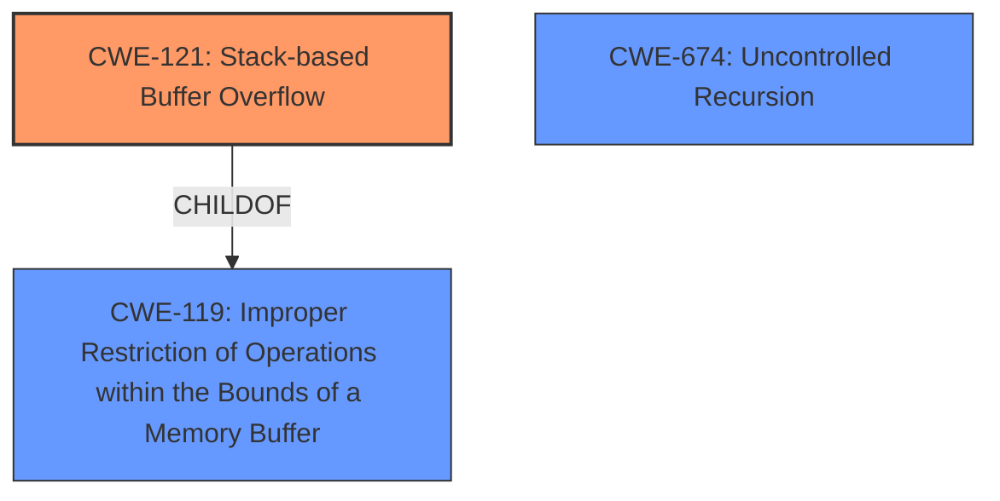

# Analysis Report for CVE-2025-3588

# Vulnerability Analysis Report: CVE-2025-3588

## Description

A vulnerability, which was classified as problematic, has been found in joelittlejohn jsonschema2pojo 1.2.2. This issue affects the function apply of the file org/jsonschema2pojo/rules/SchemaRule.java of the component JSON File Handler. The manipulation leads to **stack-based buffer overflow**. Attacking locally is a requirement. The exploit has been disclosed to the public and may be used. The vendor was contacted early about this disclosure but did not respond in any way.

## Vulnerability Description Key Phrases

- **Weakness:** stack-based buffer overflow
- **Product:** jsonschema2pojo
- **Version:** 1.2.2
- **Component:** org/jsonschema2pojo/rules/SchemaRule.java

## Analysis (with Relationship Data)

# Summary
| CWE ID | CWE Name | Confidence | CWE Abstraction Level | CWE Vulnerability Mapping Label | CWE-Vulnerability Mapping Notes |
|---|---|---|---|---|---|
| CWE-121 | Stack-based Buffer Overflow | 0.9 | Variant | Allowed | Primary CWE |
| CWE-674 | Uncontrolled Recursion | 0.7 | Class | Allowed-with-Review | Secondary Candidate |

## Evidence and Confidence

*   **Confidence Score:** 0.8
*   **Evidence Strength:** HIGH

## Relationship Analysis
The primary relationship influencing the decision is the hierarchical relationship. CWE-121 is a variant of the broader CWE-119. Additionally, the CVE Reference Links Content Summary indicates a recursive call vulnerability, suggesting a relationship to CWE-674. However, the provided description focuses on a **stack-based buffer overflow**, thus CWE-121 is more specific.



## Vulnerability Chain
The vulnerability chain appears to start with a **recursive call** due to **lack of input validation**, leading to a **stack-based buffer overflow**.

Recursive Call -> Lack of Input Validation -> Stack-based Buffer Overflow

## Summary of Analysis
The initial analysis strongly indicates a **stack-based buffer overflow** based on the vulnerability description. The phrase "stack-based buffer overflow" is a clear indicator. The CVE Reference Links Content Summary confirms a recursive call vulnerability, and therefore a lack of input validation, as the root cause leading to a StackOverflowError and potentially leading to the buffer overflow.

The evidence supporting CWE-121 is the explicit mention of "stack-based buffer overflow" in the vulnerability description. The CWE-674 is supported by the recursive nature described in the CVE Reference Links Content Summary.

CWE-121 is selected as the primary CWE because it accurately describes the vulnerability's manifestation, a **stack-based buffer overflow**. CWE-674 is considered a secondary CWE due to the root cause involving recursive calls. The selection is made at the optimal level of specificity, as CWE-121 is a variant of the more general CWE-119.

Relevant CWE Information:

# Enhanced Context (25 CWEs)
The following CWEs were identified as potentially relevant to this vulnerability:

## CWE-674: Uncontrolled Recursion
**Abstraction Level**: Class
**Similarity Score**: 0.76
**Source**: dense

**Description**:
The product does not properly control the amount of recursion that takes place,  consuming excessive resources, such as allocated memory or the program stack.

**Mapping Guidance**:
- Usage: Allowed-with-Review
- Rationale: This CWE entry is a Class and might have Base-level children that would be more appropriate

CWE-674 was considered because the CVE Reference Links Content Summary mentioned the issue involves a recursive loop. However, it is a Class level CWE and the specific vulnerability is a Stack-based Buffer Overflow, thus CWE-121 is more appropriate.

## CWE-502: Deserialization of Untrusted Data
**Abstraction Level**: Base
**Similarity Score**: 0.72
**Source**: dense

**Description**:
The product deserializes untrusted data without sufficiently ensuring that the resulting data will be valid.

**Mapping Guidance**:
- Usage: Allowed
- Rationale: This CWE entry is at the Base level of abstraction, which is a preferred level of abstraction for mapping to the root causes of vulnerabilities.

CWE-502 was not selected because there is no explicit mention or evidence that deserialization of untrusted data is a contributing factor to this vulnerability.

## CWE-116: Improper Encoding or Escaping of Output
**Abstraction Level**: Class
**Similarity Score**: 0.72
**Source**: dense

**Description**:
The product prepares a structured message for communication with another component, but encoding or escaping of the data is either missing or done incorrectly. As a result, the intended structure of the message is not preserved.

**Mapping Guidance**:
- Usage: Allowed-with-Review
- Rationale: This CWE entry is a Class and might have Base-level children that would be more appropriate

CWE-116 was not selected because there is no explicit mention or evidence that improper encoding or escaping of output is a contributing factor to this vulnerability.

## CWE-1286: Improper Validation of Syntactic Correctness of Input
**Abstraction Level**: Base
**Similarity Score**: 0.71
**Source**: dense

**Description**:
The product receives input that is expected to be well-formed - i.e., to comply with a certain syntax - but it does not validate or incorrectly validates that the input complies with the syntax.

**Mapping Guidance**:
- Usage: Allowed
- Rationale: This CWE entry is at the Base level of abstraction, which is a preferred level of abstraction for mapping to the root causes of vulnerabilities.

CWE-1286 was not selected as the primary CWE, but it is related to CWE-674 because the lack of validation allows the uncontrolled recursion to occur.

## CWE-138: Improper Neutralization of Special Elements
**Abstraction Level**: Class
**Similarity Score**: 0.71
**Source**: dense

**Description**:
The product receives input from an upstream component, but it does not neutralize or incorrectly neutralizes special elements that could be interpreted as control elements or syntactic markers when they are sent to a downstream component.

**Mapping Guidance**:
- Usage: Discouraged
- Rationale: This CWE entry is a level-1 Class (i.e., a child of a Pillar). It might have lower-level children that would be more appropriate

CWE-138 was not selected because there is no explicit mention or evidence that improper neutralization of special elements is a contributing factor to this vulnerability.

## CWE-74: Improper Neutralization of Special Elements in Output Used by a Downstream Component ('Injection')
**Abstraction Level**: Class
**Similarity Score**: 0.71
**Source**: dense

**Description**:
The product constructs all or part of a command, data structure, or record using externally-influenced input from an upstream component, but it does not neutralize or incorrectly neutralizes special elements that could modify how it is parsed or interpreted when it is sent to a downstream component.

**Mapping Guidance**:
- Usage: Discouraged
- Rationale: CWE-74 is high-level and often misused when lower-level weaknesses are more appropriate.

CWE-74 was not selected because there is no explicit mention or evidence that improper neutralization of special elements is a contributing factor to this vulnerability.

## CWE-193: Off-by-one Error
**Abstraction Level**: Base
**Similarity Score**: 0.71
**Source**: dense

**Description**:
A product calculates or uses an incorrect maximum or minimum value that is 1 more, or 1 less, than the correct value.

**Mapping Guidance**:
- Usage: Allowed
- Rationale: This CWE entry is at the Base level of abstraction, which is a preferred level of abstraction for mapping to the root causes of vulnerabilities.

CWE-193 was not selected because there is no explicit mention or evidence that an off-by-one error is a contributing factor to this vulnerability.

## CWE-755: Improper Handling of Exceptional Conditions
**Abstraction Level**: Class
**Similarity Score**: 0.71
**Source**: dense

**Description**:
The product does not handle or incorrectly handles an exceptional condition.

**Mapping Guidance**:
- Usage: Discouraged
- Rationale: This CWE entry is a level-1 Class (i.e., a child of a Pillar). It might have lower-level children that would be more appropriate

CWE-755 was not selected because there is no explicit mention or evidence that improper handling of exceptional conditions is a contributing factor to this vulnerability, although the StackOverflowError could be argued to be an exceptional condition.

## CWE-789: Memory Allocation with Excessive Size Value
**Abstraction Level**: Variant
**Similarity Score**: 0.70
**Source**: dense

**Description**:
The product allocates memory based on an untrusted, large size value, but it does not ensure that the size is within expected limits, allowing arbitrary amounts of memory to be allocated.

**Mapping Guidance**:
- Usage: Allowed
- Rationale: This CWE entry is at the Variant level of abstraction, which is a preferred level of abstraction for mapping to the root causes of vulnerabilities.

CWE-789 was not selected because there is no explicit mention or evidence that memory allocation with excessive size is a contributing factor to this vulnerability.

## CWE-917: Improper Neutralization of Special Elements used in an Expression Language Statement ('Expression Language Injection')
**Abstraction


## CWE Relationship Analysis

Current CWEs represent these abstraction levels: .


### Vulnerability Chain Analysis

**Chain starting from CWE-502:**
- 502 (Deserialization of Untrusted Data) - ROOT


**Chain starting from CWE-121:**
- 121 (Stack-based Buffer Overflow) - ROOT


### CWE Relationship Diagram

```mermaid
graph TD
    classDef primary fill:#f96,stroke:#333,stroke-width:2px
    classDef secondary fill:#69f,stroke:#333
    classDef tertiary fill:#9e9,stroke:#333
```


*Report generated on 2025-07-14 20:53:40*
