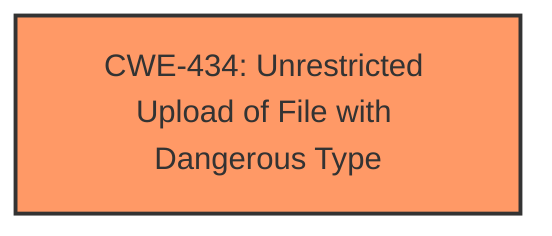

# Analysis Report for CVE-2025-3593

# Vulnerability Analysis Report: CVE-2025-3593

## Description

A vulnerability was found in ZHENFENG13/code-projects My-Blog-layui 1.0. It has been declared as critical. This vulnerability affects the function Upload of the file /admin/upload/authorImg/. The manipulation of the argument File leads to **unrestricted upload**. The attack can be initiated remotely. The exploit has been disclosed to the public and may be used. The vendor was contacted early about this disclosure but did not respond in any way.

## Vulnerability Description Key Phrases

- **Weakness:** unrestricted upload
- **Vector:** manipulation of File argument
- **Product:** ZHENFENG13/code-projects My-Blog-layui
- **Version:** 1
- **Component:** Upload function in /admin/upload/authorImg/

## Analysis (with Relationship Data)

# Summary
| CWE ID | CWE Name | Confidence | CWE Abstraction Level | CWE Vulnerability Mapping Label | CWE-Vulnerability Mapping Notes |
|---|---|---|---|---|---|
| CWE-434 | Unrestricted Upload of File with Dangerous Type | 1.0 | Base | Primary | Allowed |

## Evidence and Confidence

*   **Confidence Score:** 1.0
*   **Evidence Strength:** HIGH

## Relationship Analysis
The primary CWE is CWE-434, which is a base level CWE. There are no parent or child relationships that are particularly relevant to this vulnerability. The other CWEs identified are related to input validation, path traversal, or injection, but they don't describe the core issue of allowing unrestricted uploads of dangerous file types.



## Vulnerability Chain
The vulnerability chain is simple:
1.  **Unrestricted Upload (CWE-434)**: The application allows users to upload files without sufficient restrictions on the file type.

## Summary of Analysis
The primary weakness described in the vulnerability is an **unrestricted upload** of files. The vulnerability description clearly states that the manipulation of the File argument leads to this **unrestricted upload**. The retriever results also list CWE-434 as a potential match.

Based on the vulnerability description, the most appropriate CWE is CWE-434 (Unrestricted Upload of File with Dangerous Type). This CWE directly addresses the **root cause** of the vulnerability, which is the lack of restrictions on uploaded file types.

The vulnerability description states: "This vulnerability affects the function Upload of the file /admin/upload/authorImg/. The manipulation of the argument File leads to **unrestricted upload**."

The description clearly highlights the ability to upload files without restrictions, making CWE-434 the most accurate classification.

# Relevant CWE Information:

# Enhanced Context (25 CWEs)
The following CWEs were identified as potentially relevant to this vulnerability:

## CWE-434: Unrestricted Upload of File with Dangerous Type
**Abstraction Level**: Base
**Similarity Score**: 0.81
**Source**: dense

**Description**:
The product allows the upload or transfer of dangerous file types that are automatically processed within its environment.

**Mapping Guidance**:
- Usage: Allowed
- Rationale: This CWE entry is at the Base level of abstraction, which is a preferred level of abstraction for mapping to the root causes of vulnerabilities.


## CWE Relationship Analysis

Current CWEs represent these abstraction levels: .


### Vulnerability Chain Analysis

**Chain starting from CWE-434:**
- 434 (Unrestricted Upload of File with Dangerous Type) - ROOT


### CWE Relationship Diagram

```mermaid
graph TD
    classDef primary fill:#f96,stroke:#333,stroke-width:2px
    classDef secondary fill:#69f,stroke:#333
    classDef tertiary fill:#9e9,stroke:#333
```


*Report generated on 2025-07-14 20:54:43*
