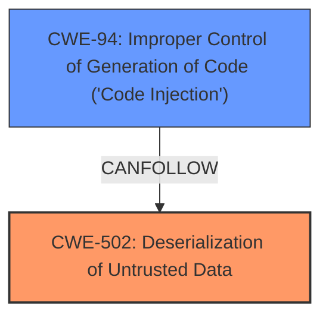

# Analysis Report for CVE-2025-3622

# Vulnerability Analysis Report: CVE-2025-3622

## Description

A vulnerability, which was classified as critical, has been found in Xorbits Inference up to 1.4.1. This issue affects the function load of the file xinference/thirdparty/cosyvoice/cli/model.py. The manipulation leads to **deserialization**.

## Vulnerability Description Key Phrases

- **Weakness:** deserialization
- **Product:** Xorbits Inference
- **Version:** up to 1.4.1
- **Component:** xinference/thirdparty/cosyvoice/cli/model.py load function

## Analysis (with Relationship Data)

# Summary
| CWE ID | CWE Name | Confidence | CWE Abstraction Level | CWE Vulnerability Mapping Label | CWE-Vulnerability Mapping Notes |
|---|---|---|---|---|---|
| CWE-502 | Deserialization of Untrusted Data | 1.0 | Base | Allowed | Primary CWE. The vulnerability stems from using `torch.load` without the `weights_only=True` parameter when deserializing model state dictionaries from potentially untrusted files, leading to arbitrary code execution. |

## Evidence and Confidence

*   **Confidence Score:** 1.0
*   **Evidence Strength:** HIGH

## Relationship Analysis
The primary CWE identified is CWE-502 (Deserialization of Untrusted Data), which is a Base level CWE. There are no direct parent-child or chain relationships that significantly influence the selection in this specific case, as the vulnerability is directly attributable to the insecure deserialization process. While other CWEs like CWE-94 (Improper Control of Generation of Code ('Code Injection')) could be a consequence of CWE-502, the root cause is the deserialization itself.



## Vulnerability Chain
The vulnerability chain starts with the **deserialization** of untrusted data via `torch.load` without `weights_only=True` (CWE-502). This leads to the potential for arbitrary code execution (CWE-94 as a consequence).

CWE-502 (Root Cause) -> CWE-94 (Potential Impact)

## Summary of Analysis
The analysis is primarily based on the provided vulnerability description and the CVE reference content summary, which clearly indicate that the root cause is the insecure deserialization of untrusted data.

Evidence:
- Vulnerability Description Key Phrases: "**weakness:** **deserialization**"
- CVE Reference Links Content Summary: "The vulnerability stems from using `torch.load` without the `weights_only=True` parameter when deserializing model state dictionaries from potentially untrusted files (`llm_model`, `flow_model`, `hift_model`). This allows for arbitrary code execution if the files contain malicious pickle data."

The relationship analysis confirms that while other CWEs might be related or consequential, the primary issue is the deserialization of untrusted data, making CWE-502 the most appropriate and specific classification. The other potential CWEs are less specific and do not represent the core issue as directly as CWE-502. For example, CWE-94 (Code Injection) could be a *result* of the deserialization, but it is not the root cause.

Relevant CWE Information:

# Enhanced Context (25 CWEs)
The following CWEs were identified as potentially relevant to this vulnerability:

## CWE-345: Insufficient Verification of Data Authenticity
**Abstraction Level**: Class
**Similarity Score**: 0.72
**Source**: dense

**Description**:
The product does not sufficiently verify the origin or authenticity of data, in a way that causes it to accept invalid data.

**Mapping Guidance**:
- Usage: Discouraged
- Rationale: This CWE entry is a level-1 Class (i.e., a child of a Pillar). It might have lower-level children that would be more appropriate

*Not Used:* While data authenticity is a concern, the core issue is the **deserialization** process itself, not just the lack of authentication.

## CWE-116: Improper Encoding or Escaping of Output
**Abstraction Level**: Class
**Similarity Score**: 0.72
**Source**: dense

**Description**:
The product prepares a structured message for communication with another component, but encoding or escaping of the data is either missing or done incorrectly. As a result, the intended structure of the message is not preserved.

**Mapping Guidance**:
- Usage: Allowed-with-Review
- Rationale: This CWE entry is a Class and might have Base-level children that would be more appropriate

*Not Used:* This is not related to encoding or escaping of output.

## CWE-1286: Improper Validation of Syntactic Correctness of Input
**Abstraction Level**: Base
**Similarity Score**: 0.72
**Source**: dense

**Description**:
The product receives input that is expected to be well-formed - i.e., to comply with a certain syntax - but it does not validate or incorrectly validates that the input complies with the syntax.

**Mapping Guidance**:
- Usage: Allowed
- Rationale: This CWE entry is at the Base level of abstraction, which is a preferred level of abstraction for mapping to the root causes of vulnerabilities.

*Not Used:* While input validation is lacking, the core issue is the unsafe deserialization of data without proper type checking.

## CWE-502: Deserialization of Untrusted Data
**Abstraction Level**: Base
**Similarity Score**: 0.72
**Source**: dense

**Description**:
The product deserializes untrusted data without sufficiently ensuring that the resulting data will be valid.

**Mapping Guidance**:
- Usage: Allowed
- Rationale: This CWE entry is at the Base level of abstraction, which is a preferred level of abstraction for mapping to the root causes of vulnerabilities.

*Used:* This aligns perfectly with the vulnerability where `torch.load` is used without `weights_only=True`, leading to the potential for arbitrary code execution.

## CWE-755: Improper Handling of Exceptional Conditions
**Abstraction Level**: Class
**Similarity Score**: 0.71
**Source**: dense

**Description**:
The product does not handle or incorrectly handles an exceptional condition.

**Mapping Guidance**:
- Usage: Discouraged
- Rationale: This CWE entry is a level-1 Class (i.e., a child of a Pillar). It might have lower-level children that would be more appropriate

*Not Used:* This is too general. The vulnerability is specifically related to deserialization.

## CWE-497: Exposure of Sensitive System Information to an Unauthorized Control Sphere
**Abstraction Level**: Base
**Similarity Score**: 0.71
**Source**: dense

**Description**:
The product does not properly prevent sensitive system-level information from being accessed by unauthorized actors who do not have the same level of access to the underlying system as the product does.

**Mapping Guidance**:
- Usage: Allowed
- Rationale: This CWE entry is at the Base level of abstraction, which is a preferred level of abstraction for mapping to the root causes of vulnerabilities.

*Not Used:* This is not relevant to the vulnerability.

## CWE-346: Origin Validation Error
**Abstraction Level**: Class
**Similarity Score**: 0.71
**Source**: dense

**Description**:
The product does not properly verify that the source of data or communication is valid.

**Mapping Guidance**:
- Usage: Allowed-with-Review
- Rationale: This CWE entry is a Class and might have Base-level children that would be more appropriate

*Not Used:* While origin validation could be a concern, the primary issue is the insecure deserialization process itself.

## CWE-203: Observable Discrepancy
**Abstraction Level**: Base
**Similarity Score**: 0.71
**Source**: dense

**Description**:
The product behaves differently or sends different responses under different circumstances in a way that is observable to an unauthorized actor, which exposes security-relevant information about the state of the product, such as whether a particular operation was successful or not.

**Mapping Guidance**:
- Usage: Allowed
- Rationale: This CWE entry is at the Base level of abstraction, which is a preferred level of abstraction for mapping to the root causes of vulnerabilities.

*Not Used:* This is not relevant to the vulnerability.

## CWE-88: Improper Neutralization of Argument Delimiters in a Command ('Argument Injection')
**Abstraction Level**: Base
**Similarity Score**: 0.71
**Source**: dense

**Description**:
The product constructs a string for a command to be executed by a separate component
in another control sphere, but it does not properly delimit the
intended arguments, options, or switches within that command string.

**Mapping Guidance**:
- Usage: Allowed
- Rationale: This CWE entry is at the Base level of abstraction, which is a preferred level of abstraction for mapping to the root causes of vulnerabilities.

*Not Used:* This is not relevant to the vulnerability.

## CWE-319: Cleartext Transmission of Sensitive Information
**Abstraction Level**: Base
**Similarity Score**: 0.71
**Source**: dense

**Description**:
The product transmits sensitive or security-critical data in cleartext in a communication channel that can be sniffed by unauthorized actors.

**Mapping Guidance**:
- Usage: Allowed
- Rationale: This CWE entry is at the Base level of abstraction, which is a preferred level of abstraction for mapping to the root causes of vulnerabilities.

*Not Used:* This is not relevant to the vulnerability.

## CWE-22: Improper Limitation of a Path


## CWE Relationship Analysis

Current CWEs represent these abstraction levels: .


### Vulnerability Chain Analysis

**Chain starting from CWE-502:**
- 502 (Deserialization of Untrusted Data) - ROOT


**Chain starting from CWE-116:**
- 116 (Improper Encoding or Escaping of Output) - ROOT


### CWE Relationship Diagram

```mermaid
graph TD
    classDef primary fill:#f96,stroke:#333,stroke-width:2px
    classDef secondary fill:#69f,stroke:#333
    classDef tertiary fill:#9e9,stroke:#333
```


*Report generated on 2025-07-14 20:57:01*
