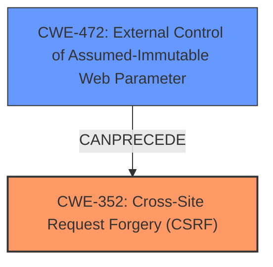

# Raw Analyzer Response for CVE-2025-3637

# Summary
| CWE ID | CWE Name | Confidence | CWE Abstraction Level | CWE Vulnerability Mapping Label | CWE-Vulnerability Mapping Notes |
|---|---|---|---|---|---|
| CWE-352 | Cross-Site Request Forgery (CSRF) | 0.9 | Compound |  Primary | Allowed |
| CWE-472 | External Control of Assumed-Immutable Web Parameter | 0.6 | Base | Secondary | Allowed |

## Evidence and Confidence

*   **Confidence Score:** 0.75
*   **Evidence Strength:** MEDIUM

## Relationship Analysis
The primary identified weakness is CWE-352, Cross-Site Request Forgery (CSRF), which is a compound weakness involving multiple contributing factors. The secondary weakness is CWE-472, External Control of Assumed-Immutable Web Parameter, which is a base-level weakness. CWE-472 can be a contributing factor to CSRF by allowing attackers to manipulate parameters that are assumed to be immutable, such as CSRF tokens themselves when passed via a URL.

## Vulnerability Chain
The vulnerability chain starts with the **incorrect** inclusion of the CSRF token in the URL (a form of **External Control of Assumed-Immutable Web Parameter** - CWE-472). This **exposure** then leads to the possibility of a Cross-Site Request Forgery (CSRF) attack (CWE-352).

## Summary of Analysis
The analysis indicates that the primary weakness is CWE-352 (Cross-Site Request Forgery), as the vulnerability description explicitly mentions CSRF attacks. Supporting this, the CVE description states "CSRF Token Exposure via URL". The root cause, however, lies in the fact that the CSRF token was included in the URL, which is an externally controllable parameter that should be treated as immutable. This leads to the consideration of CWE-472 (External Control of Assumed-Immutable Web Parameter).

The provided evidence directly supports CWE-352 as the main vulnerability. The inclusion of the CSRF token in the URL makes the application vulnerable to CSRF attacks. The retriever results also list CWE-352 as the top candidate.

CWE-472 is selected as a secondary weakness because the vulnerability involves the external control of a parameter (the CSRF token in the URL) that should be treated as immutable. This external control is a prerequisite for the CSRF vulnerability.

I am overriding the retriever results which only include CWE-352. The additional information provided in the vulnerability description allows inclusion of CWE-472, because it contains the rootcause of the vulnerability chain.

Relevant CWE Information:

# Enhanced Context (25 CWEs)
The following CWEs were identified as potentially relevant to this vulnerability:

## CWE-472: External Control of Assumed-Immutable Web Parameter
**Abstraction Level**: Base
**Similarity Score**: 0.75
**Source**: dense

**Description**:
The web application does not sufficiently verify inputs that are assumed to be immutable but are actually externally controllable, such as hidden form fields.

**Mapping Guidance**:
- Usage: Allowed
- Rationale: This CWE entry is at the Base level of abstraction, which is a preferred level of abstraction for mapping to the root causes of vulnerabilities.

**CWE-352 Cross-Site Request Forgery:** The web application does not, or can not, sufficiently verify whether a well-formed, valid, consistent request was intentionally provided by the user who submitted the request.