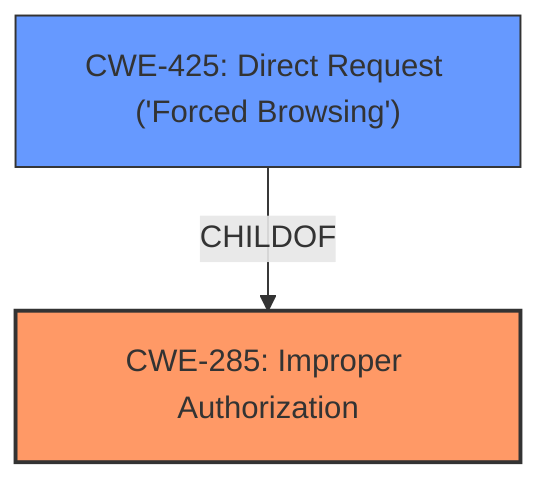

# Analysis for CVE-2025-3667

# Summary
| CWE ID  | CWE Name                                                                    | Confidence | CWE Abstraction Level | CWE Vulnerability Mapping Label | CWE-Vulnerability Mapping Notes |
| :-------- | :-------------------------------------------------------------------------- | :--------- | :---------------------- | :------------------------------ | :------------------------------ |
| CWE-285   | Improper Authorization                                                      | 0.85       | Class                   | Primary                         | Allowed                        |
| CWE-425   | Direct Request ('Forced Browsing')                                       | 0.75       | Base                   | Secondary                      | Allowed                        |

## Evidence and Confidence

*   **Confidence Score:** 0.8
*   **Evidence Strength:** MEDIUM

## Relationship Analysis
The primary weakness identified is **improper access controls**, which is best represented by CWE-285, Improper Authorization. CWE-285 is a class-level CWE. A more specific base-level CWE related to authorization is CWE-425, Direct Request ('Forced Browsing'), which describes a failure to enforce authorization on specific URLs, scripts, or files. The vulnerability description indicates that the attack can be initiated remotely, supporting the idea that specific functions are accessible without proper authorization checks.

## Vulnerability Chain
The vulnerability chain starts with the **improper access controls** (CWE-285). The TOTOLINK A3700R 9.1.2u.5822_B20200513 allows unauthorized remote manipulation of the setUPnPCfg function, due to a failure in authorization checks. This aligns with CWE-425, Direct Request, as the specific function can be accessed directly without proper authorization, leading to unauthorized configuration changes.

## Summary of Analysis
The primary classification is CWE-285, Improper Authorization, based on the explicit mention of **improper access controls** in the vulnerability description. However, considering that the vulnerability allows remote access to a specific function without authorization, CWE-425, Direct Request ('Forced Browsing'), is included as a secondary, more specific CWE. The evidence supports these classifications, although details of the exact mechanism are not provided.

The final selection represents the optimal level of specificity given the available evidence. CWE-285 captures the general authorization failure, while CWE-425 provides a more granular view of the specific attack vector (direct request without authorization).

Relevant CWE Information:

# Enhanced Context (25 CWEs)
The following CWEs were identified as potentially relevant to this vulnerability:

## CWE-790: Improper Filtering of Special Elements
**Abstraction Level**: Class
**Similarity Score**: 0.79

## CWE-425: Direct Request ('Forced Browsing')
**Abstraction Level**: Base
**Similarity Score**: 0.76

## CWE-259: Use of Hard-coded Password
**Abstraction Level**: Variant
**Similarity Score**: 0.76

## CWE-78: Improper Neutralization of Special Elements used in an OS Command ('OS Command Injection')
**Abstraction Level**: Base
**Similarity Score**: 0.76

## CWE-294: Authentication Bypass by Capture-replay
**Abstraction Level**: Base
**Similarity Score**: 0.75

## CWE-923: Improper Restriction of Communication Channel to Intended Endpoints
**Abstraction Level**: Class
**Similarity Score**: 0.75

## CWE-303: Incorrect Implementation of Authentication Algorithm
**Abstraction Level**: Base
**Similarity Score**: 0.74

## CWE-1391: Use of Weak Credentials
**Abstraction Level**: Class
**Similarity Score**: 0.74

## CWE-798: Use of Hard-coded Credentials
**Abstraction Level**: Base
**Similarity Score**: 0.74

## CWE-497: Exposure of Sensitive System Information to an Unauthorized Control Sphere
**Abstraction Level**: Base
**Similarity Score**: 0.74

## CWE-89: Improper Neutralization of Special Elements used in an SQL Command ('SQL Injection')
**Abstraction Level**: Base
**Similarity Score**: 547.45

## CWE-22: Improper Limitation of a Pathname to a Restricted Directory ('Path Traversal')
**Abstraction Level**: Base
**Similarity Score**: 512.17

## CWE-138: Improper Neutralization of Special Elements
**Abstraction Level**: Class
**Similarity Score**: 493.57

## CWE-79: Improper Neutralization of Input During Web Page Generation ('Cross-site Scripting')
**Abstraction Level**: Base
**Similarity Score**: 486.01

## CWE-78: Improper Neutralization of Special Elements used in an OS Command ('OS Command Injection')
**Abstraction Level**: Base
**Similarity Score**: 481.61

## CWE-22: Improper Limitation of a Pathname to a Restricted Directory ('Path Traversal')
**Abstraction Level**: base
**Similarity Score**: 4.33

## CWE-73: External Control of File Name or Path
**Abstraction Level**: Base
**Similarity Score**: 3.31

## CWE-79: Improper Neutralization of Input During Web Page Generation ('Cross-site Scripting')
**Abstraction Level**: base
**Similarity Score**: 3.23

## CWE-89: Improper Neutralization of Special Elements used in an SQL Command ('SQL Injection')
**Abstraction Level**: base
**Similarity Score**: 3.00

## CWE-78: Improper Neutralization of Special Elements used in an OS Command ('OS Command Injection')
**Abstraction Level**: Base
**Similarity Score**: 2.64

## CWE-425: Direct Request ('Forced Browsing')
**Abstraction Level**: Base
**Similarity Score**: 2.59

## CWE-184: Incomplete List of Disallowed Inputs
**Abstraction Level**: base
**Similarity Score**: 2.21

## CWE-494: Download of Code Without Integrity Check
**Abstraction Level**: base
**Similarity Score**: 2.21

## CWE-434: Unrestricted Upload of File with Dangerous Type
**Abstraction Level**: base
**Similarity Score**: 2.21

## CWE-59: Improper Link Resolution Before File Access ('Link Following')
**Abstraction Level**: base
**Similarity Score**: 2.21

CWEs Considered but Not Used:

*   CWE-306 (Missing Authentication for Critical Function): While related, the description explicitly mentions **improper access controls**, making CWE-285 a more direct fit. CWE-306 also implies the function should have authentication, but it is missing. CWE-285 is more general and applies even if the function *has* authentication but it is flawed.
*   CWE-266 (Incorrect Privilege Assignment): This is a more specific case of **improper access controls**, but the provided details do not confirm that the issue lies in incorrect privilege assignments. The issue is more general than just privilege assignment.
*   CWE-78, CWE-79, CWE-89, CWE-22: These CWEs relate to input validation and injection vulnerabilities, but there is no evidence to suggest these are present.