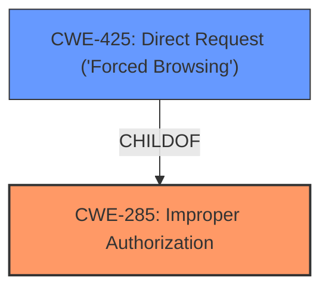

# Raw Analyzer Response for CVE-2025-3675

# Summary
| CWE ID | CWE Name | Confidence | CWE Abstraction Level | CWE Vulnerability Mapping Label | CWE-Vulnerability Mapping Notes |
|---|---|---|---|---|---|
| CWE-285 | Improper Authorization | 0.9 | Class | Primary | Allowed |
| CWE-425 | Direct Request ('Forced Browsing') | 0.7 | Base | Secondary | Allowed |

## Evidence and Confidence

*   **Confidence Score:** 0.8
*   **Evidence Strength:** MEDIUM

## Relationship Analysis
The primary CWE is CWE-285, "Improper Authorization," which is a class-level CWE. CWE-425, "Direct Request ('Forced Browsing')," is a child of CWE-285 and represents a more specific case where authorization is not adequately enforced on URLs. The relationship between CWE-285 and CWE-425 influenced the decision to include both, with CWE-285 as the broader class and CWE-425 as a specific manifestation of the authorization issue.

## Vulnerability Chain
The vulnerability chain starts with **improper access controls** (CWE-285), potentially leading to direct requests without proper authorization (CWE-425). The manipulation of the `setL2tpServerCfg` function in `/cgi-bin/cstecgi.cgi` allows remote attackers to bypass intended access restrictions.

## Summary of Analysis
The initial assessment identified **improper access controls** as the root cause. The vulnerability description directly states that "The manipulation leads to **improper access controls**." This aligns well with CWE-285.

The Retriever Results suggest several other CWEs, including SQL injection (CWE-89), Cross-Site Scripting (CWE-79), and OS Command Injection (CWE-78). However, these relate to different types of vulnerabilities, i.e. improper neutralization of input, while the stated weakness is **improper access controls**.

CWE-425, "Direct Request ('Forced Browsing')," is included as a secondary CWE because it represents a specific type of authorization failure, where the application does not adequately enforce authorization on restricted URLs. While the description does not explicitly state forced browsing, **improper access controls** could manifest as such, especially given the affected function `setL2tpServerCfg`.

The selected CWEs are at the optimal level of specificity. CWE-285 is a class-level CWE that captures the general **improper authorization** issue. CWE-425 provides a more specific context related to direct requests, enhancing the overall understanding of the vulnerability.

Relevant CWE Information:

# Enhanced Context (25 CWEs)
The following CWEs were identified as potentially relevant to this vulnerability:

## CWE-790: Improper Filtering of Special Elements
**Abstraction Level**: Class
**Similarity Score**: 0.78
**Source**: dense

**Description**:
The product receives data from an upstream component, but does not filter or incorrectly filters special elements before sending it to a downstream component.

**Mapping Guidance**:
- Usage: Allowed-with-Review
- Rationale: This CWE entry is a Class and might have Base-level children that would be more appropriate

*NOT USED:* This CWE relates to improper filtering, which is not the primary issue described in the vulnerability. The root cause is **improper access controls**.

## CWE-259: Use of Hard-coded Password
**Abstraction Level**: Variant
**Similarity Score**: 0.76
**Source**: dense

**Description**:
The product contains a hard-coded password, which it uses for its own inbound authentication or for outbound communication to external components.

**Mapping Guidance**:
- Usage: Allowed
- Rationale: This CWE entry is at the Variant level of abstraction, which is a preferred level of abstraction for mapping to the root causes of vulnerabilities.

*NOT USED:* This CWE relates to hard-coded passwords, which is not mentioned in the vulnerability description. The root cause is **improper access controls**.

## CWE-425: Direct Request ('Forced Browsing')
**Abstraction Level**: Base
**Similarity Score**: 0.76
**Source**: dense

**Description**:
The web application does not adequately enforce appropriate authorization on all restricted URLs, scripts, or files.

**Mapping Guidance**:
- Usage: Allowed
- Rationale: This CWE entry is at the Base level of abstraction, which is a preferred level of abstraction for mapping to the root causes of vulnerabilities.

*USED as secondary:* This CWE is relevant as a possible manifestation of **improper access controls**, where authorization is not adequately enforced.

## CWE-78: Improper Neutralization of Special Elements used in an OS Command ('OS Command Injection')
**Abstraction Level**: Base
**Similarity Score**: 0.76
**Source**: dense

**Description**:
The product constructs all or part of an OS command using externally-influenced input from an upstream component, but it does not neutralize or incorrectly neutralizes special elements that could modify the intended OS command when it is sent to a downstream component.

**Mapping Guidance**:
- Usage: Allowed
- Rationale: This CWE entry is at the Base level of abstraction, which is a preferred level of abstraction for mapping to the root causes of vulnerabilities.

*NOT USED:* This CWE relates to OS command injection, which is not the primary issue described in the vulnerability. The root cause is **improper access controls**.

## CWE-294: Authentication Bypass by Capture-replay
**Abstraction Level**: Base
**Similarity Score**: 0.75
**Source**: dense

**Description**:
A capture-replay flaw exists when the design of the product makes it possible for a malicious user to sniff network traffic and bypass authentication by replaying it to the server in question to the same effect as the original message (or with minor changes).

**Mapping Guidance**:
- Usage: Allowed
- Rationale: This CWE entry is at the Base level of abstraction, which is a preferred level of abstraction for mapping to the root causes of vulnerabilities.

*NOT USED:* This CWE relates to capture-replay attacks, which are not mentioned in the vulnerability description. The root cause is **improper access controls**.

## CWE-923: Improper Restriction of Communication Channel to Intended Endpoints
**Abstraction Level**: Class
**Similarity Score**: 0.74
**Source**: dense

**Description**:
The product establishes a communication channel to (or from) an endpoint for privileged or protected operations, but it does not properly ensure that it is communicating with the correct endpoint.

**Mapping Guidance**:
- Usage: Allowed-with-Review
- Rationale: This CWE entry is a Class and might have Base-level children that would be more appropriate

*NOT USED:* This CWE relates to communication channel restrictions, which is not the primary issue described in the vulnerability. The root cause is **improper access controls**.

## CWE-303: Incorrect Implementation of Authentication Algorithm
**Abstraction Level**: Base
**Similarity Score**: 0.74
**Source**: dense

**Description**:
The requirements for the product dictate the use of an established authentication algorithm, but the implementation of the algorithm is incorrect.

**Mapping Guidance**:
- Usage: Allowed
- Rationale: This CWE entry is at the Base level of abstraction, which is a preferred level of abstraction for mapping to the root causes of vulnerabilities.

*NOT USED:* This CWE relates to authentication algorithm implementation, which is not mentioned in the vulnerability description. The root cause is **improper access controls**.

## CWE-1391: Use of Weak Credentials
**Abstraction Level**: Class
**Similarity Score**: 0.74
**Source**: dense

**Description**:
The product uses weak credentials (such as a default key or hard-coded password) that can be calculated, derived, reused, or guessed by an attacker.

**Mapping Guidance**:
- Usage: Allowed-with-Review
- Rationale: This CWE entry is a Class and might have Base-level children that would be more appropriate

*NOT USED:* This CWE relates to weak credentials, which is not mentioned in the vulnerability description. The root cause is **improper access controls**.

## CWE-798: Use of Hard-coded Credentials
**Abstraction Level**: Base
**Similarity Score**: 0.74
**Source**: dense

**Description**:
The product contains hard-coded credentials, such as a password or cryptographic key.

**Mapping Guidance**:
- Usage: Allowed
- Rationale: This CWE entry is at the Base level of abstraction, which is a preferred level of abstraction for mapping to the root causes of vulnerabilities.

*NOT USED:* This CWE relates to hard-coded credentials, which is not mentioned in the vulnerability description. The root cause is **improper access controls**.

## CWE-472: External Control of Assumed-Immutable Web Parameter
**Abstraction Level**: Base
**Similarity Score**: